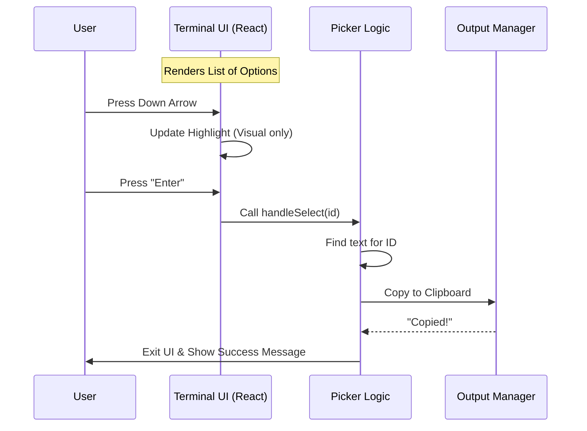

# Chapter 4: Interactive Picker UI

Welcome to Chapter 4!

In the previous chapter, [Markdown Content Parsing](03_markdown_content_parsing.md), we successfully parsed the AI's response. We separated the "meat" (code blocks) from the "bread" (conversational text).

Now we face a User Experience (UX) challenge. If Claude provides **three** different code snippets in one message, how does the user choose which one to copy?

We can't just guess. We need to ask the user.

## The Motivation: From Command Line to Interactive Menu

Standard command-line tools are usually linear: you type a command, and it spits out text.

But modern CLI tools can be **Interactive**. Instead of forcing the user to memorize complex flags (like `copy --block 2`), we can show them a visual menu.

**The Goal:**
1.  Display a list of available content (The full text vs. individual code blocks).
2.  Allow the user to navigate with `Up` / `Down` arrows.
3.  Allow the user to press `Enter` to copy, or `w` to write to a file.

---

## Concept: React in the Terminal?

Yes, you read that right. We are using **React** to build this interface.

Usually, React renders HTML `<div>` tags for a web browser. In this project, we use a library called **Ink**. Ink takes React components and renders them as text strings and ANSI escape codes that the Terminal understands.

### Analogy: The Video Game Menu
Think of this UI like the "Equip Item" menu in a generic RPG video game.
*   **State:** The game knows you are highlighting item #2.
*   **Render:** The game draws a glowing border around item #2.
*   **Event:** You press "A" (or Enter), and the game performs an action.

We are building this exact mechanism for our clipboard tool.

---

## Step 1: Preparing the Menu Options

The `CopyPicker` component needs a list of items to display. We need to convert our raw data (full text and code blocks) into a format our UI component (the `<Select />`) understands.

We create an array of "Options".

### 1. The "Full Response" Option
The first item in the menu is always the full text, in case the user wants the explanations too.

```typescript
// copy.tsx - inside CopyPicker component

const options = [
  {
    label: "Full response",
    value: "full",
    description: `${fullText.length} chars, full conversation text`
  },
  // ... code blocks come next
];
```

### 2. The Code Block Options
Next, we loop through the code blocks we found in Chapter 3 and add them to the list. We truncate the code so the menu stays readable.

```typescript
// We map our parsed blocks to menu options
...codeBlocks.map((block, index) => ({
  // Show the first 60 chars of code as the label
  label: truncateLine(block.code, 60), 
  
  // The value is the index (0, 1, 2...)
  value: index,
  
  // Description shows the language (e.g., "python, 5 lines")
  description: `${block.lang}, ${countLines(block.code)} lines`
}))
```

---

## Step 2: Rendering the UI

Now that we have our `options`, we render the interface. We use a pre-built component called `Select`.

The `Select` component handles the hard work: listening for arrow keys and highlighting the current line.

```typescript
// copy.tsx - The JSX returned by CopyPicker

return (
  <Pane>
    <Box flexDirection="column" gap={1}>
      <Text dimColor>Select content to copy:</Text>
      
      <Select 
        options={options} 
        onChange={handleSelect} // What happens when they press Enter?
        onCancel={handleCancel} // What happens when they press Esc?
      />
      
      {/* Footer with hints */}
      <Text dimColor>
         <KeyboardShortcutHint shortcut="w" action="write to file" />
      </Text>
    </Box>
  </Pane>
);
```

**Explanation:**
*   `<Pane>` and `<Box>`: These are layout containers, similar to `div` in HTML.
*   `<Select>`: The interactive list.
*   `<KeyboardShortcutHint>`: A visual helper to tell users they can press extra keys.

---

## Step 3: Handling Interactions

When the user makes a choice, we need to take action.

### The "Select" Handler (Pressing Enter)
This function runs when the user hits Enter. It figures out what was selected and sends the text to the output manager.

```typescript
const handleSelect = async (selected) => {
  // 1. Get the actual content based on selection ID
  const content = getSelectionContent(selected);

  // 2. Perform the copy logic
  const result = await copyOrWriteToFile(content.text, content.filename);
  
  // 3. Tell the CLI we are finished so it can exit the UI
  onDone(result);
};
```

### The "Write" Shortcut (Pressing 'w')
We also want a power-user feature: pressing `w` to immediately save the selection to a file instead of just copying it.

We use a standard HTML-style event handler `onKeyDown`.

```typescript
function handleKeyDown(e) {
  // Check if the key pressed was 'w'
  if (e.key === 'w') {
    e.preventDefault(); // Stop standard behavior
    
    // Write the CURRENTLY highlighted item to a file
    handleWrite(focusedRef.current);
  }
}
```

---

## Under the Hood: The Interaction Flow

Here is how the data flows when the user sees this menu.



---

## Putting It Into The Command Flow

Finally, we need to connect this UI to our main command logic.

In the `call` function (where we started in Chapter 2), we make a decision. If we found code blocks, we **return the React component**. This tells the CLI framework: "Don't exit yet, render this UI."

```typescript
// copy.tsx - inside call()

// ... previous steps (history retrieval, parsing) ...

const codeBlocks = extractCodeBlocks(text);

// If we have blocks, Show the UI!
return (
  <CopyPicker 
    fullText={text} 
    codeBlocks={codeBlocks} 
    onDone={onDone} 
  />
);
```

**Note:** If we return a component, the CLI stays alive. It waits until the component calls `onDone()` before finishing the command.

---

## Conclusion

In this chapter, we built the **Interactive Picker UI**.

1.  **The Problem:** Users need to choose between copying the whole text or just a specific snippet.
2.  **The Solution:** We used **React and Ink** to render an interactive menu in the terminal.
3.  **The Implementation:** We mapped code blocks to menu options and handled keyboard events like `Enter` and `w`.

We have now successfully selected the data we want. The final step is to actually put that data where the user wants it—either the system clipboard or a physical file on the disk.

[Next: Output Management](05_output_management.md)

---

Generated by [Code IQ](https://github.com/adityasoni99/Code-IQ)