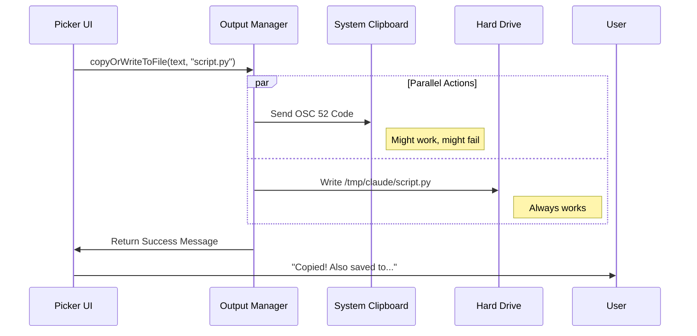

# Chapter 5: Output Management

Welcome to the final chapter of our tutorial!

In the previous chapter, [Interactive Picker UI](04_interactive_picker_ui.md), we built a nice menu that lets the user select exactly which piece of code or text they want.

Now we have the text in our hand. We are at the final mile. We need to get this text out of our program and into the user's computer so they can use it.

## The Motivation: The "Remote" Problem

If you are running this tool on your own laptop, copying text is easy. But developers often use tools like this over **SSH** (connecting to a remote server).

Here is the nightmare scenario:
1.  You are connected to a remote Linux server.
2.  You use our tool to find a complex Python script.
3.  The tool says "Copied!"
4.  You paste into your local editor... and **nothing happens**, or you paste an old clipboard item.

**Why?** Browsers and Terminals often block remote programs from touching your local clipboard for security reasons.

To solve this, we use a **"Belt and Suspenders"** strategy. We don't rely on just one method. We do two things at once to ensure the user *always* gets their data.

---

## The Concept: Dual Output Strategy

Our Output Management layer acts like a paranoid delivery service. It assumes the first delivery method might fail, so it always sends a backup.

### Method 1: The System Clipboard (The Belt)
We attempt to inject the text directly into the system clipboard using special terminal codes (OSC 52).
*   **Pros:** Fast. You can just `Ctrl+V` immediately.
*   **Cons:** Often fails in remote environments or specific terminal emulators (like standard Windows CMD).

### Method 2: The Physical File (The Suspenders)
Simultaneously, we write the text to a temporary file on the disk (e.g., `/tmp/claude/response.md`).
*   **Pros:** 100% reliable. The file is always there.
*   **Cons:** You have to open the file to get the content.

By doing both, we guarantee success.

---

## Step 1: Writing to the Disk

First, let's build the "reliable" backup method. We need a function that takes our text and saves it to a temporary folder.

We use Node.js built-in libraries `fs` (File System) and `path`.

```typescript
// copy.tsx - Helper function

const COPY_DIR = join(tmpdir(), 'claude'); // e.g., /tmp/claude

async function writeToFile(text: string, filename: string): Promise<string> {
  const filePath = join(COPY_DIR, filename);
  
  // 1. Ensure the directory exists (create if missing)
  await mkdir(COPY_DIR, { recursive: true });
  
  // 2. Write the text to the file
  await writeFile(filePath, text, 'utf-8');
  
  // 3. Return the path so we can tell the user where it is
  return filePath;
}
```

**Explanation:**
*   `tmpdir()`: Finds the system's temp folder automatically (works on Mac, Linux, and Windows).
*   `recursive: true`: If the folder `/tmp/claude` doesn't exist, create it.

---

## Step 2: The Coordinator Function

Now we create the main function that coordinates the dual strategy. This is called `copyOrWriteToFile`.

It attempts the clipboard copy, but regardless of whether that works or fails, it proceeds to write the file.

### Trying the Clipboard

We use a helper `setClipboard` (which uses ANSI escape codes).

```typescript
async function copyOrWriteToFile(text: string, filename: string) {
  // Try to set the clipboard
  const raw = await setClipboard(text);
  
  // If the terminal supports it, write the code to stdout
  if (raw) process.stdout.write(raw);
  
  // ... continued below
```

### Adding the Backup

Immediately after, we trigger the file write.

```typescript
  // ... continued
  
  // Always write to a temp file as a fallback
  try {
    const filePath = await writeToFile(text, filename);
    
    // Tell the user we did BOTH
    return `Copied to clipboard...\nAlso written to ${filePath}`;
  } catch {
    // If file writing fails (rare), just mention the clipboard
    return `Copied to clipboard`;
  }
}
```

---

## Under the Hood: The Execution Flow

When the user selects an option in the Picker UI (from Chapter 4), this sequence occurs:



---

## Putting It All Together

We have now seen every part of the `copy` command.

1.  **Chapter 1:** We defined the command metadata so the CLI knows it exists.
2.  **Chapter 2:** We dug into history to find the text.
3.  **Chapter 3:** We parsed that text to find code blocks.
4.  **Chapter 4:** We built a UI to let the user choose a block.
5.  **Chapter 5:** We saved that block to the clipboard and disk.

### The Final Result

When the process finishes, the `onDone` callback is triggered with our status message. This exits the UI and leaves a helpful message in the user's terminal history.

```text
> Copied to clipboard (450 characters, 12 lines)
> Also written to /tmp/claude/copy.tsx
```

## Conclusion

Congratulations! You have walked through the complete architecture of a robust CLI command.

In this specific chapter, we learned about **Output Management**.
*   **The Problem:** Remote environments make clipboards unreliable.
*   **The Solution:** A dual strategy (Redundancy).
*   **The Implementation:** We combined `setClipboard` with `fs.writeFile` to ensure the user never loses their data.

This concludes our tutorial series on building the `copy` command. You now understand how to build complex, interactive, and robust terminal tools using TypeScript and React!

---

Generated by [Code IQ](https://github.com/adityasoni99/Code-IQ)