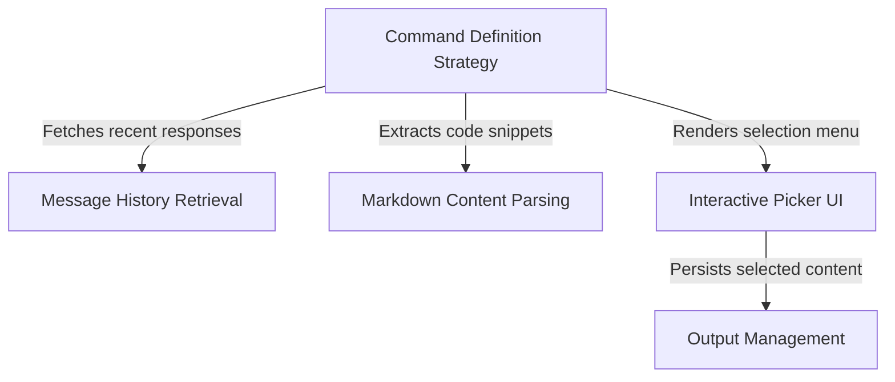

# Tutorial: copy

This project implements a smart **copy command** for a CLI chat interface. It allows users to extract the AI's most recent response, intelligently parsing the content to separate **code blocks** from text. Users are presented with an *interactive menu* to choose whether to copy the full message or specific code snippets to their system clipboard and a local backup file.

## Chapters

1. [Command Definition Strategy](01_command_definition_strategy.md)
2. [Message History Retrieval](02_message_history_retrieval.md)
3. [Markdown Content Parsing](03_markdown_content_parsing.md)
4. [Interactive Picker UI](04_interactive_picker_ui.md)
5. [Output Management](05_output_management.md)

---

Generated by [Code IQ](https://github.com/adityasoni99/Code-IQ)