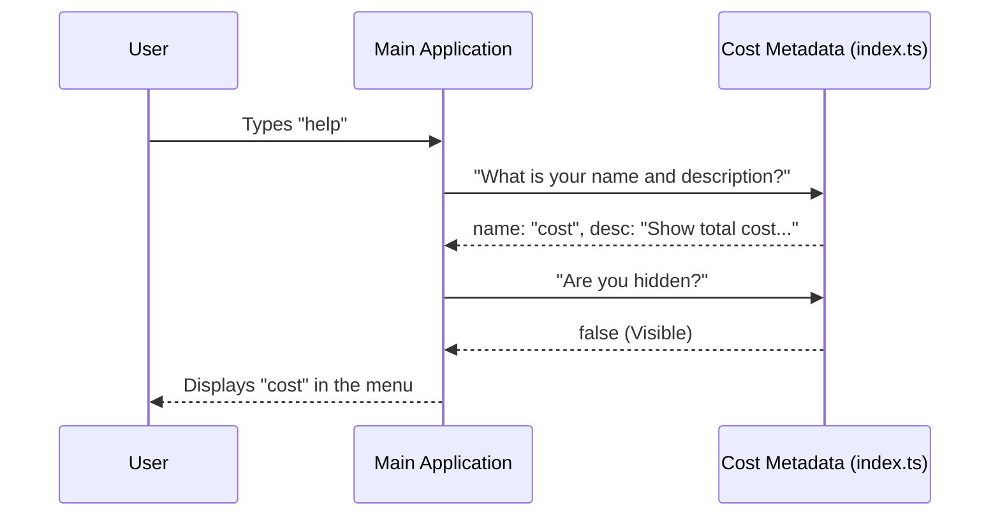

# Chapter 1: Command Definition & Metadata

Welcome to the **cost** project! If you are new to building Command Line Interfaces (CLIs), you are in the right place.

In this first chapter, we are going to look at the very foundation of any tool in our system: the **Command Definition**.

## Why do we need this?

Imagine you are walking into a large office building. Before you can talk to the CEO or the Accounting Department, you usually look at the **building directory** or talk to a receptionist. The directory doesn't do the accounting; it just tells you:
1.  **Name:** Accounting.
2.  **Description:** Handles money.
3.  **Location:** Floor 5.

In our CLI, we need a "Directory" like this.

### The Use Case
We want users to be able to type `cost` to see how much money their session has used. However, before the computer calculates the bill (which takes work), the CLI needs to know:
*   What is the command called? (`cost`)
*   What does it do? (Description)
*   Who is allowed to see it?

We solve this by creating a **Command Definition**. Think of this file as a **Business Card** or an **ID Badge** for our tool.

## Concept: The Metadata Object

Instead of writing complex code immediately, we create a simple JavaScript/TypeScript object that describes the tool. This data about the tool is called **Metadata**.

Here is how we define the `cost` command, broken down into simple pieces.

### Step 1: Identity (Name & Description)

First, we tell the system who we are.

```typescript
// defined in index.ts
const cost = {
  name: 'cost',
  description: 'Show the total cost and duration of the current session',
  // ... other properties
}
```

**Explanation:**
*   `name`: This is the specific word the user types in the terminal.
*   `description`: When the user types `--help`, this text explains what the tool does.

### Step 2: Categorization

Next, we define what *kind* of command this is.

```typescript
const cost = {
  // ... previous properties
  type: 'local', 
  supportsNonInteractive: true,
}
```

**Explanation:**
*   `type: 'local'`: This tells the CLI that this command runs on your machine (as opposed to running remotely on a server).
*   `supportsNonInteractive`: If this is `true`, it means this command can be run by scripts or robots (CI/CD) without a human needing to press keys.

### Step 3: Rules & Code Location

Finally, we set rules for visibility and tell the CLI where the *actual* hard work happens.

```typescript
import { isClaudeAISubscriber } from '../../utils/auth.js'

const cost = {
  // ... previous properties
  get isHidden() {
    // Logic to decide if we show this command
    return isClaudeAISubscriber()
  },
  load: () => import('./cost.js'), // Point to the real code
}
```

**Explanation:**
*   `isHidden`: This is a dynamic rule. Sometimes we want to hide commands from specific users. We will explore the logic inside this function in [Dynamic Visibility Logic](03_dynamic_visibility_logic.md).
*   `load`: This is very important! It tells the CLI, "If the user actually runs this command, go load this file." This keeps our app fast. We discuss this in [Lazy-Loaded Command Architecture](04_lazy_loaded_command_architecture.md).

## Internal Implementation: How it works

Let's look at what happens "under the hood" when the main application starts up. The application doesn't load the heavy code immediately. It just collects these "Business Cards."

### The Sequence

1.  **App Start:** The CLI wakes up.
2.  **Collection:** It gathers all `index.ts` files (the metadata).
3.  **Registration:** It registers the name `cost` into its internal dictionary.
4.  **Display:** If the user types `help`, the CLI reads the `description` from the metadata to show the menu.

Here is a diagram showing how the Main App interacts with this Metadata file:



### The Code Structure

The file `index.ts` is intentionally kept very small. It imports a type definition to ensure we don't make spelling mistakes.

```typescript
import type { Command } from '../../commands.js'

// We ensure 'cost' follows the rules of a 'Command'
const cost = {
   name: 'cost',
   // ... properties
} satisfies Command

export default cost
```

**Explanation:**
*   `satisfies Command`: This is a TypeScript feature. It checks our "Business Card" to make sure we didn't forget the Name or Description. If we forget one, the code will show a red error line.

## Summary

We have successfully defined the **Command Definition & Metadata** for our cost tool. 

*   We created an "ID Badge" for the tool.
*   We defined its name, description, and basic behavior flags.
*   We pointed to where the heavy code lives (`load`) without running it yet.

However, in our code, you might have noticed `process.env.USER_TYPE` or `isClaudeAISubscriber`. How does the command know who the user is to decide if it should be hidden or visible?

To answer that, we need to understand the user's environment.

[Next Chapter: User Context & Authorization](02_user_context___authorization.md)

---

Generated by [Code IQ](https://github.com/adityasoni99/Code-IQ)