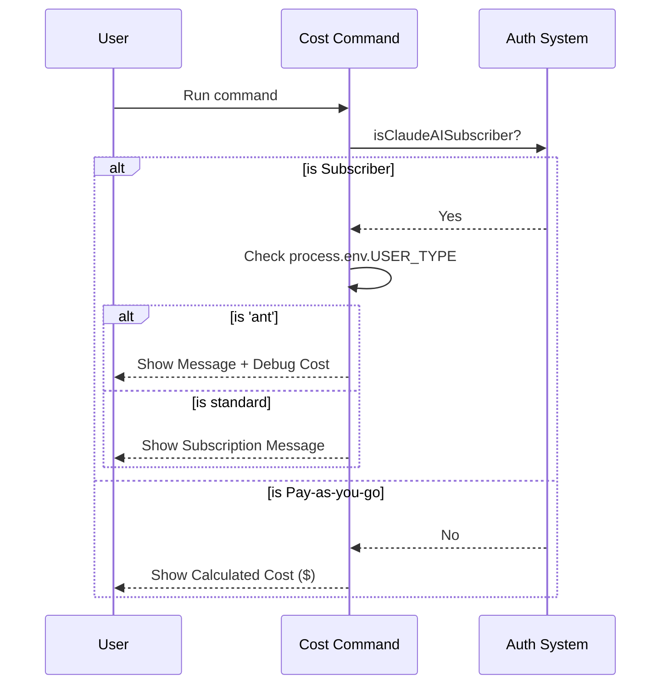

# Chapter 2: User Context & Authorization

Welcome back! In [Chapter 1: Command Definition & Metadata](01_command_definition___metadata.md), we learned how to create an "ID Card" (Metadata) for our `cost` command so the application knows it exists.

However, having a command is only half the battle. Sometimes, we want the command to behave differently depending on **who** is typing it.

## The Motivation

Imagine a smart electronic lock on a secure office door.
1.  **Standard User:** Scans their badge, the light turns green, and the door opens.
2.  **Security Guard:** Scans their badge, the door opens, *and* the security system announces "Security Inspection Logged."
3.  **Stranger:** Scans a fake badge, the light turns red, and the door stays locked.

In our CLI application, we have a similar situation with the `cost` command:
*   **Regular Users (Pay-as-you-go):** Need to see exactly how much money they spent (e.g., "$0.15").
*   **Subscribers (Claude AI):** Don't pay per request. Showing them "$0.15" is confusing. They should see a message about their subscription status.
*   **Internal Employees (Ants):** Even if they are subscribers, they are building the tool and need to see the debug cost data.

This chapter explains how we use **User Context** to create this "Smart Lock" logic.

## Key Concepts

To solve this, we rely on two pieces of information available in our environment.

### 1. The Helper Function (`isClaudeAISubscriber`)
We don't want to rewrite complex logic every time we check a user. Instead, we import a simple "Yes/No" question function.
*   **Input:** None.
*   **Output:** `true` (User is a subscriber) or `false` (User pays per usage).

### 2. Environment Variables (`process.env`)
The computer running the code has global variables called "Environment Variables." We look for a specific tag called `USER_TYPE`.
*   If `process.env.USER_TYPE === 'ant'`, we know the user is an internal employee (an "Ant").

## Implementation: Solving the Use Case

Let's look at how we combine these concepts inside `cost.ts` to change the text the user sees.

### Step 1: Handling Subscribers
First, we check if the user is a subscriber. If they are, we prepare a friendly message instead of a dollar amount.

```typescript
// defined in cost.ts
import { isClaudeAISubscriber } from '../../utils/auth.js'

export const call: LocalCommandCall = async () => {
  // Check: Is this a subscriber?
  if (isClaudeAISubscriber()) {
    let value = 'You are using your subscription...'
    
    // ... logic continues
  }
  // ...
}
```

**Explanation:**
If `isClaudeAISubscriber()` returns true, we enter a special branch of logic. We set the output text (`value`) to a helpful message about their subscription limits.

### Step 2: The "Internal Employee" Override
This is the "Security Guard" part of our analogy. Even if the logic above runs, we might want to show extra data if the user is an employee.

```typescript
// inside the if (isClaudeAISubscriber()) block
if (process.env.USER_TYPE === 'ant') {
  // Append extra debug info for employees
  value += `\n\n[ANT-ONLY] Showing cost anyway:\n ${formatTotalCost()}`
}

return { type: 'text', value }
```

**Explanation:**
We check `process.env.USER_TYPE`. If it equals `'ant'`, we add (`+=`) the actual calculated cost to the message. This allows developers to verify that the cost calculator is working, even when testing as a subscriber.

### Step 3: Default Behavior (Pay-as-you-go)
If the user is *not* a subscriber, we skip the complex logic and just do the math.

```typescript
// If NOT a subscriber
return { type: 'text', value: formatTotalCost() }
```

**Explanation:**
This is the standard behavior. We simply call `formatTotalCost()`, which calculates the dollars and cents. (We will learn how this calculation works in [Cost & Quota Management](05_cost___quota_management.md)).

## Internal Implementation: Under the Hood

How does the application flow when a user types `cost`? Let's visualize the decision-making process.

### The Logic Flow

1.  **User** runs `cost`.
2.  **Command** asks: "Are you a subscriber?"
3.  **If No:** Calculate cost -> Display "$0.50".
4.  **If Yes:**
    *   Prepare message: "You are using a subscription."
    *   Ask: "Are you also an internal employee ('ant')?"
    *   **If Yes (Ant):** Add debug cost to the message -> Display Message + Cost.
    *   **If No:** Display only the Subscription Message.

### Sequence Diagram



### Authorization in Metadata
We also use this logic *before* the command even runs, inside our Metadata file (`index.ts`). This controls whether the command appears in the help menu at all.

```typescript
// defined in index.ts
get isHidden() {
  // 1. Employees (Ants) see everything
  if (process.env.USER_TYPE === 'ant') {
    return false // Not hidden
  }
  // 2. Hide this command if user is a subscriber
  return isClaudeAISubscriber()
}
```

**Explanation:**
This getter, `isHidden`, is accessed by the help menu.
*   If you are an 'ant', `isHidden` is `false` (Show the command).
*   If you are a regular subscriber, `isHidden` is `true`. Why? because subscribers don't need to worry about individual costs, so we hide the clutter from them.

We will explore how the CLI uses this `isHidden` property in depth in the next chapter, [Dynamic Visibility Logic](03_dynamic_visibility_logic.md).

## Summary

In this chapter, we learned how to make our CLI "smart" about who is using it.

*   We used **User Context** (`isClaudeAISubscriber`, `process.env`) to identify the user.
*   We used **Authorization** logic to change the *output* of the command (showing text vs. costs).
*   We used this same logic to decide if we should hide the command entirely.

Now that we know *how* to check who the user is, let's see how the Main Application uses these rules to show or hide commands dynamically in the menu.

[Next Chapter: Dynamic Visibility Logic](03_dynamic_visibility_logic.md)

---

Generated by [Code IQ](https://github.com/adityasoni99/Code-IQ)