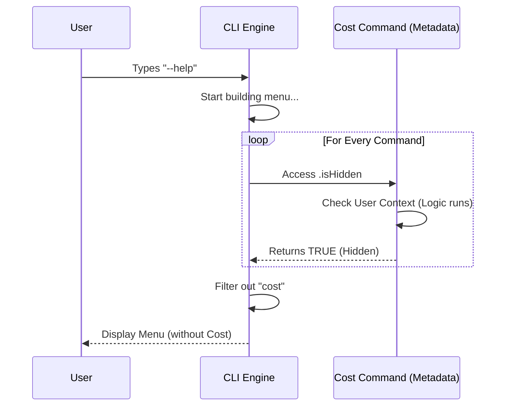

# Chapter 3: Dynamic Visibility Logic

Welcome to Chapter 3! In the previous chapter, [User Context & Authorization](02_user_context___authorization.md), we learned how to identify *who* is using our tool (User Context) and authorized them to see specific data.

Now, we take that authorization logic and apply it to the interface itself. We don't just want to change the output of a command; sometimes, we want to hide the command entirely from the menu. This is called **Dynamic Visibility Logic**.

## The Motivation

Imagine you are playing a Role-Playing Game (RPG).
*   **Warrior Class:** The screen shows a "Rage Meter."
*   **Wizard Class:** The screen shows a "Mana Bar."

It would be very confusing if the Warrior saw a generic "Mana Bar" that was always empty, or if the Wizard saw a "Rage Meter" they couldn't use. Good interfaces **adapt** to the user. They only show tools that are currently useful.

### The Use Case

In our `cost` tool, we have a similar situation:
1.  **Pay-as-you-go Users:** They pay for every request. They worry about money. They **need** to see the `cost` command in the help menu.
2.  **Subscribers:** They have a flat rate. Seeing a `cost` command creates anxiety or confusion ("Do I need to pay extra??"). We should **hide** the command from their menu.

How do we write code that says: *"Hide this, but only sometimes"*?

## Key Concept: The "Getter" Function

In most basic programming, we set variables to static values:

```typescript
const isHidden = true; // Always hidden
const isHidden = false; // Never hidden
```

This is like painting a sign. Once it is painted, it doesn't change.

To make our visibility dynamic, we use a JavaScript feature called a **Getter** (`get`). A getter looks like a variable, but it acts like a function. It calculates the answer *fresh* every time you look at it.

Think of a **Getter** like a motion-sensor light. It doesn't decide whether to be On or Off until someone actually walks by.

## Implementation: Solving the Use Case

Let's apply this to our `cost` command. We want the `isHidden` property to check our User Context (from Chapter 2) in real-time.

### Step 1: The Basic Logic

We modify our metadata file (`index.ts`). Instead of `isHidden: true`, we write `get isHidden()`.

```typescript
// defined in index.ts
import { isClaudeAISubscriber } from '../../utils/auth.js'

const cost = {
  name: 'cost',
  // The magic happens here:
  get isHidden() {
    // If user is a subscriber, return true (Hide it!)
    // If user acts normally, return false (Show it!)
    return isClaudeAISubscriber()
  },
  // ... other properties
}
```

**Explanation:**
When the CLI builds the help menu, it "touches" `isHidden`. The code runs immediately. If `isClaudeAISubscriber()` says "Yes", `isHidden` becomes `true`, and the command vanishes from the list.

### Step 2: Adding the Exception

As we discussed in Chapter 2, internal employees ("Ants") act as "Security Guards." Even if they have a subscription, they need to see the debug tools. We need to add an exception logic.

```typescript
// defined in index.ts
get isHidden() {
  // 1. Exception: Employees (Ants) always see the command
  if (process.env.USER_TYPE === 'ant') {
    return false // Not hidden
  }

  // 2. Standard Rule: Hide if subscriber
  return isClaudeAISubscriber()
}
```

**Explanation:**
The logic is now layered:
1.  Are you an Ant? -> Show it.
2.  If not, are you a subscriber? -> Hide it.
3.  Otherwise -> Show it.

## Internal Implementation: Under the Hood

How does the Main Application (the CLI engine) actually use this?

The application doesn't know *why* a command is hidden. It simply asks every command for its status right before it prints the menu.

### The Sequence

1.  **User Input:** The user types `--help`.
2.  **Loop:** The CLI loops through every command in its folder.
3.  **The Question:** The CLI accesses `.isHidden` on the `cost` object.
4.  **The Calculation:** Our `get` function runs, checks the environment, and returns `true` or `false`.
5.  **The Render:** The CLI filters the list and prints only the visible commands.



### The Engine Code (Simplified)

Here is a simplified version of what the CLI engine code looks like when it builds the help menu.

```typescript
// Inside the CLI Help Generator
function printHelpMenu(commands: Command[]) {
  const visibleCommands = []

  for (const cmd of commands) {
    // We "touch" the property here. 
    // The getter logic runs NOW.
    if (cmd.isHidden) {
      continue; // Skip this command
    }
    
    visibleCommands.push(cmd)
  }
  
  console.log(visibleCommands)
}
```

**Explanation:**
The engine is lightweight. It doesn't know about "Subscribers" or "Ants." It just relies on the `cmd.isHidden` answering `true` or `false`. This keeps our main application code clean, while the specific logic stays inside the `cost` command file.

## Summary

In this chapter, we learned:
*   **Static vs. Dynamic:** Why simple `true/false` isn't enough for modern tools.
*   **Getters:** How to use `get isHidden()` to run logic at the exact moment the menu is requested.
*   **Context Awareness:** How to combine User Context to hide features that aren't relevant to the current user.

We have defined the command ([Chapter 1](01_command_definition___metadata.md)), secured it ([Chapter 2](02_user_context___authorization.md)), and now we can hide it dynamically.

But wait—if the command *is* visible, and the user types `cost`, what happens next? We need to load the actual code to perform the calculation. To keep our CLI fast, we use a special technique to only load code when we absolutely need it.

[Next Chapter: Lazy-Loaded Command Architecture](04_lazy_loaded_command_architecture.md)

---

Generated by [Code IQ](https://github.com/adityasoni99/Code-IQ)