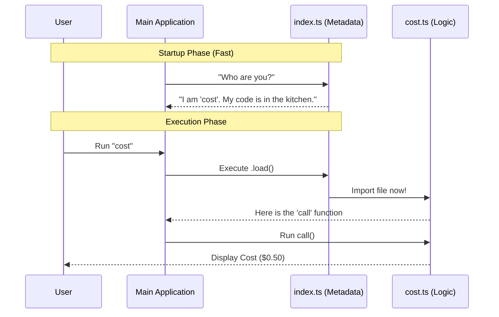

# Chapter 4: Lazy-Loaded Command Architecture

Welcome to Chapter 4! In the previous chapter, [Dynamic Visibility Logic](03_dynamic_visibility_logic.md), we learned how to show or hide commands based on who the user is.

Now that our menu is smart, we need to make sure it is **fast**.

## The Motivation: The Restaurant Menu Analogy

Imagine you go to a restaurant. You sit down and open the menu.
*   **The Menu** lists the names of the dishes (e.g., "Spaghetti", "Steak") and a short description.
*   **The Kitchen** contains the ingredients, the chefs, the pots, and the pans.

**The Problem:**
Imagine if the restaurant had to cook *every single dish* and put it on your table before you even looked at the menu. The table would be crowded, food would go to waste, and you would wait an hour just to sit down!

**The Solution:**
The restaurant uses a **Menu** (Metadata). It is light and easy to read. The **Kitchen** (Execution Logic) only starts working when you actually order a specific dish.

### The Use Case

In our CLI tool, we have many commands. Some commands require heavy mathematics or big files to work.
*   If we load all the code for every command when the user types `--help`, the CLI will feel sluggish and slow.
*   We want the CLI to start instantly.

We solve this using **Lazy-Loaded Command Architecture**. We split our code into two parts: the "Menu" and the "Kitchen."

## Concept: Splitting the File

We separate the command into two files:
1.  **`index.ts` (The Menu):** Defines the name and description. Very small. Loads instantly.
2.  **`cost.ts` (The Kitchen):** Contains the heavy logic, math, and imports. Only loads when needed.

## Implementation: How to link them

Let's look at how we wire these two files together using a specific function called `load`.

### Step 1: The Menu (`index.ts`)

This file is the entry point. It needs to tell the CLI where to find the "Kitchen" without actually entering it yet.

```typescript
// defined in index.ts
import type { Command } from '../../commands.js'

const cost = {
  name: 'cost',
  description: 'Show total cost of session',
  
  // The magic line:
  load: () => import('./cost.js'), 
} satisfies Command

export default cost
```

**Explanation:**
*   `load`: This is a function.
*   `() => import('./cost.js')`: This is a **Dynamic Import**.
    *   It tells JavaScript: "I know where `cost.js` is, but **do not read it yet**."
    *   It will only read that file when the `load()` function is actually called by the main application.

### Step 2: The Kitchen (`cost.ts`)

This file contains the actual work. It exports a function called `call`. This file can be as large as necessary because it isn't loaded during startup.

```typescript
// defined in cost.ts
import { formatTotalCost } from '../../cost-tracker.js'
// ... other heavy imports ...

// This code only runs when the user types "cost"
export const call = async () => {
  // Perform heavy calculations here
  const cost = formatTotalCost()
  
  return { type: 'text', value: cost }
}
```

**Explanation:**
*   **Heavy Imports:** Notice we import `formatTotalCost` here. If this library is large, it doesn't matter, because we only pay that "cost" when the user asks for it.
*   **`export const call`**: This is the standard function name our CLI looks for after it loads the file.

## Internal Implementation: Under the Hood

How does the Main Application orchestrate this? Let's walk through the lifecycle of a command.

### The Sequence

1.  **Startup:** The CLI starts. It scans the folder for `index.ts` files. It finds the "Menu" for `cost`. It does **not** touch `cost.ts`.
2.  **User Action:** The user types `cost` in the terminal.
3.  **Lookup:** The CLI finds the "Menu" card for `cost`.
4.  **Lazy Load:** The CLI executes the `.load()` function we defined.
5.  **Execution:** JavaScript reads `cost.ts`, compiles it, and runs the `call` function.



### The "Loader" Code (Simplified)

To understand exactly how `load` works, let's look at a simplified version of the code that runs inside the Main Application when a user presses Enter.

```typescript
// Inside the Main CLI Runner
async function runCommand(commandName: string) {
  // 1. Find the metadata (The Menu)
  const meta = registry.find(cmd => cmd.name === commandName)

  // 2. The "Lazy" part:
  // We wait for the file to be imported from disk
  const module = await meta.load()

  // 3. Run the logic (The Kitchen)
  const result = await module.call()
  
  console.log(result.value)
}
```

**Explanation:**
*   `await meta.load()`: This is the moment truth. Before this line, `cost.ts` might as well not exist to the computer.
*   By using `await`, the program pauses briefly to fetch the file, ensuring the command is ready to run.

## Summary

In this chapter, we optimized our command for performance.

*   We split our command into **Metadata** (`index.ts`) and **Logic** (`cost.ts`).
*   We used the **Menu vs. Kitchen** analogy to understand why loading everything at once is bad.
*   We implemented a **Lazy Loader** using `load: () => import(...)`.

Now our CLI starts fast and only loads code when necessary. But once the code *does* load, how do we actually calculate the money? Where does `formatTotalCost()` get its numbers?

In the final chapter, we will explore the logic inside the "Kitchen."

[Next Chapter: Cost & Quota Management](05_cost___quota_management.md)

---

Generated by [Code IQ](https://github.com/adityasoni99/Code-IQ)