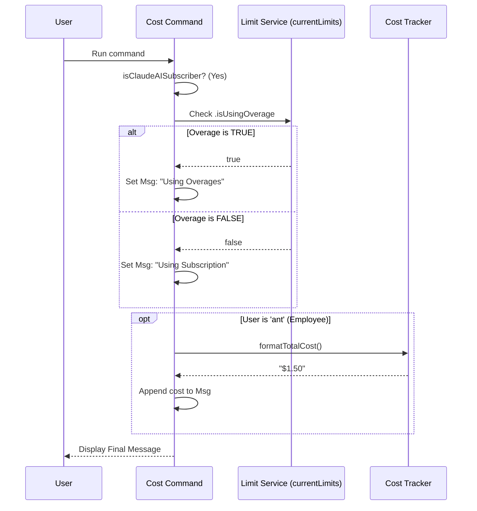

# Chapter 5: Cost & Quota Management

Welcome to the final chapter of our tutorial series!

In the previous chapter, [Lazy-Loaded Command Architecture](04_lazy_loaded_command_architecture.md), we optimized our CLI to load code only when necessary. We created the "Menu" and the "Kitchen."

Now, the user has placed their order. The code is loaded. It is time to cook.

In this chapter, we explore the core logic of the `cost` command: **Cost & Quota Management**. This is where we calculate the numbers and decide exactly what to tell the user based on their specific billing situation.

## The Motivation: The Utility Meter Analogy

To understand why this logic is necessary, think about the electricity in your home.

1.  **Standard Plan (Pay-as-you-go):** You have a meter. Every time you turn on a light, the meter spins. At the end of the month, you look at the meter and pay exactly what you used (e.g., "$50.00").
2.  **Solar Battery Plan (Subscription):** You pay a flat fee for a solar battery. When you turn on a light, you don't pay extra; you just drain the battery.
    *   **Normal State:** You are running off the battery. Free usage.
    *   **Overage State:** The battery is empty! You switch to the emergency grid. Now you might be charged extra, or just need to know you are running on reserves.

**The Use Case:**
Our CLI tool works the same way.
*   Some users pay per request (Standard Plan). We must show them the dollar amount.
*   Some users have a subscription (Solar Plan). We shouldn't show them dollars; we should tell them if they are within their limits or using overages.

## Key Concepts

To handle this, we need two specific tools (helpers) in our code.

### 1. The Cost Tracker (`formatTotalCost`)
This is the "Meter Reader." It simply looks at how many "tokens" (units of compute) we have used in the session and converts it into a formatted string like `$0.15`.

### 2. The Limit Checker (`currentLimits`)
This is the "Battery Monitor." It knows the rules of the user's subscription. It answers the question: *"Is the user currently dipping into their emergency reserves?"*

## Implementation: The Business Logic

Let's look at how we combine these concepts inside `cost.ts` to solve our use case.

### Step 1: The Branching Point

First, we must decide which "Plan" the user is on. We use the authorization check we learned about in [Chapter 2: User Context & Authorization](02_user_context___authorization.md).

```typescript
// inside cost.ts
import { isClaudeAISubscriber } from '../../utils/auth.js'
import { formatTotalCost } from '../../cost-tracker.js'

export const call = async () => {
  // Scenario A: The User is a Subscriber
  if (isClaudeAISubscriber()) {
    // ... complex logic goes here ...
  }
  
  // Scenario B: Pay-as-you-go (Default)
  return { type: 'text', value: formatTotalCost() }
}
```

**Explanation:**
*   If the user is **NOT** a subscriber (Scenario B), the logic is simple. We call `formatTotalCost()`, which returns the dollar amount, and we show it to the user.

### Step 2: Handling Subscription Logic

If the user **IS** a subscriber, simply showing "$0.15" is confusing because they aren't being billed that amount directly. We need to check their Quota status.

```typescript
import { currentLimits } from '../../services/claudeAiLimits.js'

// Inside the subscriber block
let value: string

if (currentLimits.isUsingOverage) {
  // The battery is empty, using reserves!
  value = 'You are currently using your overages...'
} else {
  // Everything is normal
  value = 'You are currently using your subscription...'
}
```

**Explanation:**
*   `currentLimits.isUsingOverage`: This is a boolean flag (true/false).
*   If `true`: We warn the user they are in "Overage" mode.
*   If `false`: We reassure the user they are within their standard subscription limits.

### Step 3: The "Internal Employee" Exception

Finally, we bring back our "Ant" logic. Even if a user is on a subscription, if they are a developer of this tool (`USER_TYPE === 'ant'`), they usually want to check if the math is working correctly.

```typescript
// Still inside the subscriber block
if (process.env.USER_TYPE === 'ant') {
  // Append the raw cost data for debugging
  const debugInfo = formatTotalCost()
  value += `\n\n[ANT-ONLY] Showing cost anyway:\n ${debugInfo}`
}

return { type: 'text', value }
```

**Explanation:**
We modify the friendly message (`value`) by appending the raw cost calculation. This gives internal employees the best of both worlds: they see the user experience *and* the raw data.

## Internal Implementation: Under the Hood

How does the system know if we are in "Overage"? Let's visualize the data flow when a Subscriber runs the command.

### The Sequence

1.  **User** runs `cost`.
2.  **Command** identifies the user as a Subscriber.
3.  **Command** asks the `LimitService`: "Are we in overage?"
4.  **LimitService** checks the global state (how many tokens used vs. the daily limit).
5.  **Command** constructs the appropriate text message.



### The Code Summary

Here is the complete picture of how the function looks when we put the pieces together. It handles all three user types (Standard, Subscriber, Employee) in one concise flow.

```typescript
// defined in cost.ts
export const call = async () => {
  // 1. Check Subscription Status
  if (isClaudeAISubscriber()) {
    
    // 2. Determine Message based on Quota/Overage
    let value = currentLimits.isUsingOverage
      ? 'You are currently using your overages...'
      : 'You are currently using your subscription...'

    // 3. Add Debug info for Employees
    if (process.env.USER_TYPE === 'ant') {
      value += `\n\n[ANT-ONLY] Cost: ${formatTotalCost()}`
    }
    return { type: 'text', value }
  }

  // 4. Default: Just show the money
  return { type: 'text', value: formatTotalCost() }
}
```

**Explanation:**
This code is the "brain" of the command. It doesn't do the heavy math itself (that's `formatTotalCost`'s job), and it doesn't track the API limits (that's `currentLimits`'s job). It acts as a **Controller**, making decisions based on the data provided by those helpers.

## Conclusion

Congratulations! You have completed the tutorial series for the `cost` project.

Over these 5 chapters, we have built a fully functional, professional-grade CLI command. Let's recap what we learned:

1.  **[Command Definition & Metadata](01_command_definition___metadata.md):** We created the "Business Card" (`index.ts`) so the CLI knows our command exists.
2.  **[User Context & Authorization](02_user_context___authorization.md):** We learned to identify *who* is using the tool (Subscribers vs. Pay-as-you-go).
3.  **[Dynamic Visibility Logic](03_dynamic_visibility_logic.md):** We learned how to hide the command from the menu using `get isHidden()`.
4.  **[Lazy-Loaded Command Architecture](04_lazy_loaded_command_architecture.md):** We optimized performance by keeping the heavy logic in a separate file (`cost.ts`) and loading it on demand.
5.  **Cost & Quota Management:** Finally, we implemented the business logic to handle different billing states (Standard vs. Overage) dynamically.

You now possess the knowledge to build scalable, user-aware, and performant CLI tools. Happy coding!

---

Generated by [Code IQ](https://github.com/adityasoni99/Code-IQ)