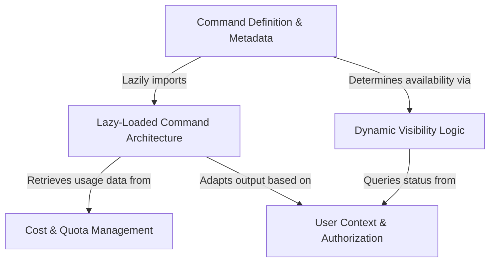

# Tutorial: cost

This project implements a **cost tracking command** for a CLI application. It uses a *lazy-loading architecture* to ensure the tool starts quickly by only loading heavy logic when the user specifically asks for cost details. The system creates a dynamic experience by checking **user permissions** to determine if pricing details should be displayed or if the command should be *hidden* entirely from the menu.

## Chapters

1. [Command Definition & Metadata](01_command_definition___metadata.md)
2. [User Context & Authorization](02_user_context___authorization.md)
3. [Dynamic Visibility Logic](03_dynamic_visibility_logic.md)
4. [Lazy-Loaded Command Architecture](04_lazy_loaded_command_architecture.md)
5. [Cost & Quota Management](05_cost___quota_management.md)

---

Generated by [Code IQ](https://github.com/adityasoni99/Code-IQ)