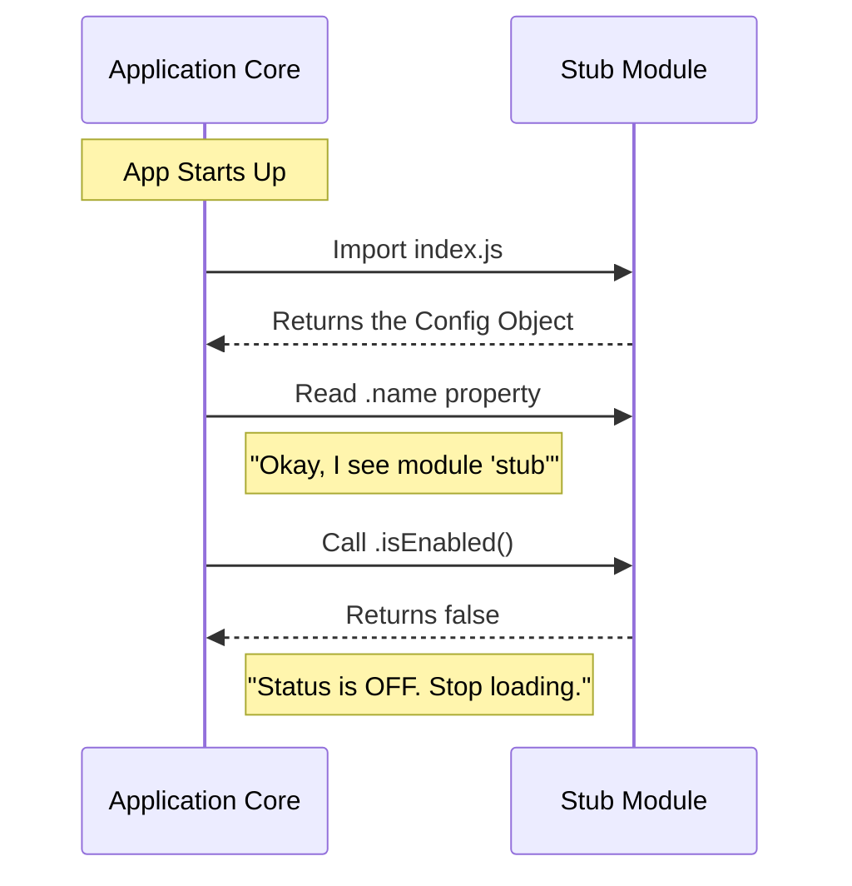

# Chapter 1: Stub Module Definition

Welcome to the first chapter of the `ctx_viz` tutorial! Today, we are going to start with the most fundamental building block of our system: the **Stub Module**.

## Why do we need a Stub?

Imagine you are building a large shopping mall (your application). You have plans for a specific store, like a "Toy Store," but you haven't bought the inventory or hired the staff yet.

You can't just leave a gaping hole in the wall. Instead, you put up a nicely designed facade with a sign that says **"Coming Soon"**.

This is exactly what a **Stub Module** is.

### The Use Case

We want to introduce a new feature into our application—let's call it the `ctx_viz` module—but we aren't ready to write the complex visualization logic yet.

**The Goal:** We need to register the file in our codebase so the application knows it exists, but we need to ensure it does **absolutely nothing** and stays invisible to the user.

## How it Works

To solve this, we create a module definition that acts as a placeholder. We tell the application three specific things about this module:

1.  **Identity:** What is it called?
2.  **Status:** Is it turned on? (No).
3.  **Visibility:** Can users see it in the menu? (No).

### The Implementation

Let's look at how we write this in code. We will create a file called `index.js`. This file exports a single object that acts as our "Coming Soon" sign.

Here is the code structure:

```javascript
// File: index.js
export default {
  isEnabled: () => false, // The switch is OFF
  isHidden: true,         // The sign is HIDDEN
  name: 'stub'            // The ID tag
};
```

**What will happen?**
When the application loads this file:
1.  It sees the module is named `'stub'`.
2.  It asks, "Should I run this?" The answer is `false`.
3.  It asks, "Should I show this in the navigation?" The answer is `true` (Wait, `isHidden` is true, so the answer to "show it" is essentially "No, hide it").

The result is a successfully loaded application that behaves exactly as if the module wasn't there, but the code structure is now ready for future work.

## Under the Hood

Let's look at what happens internally when the application starts up and encounters our Stub Module.

### The Flow

The application core acts like a security guard checking a badge.



### Code Deep Dive

Let's break down the specific code in `index.js` to understand why we wrote it that way.

#### 1. The Logic Check
First, we define if the logic should run.

```javascript
// Inside the export object...
isEnabled: () => false,
```

**Explanation:** We define a function that returns `false`. We use a function (instead of just a boolean variable) because, in the future, we might want to check a database or a user setting to decide if the module is enabled. This relates to our [Feature Flagging Strategy](03_feature_flagging_strategy.md), which we will cover in Chapter 3.

#### 2. The Visibility Check
Next, we define if the UI elements should appear.

```javascript
// Inside the export object...
isHidden: true,
```

**Explanation:** This simply tells the navigation bar to skip this item. Even if a module is "enabled" logic-wise, we might want to hide it from the menu. This is the core of [Visibility Control](04_visibility_control.md).

#### 3. The Identity
Finally, we tag the module.

```javascript
// Inside the export object...
name: 'stub'
```

**Explanation:** Every module needs a unique ID so the system can track it. Right now, we are just calling it `'stub'`, but in the next chapter, we will learn how to give it a proper [Component Identity](02_component_identity.md).

## Conclusion

Congratulations! You have successfully defined a **Stub Module**. You've learned how to reserve space in your application for a future feature without breaking the current functionality.

You have created a safe "Under Construction" zone. Now, it's time to start peeling back the stickers and giving this module a real name.

[Next Chapter: Component Identity](02_component_identity.md)

---

Generated by [Code IQ](https://github.com/adityasoni99/Code-IQ)