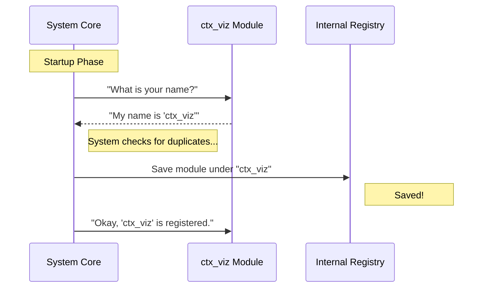

# Chapter 2: Component Identity

Welcome back! In the previous chapter, [Stub Module Definition](01_stub_module_definition.md), we built a safe, empty placeholder for our project. We created a "Coming Soon" sign that does nothing and stays hidden.

Now, we are going to look closer at that sign. specifically at the text written on it.

## Why does a module need a Name?

Imagine you are at a large conference. You are wearing a badge. If your badge is blank, people know you are a human attending the conference, but they can't call you by name, they can't assign you to a specific workshop, and they can't deliver mail to you.

In software, our application is the conference, and the **Component Identity** is your name badge.

### The Use Case

In Chapter 1, we named our module `'stub'`. This is like wearing a badge that says "Guest". It works, but it's generic.

Now, we want to formally introduce our **Context Visualization** tool to the system. Even if the tool is broken, turned off, or hidden, the system needs to know exactly **who** is turned off.

**The Goal:** Change the generic identity `'stub'` to a unique identifier: `'ctx_viz'`.

## How it Works

The Component Identity is defined by a single property in our code: `name`.

This string acts as a unique key (a fingerprint) for the module. No two modules in the entire application are allowed to have the same name.

### The Implementation

Let's update our `index.js` file. We are keeping the logic disabled (for now), but we are updating its ID card.

```javascript
// File: index.js
export default {
  isEnabled: () => false, 
  isHidden: true,         
  
  // OLD: name: 'stub'
  // NEW:
  name: 'ctx_viz' 
};
```

**What happens now?**
1.  **Before:** The system said, "I have a generic stub module here."
2.  **Now:** The system says, "I have the `ctx_viz` module here. It is currently disabled."

By changing this string, we allow the system to log specific errors like "Error in ctx_viz" instead of "Error in stub," which makes fixing bugs much easier.

## Under the Hood

How does the application use this name? Think of the application core as a **Librarian** organizing books.

When the application starts, it doesn't just pile modules in a heap. It sorts them into a catalog using their names.

### The Flow

Here is the conversation between the System Core and your Module during the setup phase:



Even though the module is *disabled*, it must be *registered* first. The system cannot check if a module is enabled if it doesn't know the module's name to look it up.

### Code Deep Dive

Let's look at a simplified version of the code that runs inside the Application Core (the code that consumes your module).

The system likely uses an object (a dictionary) to store all modules.

```javascript
// Inside the Application Core logic
const moduleRegistry = {};

function register(module) {
    // We use the .name property as the Key
    const id = module.name; 
    
    // Store it in the registry
    moduleRegistry[id] = module;
    
    console.log(`Registered: ${id}`);
}
```

**Explanation:**
1.  **Extraction:** The system reads `module.name` (which is `'ctx_viz'`).
2.  **Storage:** It saves your whole module object into `moduleRegistry['ctx_viz']`.

### Why is this important for future chapters?

Once the module is stored in the registry by its name, we can do powerful things:

1.  **Configuration:** We can look up settings specific to `'ctx_viz'` in a database. We will see how this powers the `isEnabled` check in [Feature Flagging Strategy](03_feature_flagging_strategy.md).
2.  **Menus:** We can create a list of items to show or hide based on their names, which we will cover in [Visibility Control](04_visibility_control.md).

## Conclusion

You have successfully graduated your module from a generic placeholder to a specific identity!

- **Concept:** Component Identity.
- **Implementation:** The `name` string property.
- **Result:** The system now recognizes your code specifically as `'ctx_viz'`, even though it is still sleeping (disabled).

Now that our module has a name, the system can check its specific permissions. It's time to learn how to turn the module ON and OFF safely.

[Next Chapter: Feature Flagging Strategy](03_feature_flagging_strategy.md)

---

Generated by [Code IQ](https://github.com/adityasoni99/Code-IQ)