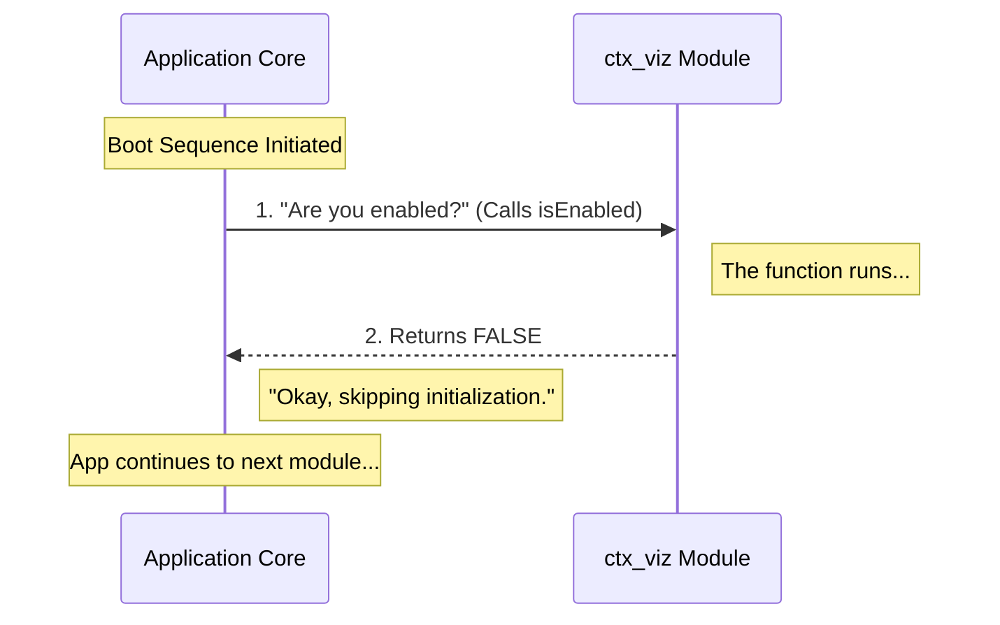

# Chapter 3: Feature Flagging Strategy

Welcome back! In the previous chapter, [Component Identity](02_component_identity.md), we gave our module a proper name (`'ctx_viz'`) so the system knows exactly who it is dealing with.

Now that our module has a name badge, we need to decide if it is allowed to enter the party.

## Why do we need a Feature Flag?

Imagine you are an electrician wiring a house. You install a new powerful appliance, but you aren't sure if the wiring is perfect yet. You don't want to risk blowing the main power grid of the house.

What do you do? You flip the specific circuit breaker for that room to **OFF**.

This is exactly what a **Feature Flagging Strategy** is. It allows us to deploy code that might be unfinished or experimental without breaking the rest of the application.

### The Use Case

We have our `ctx_viz` module. It is currently empty and "under construction." If the application tries to run complex logic inside it right now, it might crash or cause errors.

**The Goal:** We want to create a "Master Switch" that tells the application: "Do not execute this module's logic."

## How it Works

In our system, this safety switch is represented by a specific function called `isEnabled`.

This function represents a contract (an agreement) between the application and the module. The application promises to ask, "Are you enabled?" before running any code. The module promises to answer `true` or `false`.

### The Implementation

Let's look at our `index.js` file again. We are going to focus specifically on the `isEnabled` property.

```javascript
// File: index.js
export default {
  // The Feature Flagging Strategy
  isEnabled: () => false,

  isHidden: true,
  name: 'ctx_viz' 
};
```

**Breaking it down:**
1.  **The Function:** We define `() => false`. This is an arrow function.
2.  **The Logic:** Right now, it immediately returns `false`.
3.  **The Result:** It is like taping the light switch to the "OFF" position.

**What will happen?**
When the application attempts to start the `ctx_viz` module, it will call this function. Receiving a `false` acts as a hard stop. The application will skip the initialization of this module entirely.

### Why use a function?

You might wonder, "Why not just write `isEnabled: false`?"

We use a function to allow for **future flexibility**. Right now, the answer is always "No." But later, we might want the logic to be smarter:

```javascript
// A hypothetical future version
isEnabled: () => {
    // Only turn on for Admin users
    return user.isAdmin; 
}
```

By defining it as a function now, we prepare our code for complex strategies later without changing how the application core calls it.

## Under the Hood

How does the application respect this switch? Let's visualize the process when the application is booting up.

### The Flow

The Application Core acts like a gatekeeper. It checks the "status" of every module before letting them run.



### Code Deep Dive

Let's look at the code running inside the **Application Core** (the machinery that loads your file). It creates a safety check around your module.

```javascript
// Inside the Application Core logic
function initializeModule(module) {
  
  // 1. The Safety Check
  if (module.isEnabled() === false) {
    console.log(`Skipping ${module.name}: Module is disabled.`);
    return; // STOP HERE
  }

  // 2. The Execution (Only happens if true)
  console.log(`Starting ${module.name}...`);
  // module.start(); 
}
```

**Explanation:**
1.  **The Call:** The core calls `module.isEnabled()`.
2.  **The Comparison:** It checks if the result is `false`.
3.  **The Guard Clause:** If it is false, it uses `return` to stop the function immediately. The code below the check never runs.

This ensures that no matter how broken or empty your module is "under the hood," the application is safe because the gatekeeper stopped it at the door.

## Conclusion

You have now implemented a **Feature Flagging Strategy**.

- You defined a contract using the `isEnabled` function.
- You set the strategy to "Always Off" (`false`).
- You ensured the safety of the application while you work on the features.

However, even if a module is turned "Off" in the logic, it might still try to show up in the navigation menus as a broken link. We need a way to control its appearance independently of its logic.

[Next Chapter: Visibility Control](04_visibility_control.md)

---

Generated by [Code IQ](https://github.com/adityasoni99/Code-IQ)