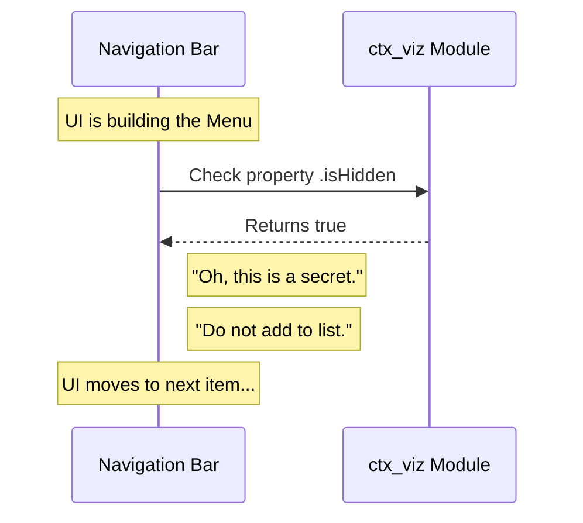

# Chapter 4: Visibility Control

Welcome to the fourth chapter of our tutorial! 

In the previous chapter, [Feature Flagging Strategy](03_feature_flagging_strategy.md), we learned how to use a "circuit breaker" (`isEnabled`) to stop our module's code from running. We ensured that our `ctx_viz` module is effectively turned "OFF".

However, just because a device is turned off doesn't mean it disappears from the room. A TV that is turned off still sits on the wall.

Today, we are going to learn how to make the TV invisible. This is the concept of **Visibility Control**.

## Why do we need Visibility Control?

Imagine you are renovating a room in your house. You have a door leading to that room. You lock the door (Feature Flagging) so no one enters. But guests still see the door in the hallway, and they might try the handle or ask, "What's in there?"

It would be much better if you could put a bookshelf in front of that door so no one even knows it exists.

### The Use Case

We have our `ctx_viz` module.
1.  **Identity:** It is named `'ctx_viz'` (from [Component Identity](02_component_identity.md)).
2.  **Status:** It is disabled (from [Feature Flagging Strategy](03_feature_flagging_strategy.md)).

**The Problem:** If we generate a Navigation Menu based on our modules, `ctx_viz` might still show up as a button. It might be a grayed-out disabled button, or clicking it might do nothing. This confuses the user.

**The Goal:** We want to completely remove this module from the visual interface (menus, lists, sidebars) so the user doesn't even know it is there.

## How it Works

To achieve this, we use a simple property called `isHidden`.

This property acts like a "Stealth Mode" or a hidden file on your computer desktop. It tells the user interface system: "Do not render me."

### The Implementation

Let's finalize our `index.js` file. We will explicitly set the visibility to create our "Magician's Trapdoor."

```javascript
// File: index.js
export default {
  isEnabled: () => false,
  
  // The Visibility Control
  isHidden: true, 
  
  name: 'ctx_viz'
};
```

**What happens here?**
1.  **Input:** We set `isHidden` to `true`.
2.  **Output:** When the application builds the sidebar menu, it will completely skip this item. It won't render a button, a link, or a placeholder. It effectively vanishes from the screen.

### Independent Controls

You might ask: *"If `isEnabled` is false, shouldn't it automatically be hidden?"*

Not always! Imagine these scenarios:
1.  **Coming Soon:** A feature is disabled (grayed out) but visible to tease users about an upcoming update. (`isEnabled: false`, `isHidden: false`).
2.  **Secret Admin Tool:** A feature works perfectly but shouldn't be in the main menu; you have to know the secret URL to get there. (`isEnabled: true`, `isHidden: true`).

By keeping **Logic** (`isEnabled`) and **Visibility** (`isHidden`) separate, we gain full control.

## Under the Hood

How does the application make the item disappear? Let's look at the process the user interface (UI) goes through when drawing the menu.

### The Flow

Think of the Navigation Bar as a **Party Organizer** making a guest list.



The Navigation Bar looks at the module. It sees the "Hidden" tag. It simply moves on to the next item without drawing anything on the screen.

### Code Deep Dive

Let's look at how the **Application Core** usually handles this. It typically uses a filtering process.

Imagine the application has an array (a list) of all the modules it found.

```javascript
// Inside the Application Core / Navigation Component
const allModules = [ dashboard, settings, ctx_viz ];

// We want to create the menu items
const visibleMenu = allModules.filter(module => {
  // If isHidden is true, exclude it!
  return module.isHidden !== true;
});

// visibleMenu is now just: [ dashboard, settings ]
```

**Explanation:**
1.  **The List:** We start with all three modules.
2.  **The Filter:** We use the JavaScript `.filter()` method. This allows us to create a *new* list based on a rule.
3.  **The Rule:** "Only keep items where `isHidden` is NOT true."
4.  **The Result:** The `ctx_viz` module is dropped from the list. When the menu is drawn on the screen, the code loops through `visibleMenu`, so `ctx_viz` is physically impossible to see.

## Conclusion

Congratulations! You have completed the setup for your module.

Let's review what we have built across these four chapters:
1.  We created a **Stub** to reserve a file in the system.
2.  We gave it a **Component Identity** (`name: 'ctx_viz'`) so the system can track it.
3.  We applied a **Feature Flag** (`isEnabled: false`) to ensure it doesn't run broken code.
4.  We applied **Visibility Control** (`isHidden: true`) so it stays invisible to the user.

You now have a perfectly safe, isolated environment within the main application. You can now begin writing the complex logic for `ctx_viz` "under the hood" without worrying about crashing the app or confusing users.

This concludes the foundational tutorial for `ctx_viz`. Happy coding!

---

Generated by [Code IQ](https://github.com/adityasoni99/Code-IQ)