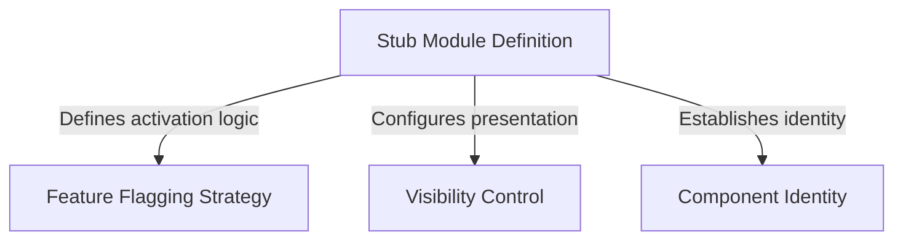

# Tutorial: ctx_viz

This project defines a **placeholder module** that acts as a structural "stub" for a feature that is not yet active. It establishes a standard interface for the application but relies on specific settings to remain **disabled** and *hidden* from the user view, effectively reserving a spot in the system without executing any logic.

## Chapters

1. [Stub Module Definition](01_stub_module_definition.md)
2. [Component Identity](02_component_identity.md)
3. [Feature Flagging Strategy](03_feature_flagging_strategy.md)
4. [Visibility Control](04_visibility_control.md)

---

Generated by [Code IQ](https://github.com/adityasoni99/Code-IQ)