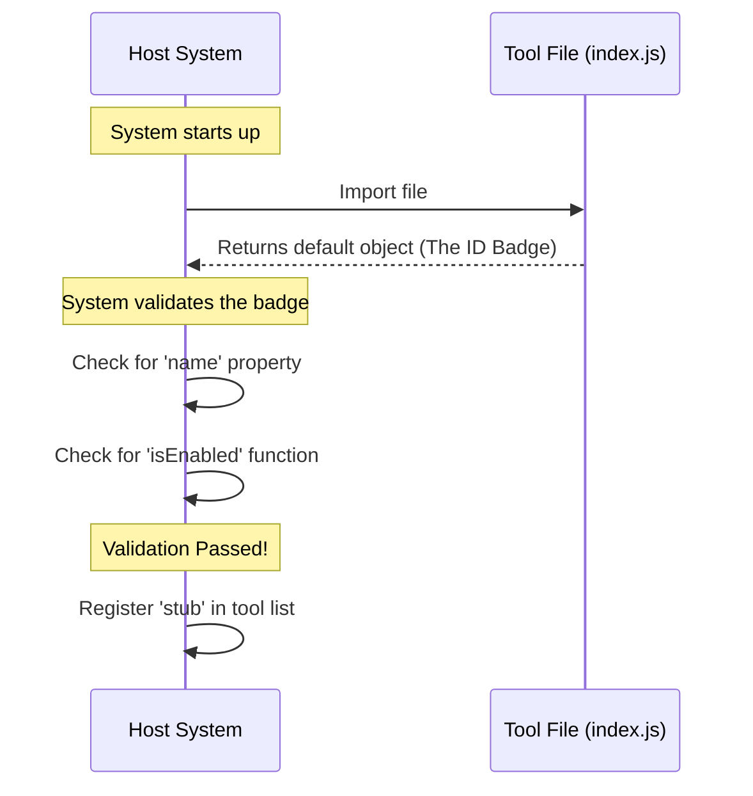

# Chapter 1: Tool Configuration Interface

Welcome to the `debug-tool-call` project! This is the starting point of our journey.

## The Problem: Chaos in the Toolbox

Imagine you are building a large software system. You want to plug in different debugging tools—like a logger, a performance tracker, or a feature flag checker.

If every tool worked differently, the main system would be very confused:
*   *Tool A:* "Call `start()` to turn me on."
*   *Tool B:* "Set `active = true` to enable me."
*   *Tool C:* "I don't have a name, just run me."

This inconsistency creates a mess. The system shouldn't need to learn a new language for every tool it uses.

## The Solution: The ID Badge

To solve this, we use a **Tool Configuration Interface**. Think of this like a corporate **ID Badge**.

Regardless of whether an employee is a CEO, a Janitor, or a Security Guard, their ID badge always looks the same. It has their **Name**, their **Access Level**, and their **Active Status** in the exact same place on the card.

Because the badge is standardized, the security scanner (our System) doesn't need to know *who* the person is; it just needs to know how to read the badge.

In our code, this "ID Badge" is a simple JavaScript object that every tool must export.

### Core Concept: The Contract

The **Tool Configuration Interface** is a contract. It says: *"If you provide an object with these specific properties, the system promises to load and manage your tool correctly."*

We are going to build a "Stub" tool—a placeholder that doesn't do anything yet—just to verify we can pass the security check.

## How to implement the Interface

To follow the contract, our tool needs to export a default object with three specific pieces of information.

### Step 1: Define the Object

We need an object with three properties:
1.  **name**: What is the tool called?
2.  **isEnabled**: Is the tool turned on right now?
3.  **isHidden**: Should this tool be invisible in the UI?

```javascript
// A simple configuration object
const toolConfig = {
  name: 'stub',           // The ID
  isHidden: true,         // Visibility
  isEnabled: () => false  // Status check
};
```

### Step 2: Export the Object

For the system to find this "badge," we must export it as the `default` value of our file.

```javascript
// Exporting the config so the system can read it
export default {
  name: 'stub',
  isHidden: true,
  isEnabled: () => false
};
```

*Explanation:* When the system imports this file, it grabs this object immediately. It doesn't run complex code; it just inspects the badge.

## Use Case Scenario

**Input:** The system loads your file `index.js`.
**Action:** The system checks if `default` export exists and looks for the required keys.
**Output:** The system registers a tool named `'stub'`, marks it as hidden, and notes that it is currently disabled. Success!

## Under the Hood: Internal Implementation

What happens when the system tries to load your tool? Let's visualize the "Security Check" process.



### Deep Dive: The Code Structure

Let's look at the actual code implementation in `index.js`. It is intentionally minimal.

--- **File: index.js** ---

```javascript
export default { 
  isEnabled: () => false, 
  isHidden: true, 
  name: 'stub' 
};
```

This single line of code is the entire "ID Badge." Let's break down the properties on this badge. Don't worry about the details of *how* they work yet; just understand *that* they exist.

1.  **`name: 'stub'`**
    This is the unique identifier. Just like the name printed on a badge. We will explore naming conventions in [Component Identity](02_component_identity.md).

2.  **`isEnabled: () => false`**
    This is a small function (logic) that tells the system if the tool is ready to work. Currently, it always returns `false` (disabled). We will learn to make this dynamic in [Runtime Availability Logic](03_runtime_availability_logic.md).

3.  **`isHidden: true`**
    This acts like a cloak. It tells the system, "I am here, but don't show me in the dashboard." We will discuss why you might hide tools in [Visibility Management](04_visibility_management.md).

## Summary

In this chapter, we learned that:
1.  The **Tool Configuration Interface** is a standardized contract (like an ID Badge).
2.  It allows the system to manage different tools in a uniform way.
3.  We implement it by exporting a specific JavaScript object.

We have successfully created a badge, but we need to understand what writes onto that badge. In the next chapter, we will focus specifically on the name tag.

[Next Chapter: Component Identity](02_component_identity.md)

---

Generated by [Code IQ](https://github.com/adityasoni99/Code-IQ)