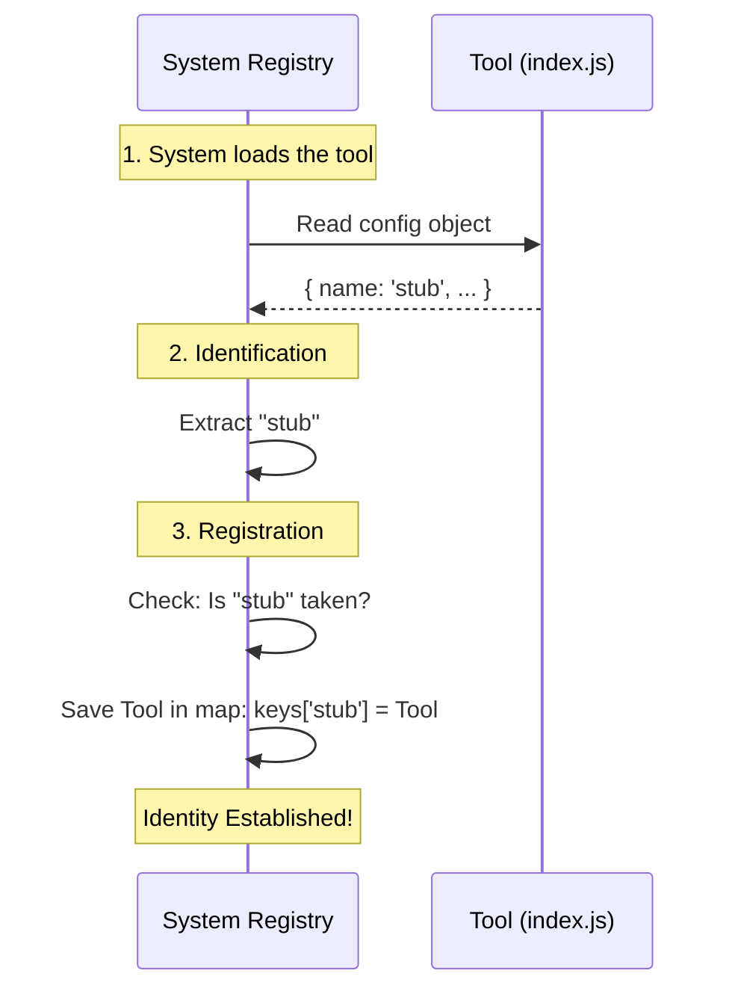

# Chapter 2: Component Identity

In the previous chapter, [Tool Configuration Interface](01_tool_configuration_interface.md), we established the "ID Badge" contract. We learned that every tool must export a specific object so the system can recognize it.

Now, we need to fill in the most important line on that badge: **The Name**.

## The Problem: The "Hey You!" Confusion

Imagine a busy parking lot managed by a computer system. There are hundreds of cars: some are red, some are blue, some are fast, and some are slow.

If the parking system wants to charge a specific car for parking, it can't just say, "Charge the red car." There might be fifty red cars! It needs a specific, unique way to identify exactly *one* vehicle.

In software, we have the same problem. Your application might load 20 different debugging tools. When the application wants to say, "The user just clicked a button, please tell the **Stub** tool to log this," it needs a unique handle to find that specific tool.

## The Solution: The License Plate

To solve this, we use **Component Identity**.

Think of the `name` property in our code as a **License Plate**.
*   The car's engine is complex (internal logic).
*   The car's interior is private (internal state).
*   But the **License Plate** is a simple string of text that anyone can read to identify the car.

Traffic cameras don't care how the engine works; they just read the plate. Similarly, our System doesn't need to know how our tool works; it just reads the `name` to track it.

## How to Implement Component Identity

To give our tool an identity, we assign a string (text) to the `name` property of our configuration object.

### Use Case Scenario

**Goal:** The system wants to register our tool so it can send logs to it later.
**Input:** The system reads our file.
**Action:** The system extracts the `name` property.
**Output:** The system saves our tool into a list under the label `'stub'`.

### Step 1: Naming the Tool

We are building a "Stub" tool (a placeholder). So, we will give it the identity `'stub'`.

```javascript
// index.js
export default {
  name: 'stub',          // <--- This is the Identity
  isEnabled: () => false,
  isHidden: true
};
```

**Explanation:**
*   We use a simple, lowercase string: `'stub'`.
*   This string must be **unique**. If another tool tries to name itself `'stub'`, the system would likely reject it (just like two cars can't have the same license plate).

### Why use a string?
Strings are easy for computers to compare. `if (tool.name === 'stub')` is a very fast and reliable check.

## Under the Hood: Internal Implementation

What happens inside the system when it reads this name? Let's look at the registration process.

The system acts like a parking garage attendant writing down license plates in a ledger.



### Deep Dive: The Code Structure

Let's look at the file `index.js` again. While the other properties define behavior, `name` defines *existence*.

--- **File: index.js** ---

```javascript
export default { 
  // The unique identifier for this module
  name: 'stub', 
  
  // Other configuration details
  isEnabled: () => false, 
  isHidden: true, 
};
```

Even though the code is simple, the implications are important:

1.  **Referencing:** Other parts of the app can now say `getTool('stub')` to find this specific code.
2.  **Logging:** If this tool crashes, the error log will say "Error in module: stub", making it easy for you to find the bug.
3.  **Independence:** The rest of the system references the string `'stub'`, not the complex file path or the function logic.

## Linking to Other Concepts

Notice the other properties sitting next to our name?

*   `isEnabled`: Now that the system knows *who* the tool is (Name), it needs to ask *if* it is working. We cover this in [Runtime Availability Logic](03_runtime_availability_logic.md).
*   `isHidden`: The system knows the tool's name, but does the user need to see it? We cover this in [Visibility Management](04_visibility_management.md).

## Summary

In this chapter, we learned:
1.  **Component Identity** acts like a car's license plate.
2.  It allows the system to distinguish our tool from others using a unique string.
3.  We implement it simply by setting `name: 'stub'`.

Now that our tool has an ID badge and a name printed on it, the system needs to know if the employee is actually at their desk working or on vacation.

[Next Chapter: Runtime Availability Logic](03_runtime_availability_logic.md)

---

Generated by [Code IQ](https://github.com/adityasoni99/Code-IQ)