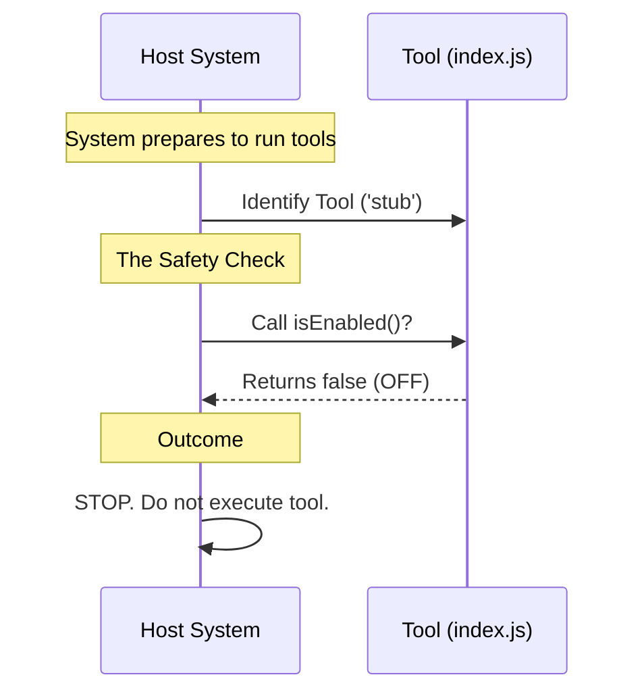

# Chapter 3: Runtime Availability Logic

In the previous chapter, [Component Identity](02_component_identity.md), we gave our tool a unique name (`'stub'`) so the system could find it.

Now that the system knows *who* the tool is, it needs to ask a critical question: **"Are you allowed to work right now?"**

## The Problem: The Uncontrolled Appliance

Imagine you are wiring a house. You plug a lamp into the wall. If there were no switches, the lamp would stay on forever, wasting electricity or burning out the bulb. You need a way to control the flow of power without unplugging the entire device.

In software, we have the same need. We might have code for a "Debug Tool" loaded into our app, but we don't always want it running.
*   Maybe it's only for Admin users.
*   Maybe it slows down the app, so we only want it on during emergencies.
*   Maybe the feature isn't finished yet.

If we don't have a switch, our only option is to delete the code, which is messy and dangerous.

## The Solution: The Master Circuit Breaker

We solve this using **Runtime Availability Logic**. In our code, this is represented by the `isEnabled` function.

Think of `isEnabled` as a **Master Circuit Breaker** for this specific tool.
*   If the breaker is **ON** (`true`), electricity flows, and the tool runs.
*   If the breaker is **OFF** (`false`), the system cuts the power. The code sits there silently, doing nothing.

## How to Implement the Logic

For our specific project, we are building a "Stub"—a placeholder tool that shouldn't actually *do* anything yet. Therefore, we want our circuit breaker to be permanently flipped **OFF**.

### The `isEnabled` Function

We define a function that, when asked, simply replies "No."

```javascript
// index.js

export default {
  name: 'stub',
  
  // The Circuit Breaker
  isEnabled: () => false, 
  
  isHidden: true
};
```

**Explanation:**
1.  **`() =>`**: This is an "Arrow Function." It's a shorthand way of writing a function.
2.  **`false`**: This is the return value.
3.  **Logic**: Whenever the system calls this function, it immediately gets the value `false`. This effectively disables the tool.

### Use Case Scenario

**Goal:** The system is running and wants to know if it should activate the 'stub' tool.
**Input:** The system calls `tool.isEnabled()`.
**Action:** The function executes and returns `false`.
**Output:** The system sees `false`, so it **skips** executing any further logic for this tool. It remains safe and silent.

## Under the Hood: Internal Implementation

How does the system use this switch? Let's visualize the decision-making process. The system acts like a safety inspector checking the breaker panel before turning on the machine.



### Deep Dive: The Code Structure

Let's look closely at `index.js` again. Why is `isEnabled` a function and not just a variable like `isEnabled: false`?

--- **File: index.js** ---

```javascript
export default { 
  // ... other properties ...
  
  // A function allows for future logic!
  isEnabled: () => false, 
};
```

**Why a function?**
Right now, we are hardcoding it to `false`. However, because it is a *function*, we could change the logic later without changing the rest of the system.

Imagine if we wanted the tool to turn on *only on Tuesdays*:
```javascript
// Hypothetical future update
isEnabled: () => {
  const today = new Date().getDay();
  return today === 2; // Returns true only on Tuesday
}
```

By defining it as a function in our [Tool Configuration Interface](01_tool_configuration_interface.md), we give ourselves the flexibility to add complex logic later. For now, however, we keep it simple: **Always False**.

## Summary

In this chapter, we learned:
1.  **Runtime Availability Logic** acts as a safety switch or circuit breaker.
2.  It prevents the tool from executing code when it shouldn't.
3.  We implement it using the `isEnabled` function, which currently returns `false` to disable our stub tool.

Our tool has a name, and we've ensured it won't accidentally run and break things. But even if it's turned off, does it still clutter up our menu?

In the next chapter, we will decide whether this tool should be seen by the human eye.

[Next Chapter: Visibility Management](04_visibility_management.md)

---

Generated by [Code IQ](https://github.com/adityasoni99/Code-IQ)