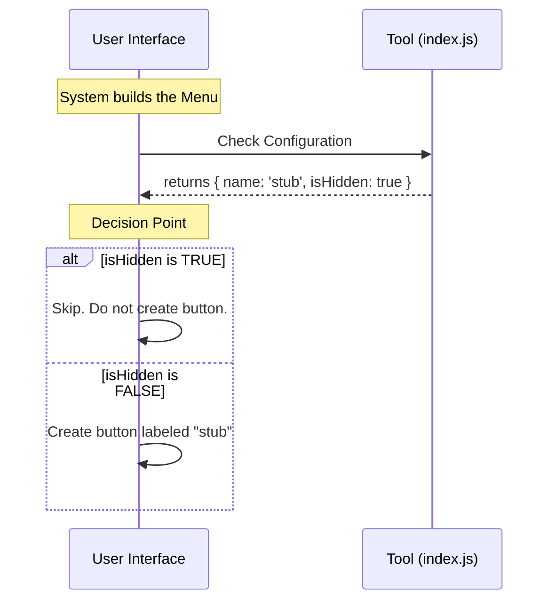

# Chapter 4: Visibility Management

In the previous chapter, [Runtime Availability Logic](03_runtime_availability_logic.md), we implemented a "circuit breaker" to stop our tool from running its logic using the `isEnabled` function.

Now that we know how to turn the tool's engine off, we need to answer a different question: **Should the audience see the tool on the stage?**

## The Problem: The Cluttered Dashboard

Imagine you are watching a theater play. There are actors on stage, but there are also stagehands moving props in the background.

*   The actors are the **Features** the user interacts with.
*   The stagehands are the **System Tools** that make things work.

The stagehands are crucial, but you don't want them blocking the view of the main actors. If every single background tool appeared on the main menu, your application would look messy, confusing, and overwhelming.

We need a way to tell the system: *"I am here, and I am part of the crew, but please don't shine a spotlight on me."*

## The Solution: The Invisible Cloak

We solve this using **Visibility Management**. In our code, this is controlled by the `isHidden` property.

Think of `isHidden` as the **Stagehand's Black Clothing**.
*   **`isHidden: false`**: The actor is wearing a costume. They stand center stage. The user sees them in the menu.
*   **`isHidden: true`**: The stagehand wears all black. They are present in the room, but they blend into the shadows so the audience doesn't notice them.

## Implementation Details

We are building a "Stub" tool. Since this tool is just a placeholder and doesn't do anything useful yet, we don't want users clicking on it. It would just confuse them.

Therefore, we will hand our tool the "black clothing" to wear.

### The `isHidden` Property

We add a simple boolean (true/false) value to our configuration object.

```javascript
// index.js

export default {
  name: 'stub',
  isEnabled: () => false,
  
  // The Invisible Cloak
  isHidden: true
};
```

**Explanation:**
1.  **`isHidden`**: This is the property name the system looks for.
2.  **`true`**: By setting this to true, we are explicitly asking the User Interface (UI) to hide us.

### Use Case Scenario

**Goal:** The system is drawing the navigation menu for the user.
**Input:** The system reads our `index.js` file.
**Action:** The system checks the value of `isHidden`.
**Output:** Because it is `true`, the system **skips** drawing a button for "stub". The tool is loaded in memory, but invisible on screen.

### Distinction: Disabled vs. Hidden

It is easy to confuse [Runtime Availability Logic](03_runtime_availability_logic.md) (`isEnabled`) with Visibility Management (`isHidden`). Here is the difference:

| Property | Concept | Analogy |
| :--- | :--- | :--- |
| **`isEnabled`** | **Logic**. Can the code run? | Is the car engine on? |
| **`isHidden`** | **Visual**. Can the user see it? | Is the car parked in the garage (hidden) or the driveway (visible)? |

*   You can have a tool that is **Enabled** (working) but **Hidden** (running in the background).
*   You can have a tool that is **Disabled** (broken) and **Visible** (grayed out in the menu).

For our Stub, we want it both **Disabled** (safe) and **Hidden** (clean).

## Under the Hood: Internal Implementation

How does the system decide what to draw? Let's visualize the "Menu Builder" process.



### Deep Dive: The Code Structure

Let's look at the final piece of our `index.js`.

--- **File: index.js** ---

```javascript
export default { 
  isEnabled: () => false, 
  
  // Visibility Management
  isHidden: true, 
  
  name: 'stub' 
};
```

**Why do we need to export this?**
You might ask: *"If the tool is hidden and disabled, why load it at all?"*

1.  **Development:** It helps developers know the file is correctly linked, even if users don't see it.
2.  **Toggle-ability:** In the future, you might change this to `isHidden: false` for "Admin" users, but keep it `true` for "Regular" users.
3.  **Completeness:** It fulfills the [Tool Configuration Interface](01_tool_configuration_interface.md) contract. The system expects this property to exist.

## Summary

In this chapter, we learned:
1.  **Visibility Management** separates the concept of a tool "existing" from a tool "being seen."
2.  It allows us to keep the user interface clean by hiding background or incomplete tools.
3.  We implement it by setting `isHidden: true`.

We have now fully defined our tool's ID Badge: it has a Name ([Component Identity](02_component_identity.md)), a Status ([Runtime Availability Logic](03_runtime_availability_logic.md)), and a Visibility setting.

We have a perfect description of a tool, but we haven't actually organized the files to make this a reusable pattern yet. In the final chapter, we will put it all together.

[Next Chapter: Stub Implementation Pattern](05_stub_implementation_pattern.md)

---

Generated by [Code IQ](https://github.com/adityasoni99/Code-IQ)