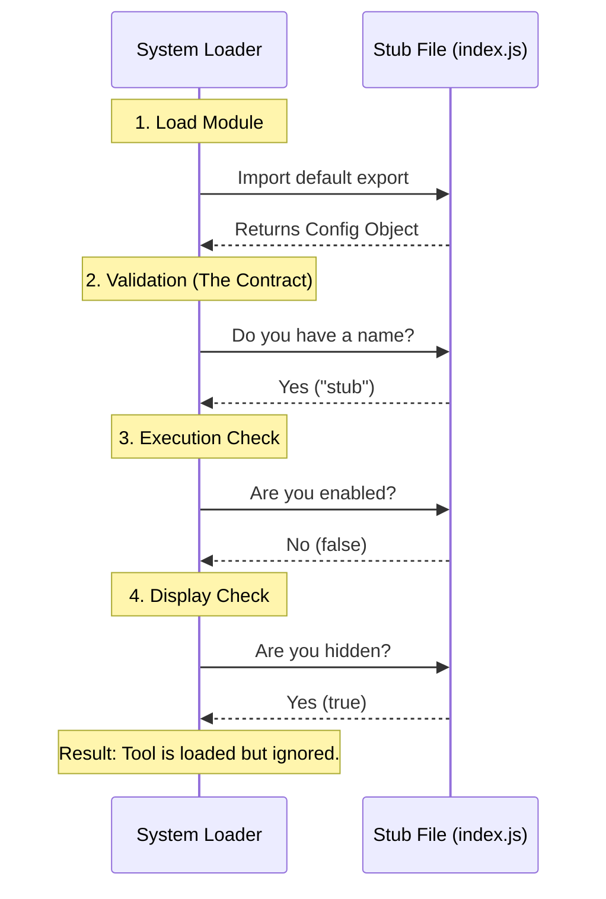

# Chapter 5: Stub Implementation Pattern

In the previous chapter, [Visibility Management](04_visibility_management.md), we learned how to hide our tool from the user interface. Before that, we established its [Component Identity](02_component_identity.md) and its [Runtime Availability Logic](03_runtime_availability_logic.md).

Now, we are going to combine all these concepts into a single, cohesive strategy known as the **Stub Implementation Pattern**.

## The Problem: The "Under Construction" Gap

Imagine you are building a new kitchen. You have a space cut out in the counter for a dishwasher, but the dishwasher hasn't been delivered yet.

If you leave that space empty:
1.  **It looks bad:** There is a gaping hole in your kitchen.
2.  **It is dangerous:** Exposed wires or pipes could cause accidents.
3.  **It breaks the flow:** You can't visualize the final room.

In software, when you start creating a new feature (like a new debugging tool), you often aren't ready to write the complex logic yet. However, the system expects *something* to be there. If you provide nothing, the system might crash with a "Module Not Found" error.

## The Solution: The Prop Book

We solve this using a **Stub**.

A **Stub** is like a "prop" book on a furniture store shelf.
*   It looks like a book.
*   It sits where a book belongs.
*   It completes the look of the room.
*   **But if you open it, the pages are blank.**

The Stub Implementation Pattern allows us to satisfy the system's strict [Tool Configuration Interface](01_tool_configuration_interface.md) immediately, without writing any actual logic. It creates a safe, silent placeholder.

## How to Implement the Pattern

The pattern is defined by a specific combination of the three properties we learned in previous chapters.

### The Formula

To create a valid Stub, your object must follow this exact formula:
1.  **Identity:** A real, unique name.
2.  **Availability:** Always `false` (Disabled).
3.  **Visibility:** Always `true` (Hidden).

### Use Case Scenario

**Goal:** You want to add a file for a future tool so your team knows where it belongs, but you don't want it to affect the app yet.
**Input:** You create `index.js` using the Stub Pattern.
**Output:** The system loads the file successfully, registers it, but never runs it or shows it. It is a "ghost" tool.

### The Code

Here is the complete implementation of the Stub Pattern.

```javascript
// index.js

export default {
  // 1. Identity: Must be present and unique
  name: 'stub',

  // 2. Logic: Permanently switched OFF
  isEnabled: () => false,

  // 3. Visibility: Permanently Hidden
  isHidden: true
};
```

**Explanation:**
*   By exporting this object, we fulfill the contract. The system is happy.
*   Because `isEnabled` is false, we consume zero CPU power.
*   Because `isHidden` is true, we take up zero screen space.

## Under the Hood: The Lifecycle of a Stub

What happens when the system encounters a Stub? It goes through a "Safety Inspection."



### Deep Dive: Why use this pattern?

You might ask, *"Why write code that does nothing?"*

Let's look at the alternative. If we didn't use the Stub Pattern, we might try to leave the file empty or incomplete.

**Bad Approach (Incomplete Code):**
```javascript
// BAD: Missing required properties
export default {
  name: 'stub'
  // Missing isEnabled!
  // Missing isHidden!
};
```

If the system tries to read `tool.isEnabled()`, it will crash because the function doesn't exist.

**The Stub Pattern Advantage:**
1.  **Crash Prevention:** It prevents `undefined` errors.
2.  **Development Workflow:** You can commit this file to your code repository today. Your teammates can see it.
3.  **Incremental Building:** Next week, you can change `isEnabled` to return `true`. The week after, you can change `isHidden` to `false`. The Stub is the solid foundation you build upon.

## Reviewing the Architecture

Throughout this tutorial, we have built a robust system for managing tools. Let's see how the Stub fits into the concepts we've learned:

1.  It respects the **Contract** defined in [Tool Configuration Interface](01_tool_configuration_interface.md).
2.  It establishes a unique **Identity** as discussed in [Component Identity](02_component_identity.md).
3.  It ensures safety via **Availability** logic from [Runtime Availability Logic](03_runtime_availability_logic.md).
4.  It keeps the UI clean via **Visibility** settings from [Visibility Management](04_visibility_management.md).

## Conclusion

In this final chapter, we learned that the **Stub Implementation Pattern** is a strategic way to create valid, safe placeholders in our application. It acts like a prop book—filling the space perfectly while remaining functionally blank.

By mastering this pattern, you can introduce new tools into complex systems without fear of breaking existing functionality or cluttering the user interface.

**Congratulations!** You have completed the `debug-tool-call` tutorial series. You now understand how to configure, identify, manage, and implement debugging tools in a modular system.

---

Generated by [Code IQ](https://github.com/adityasoni99/Code-IQ)