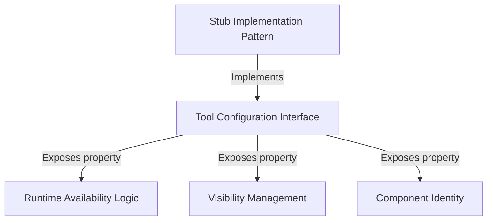

# Tutorial: debug-tool-call

This project defines a standardized **placeholder** for a debugging tool within a larger system. It uses a specific *configuration contract* to register the tool, but deliberately sets it to be **disabled** and **hidden** (a "stub"), ensuring it stays inactive until real functionality is added.

## Chapters

1. [Tool Configuration Interface](01_tool_configuration_interface.md)
2. [Component Identity](02_component_identity.md)
3. [Runtime Availability Logic](03_runtime_availability_logic.md)
4. [Visibility Management](04_visibility_management.md)
5. [Stub Implementation Pattern](05_stub_implementation_pattern.md)

---

Generated by [Code IQ](https://github.com/adityasoni99/Code-IQ)