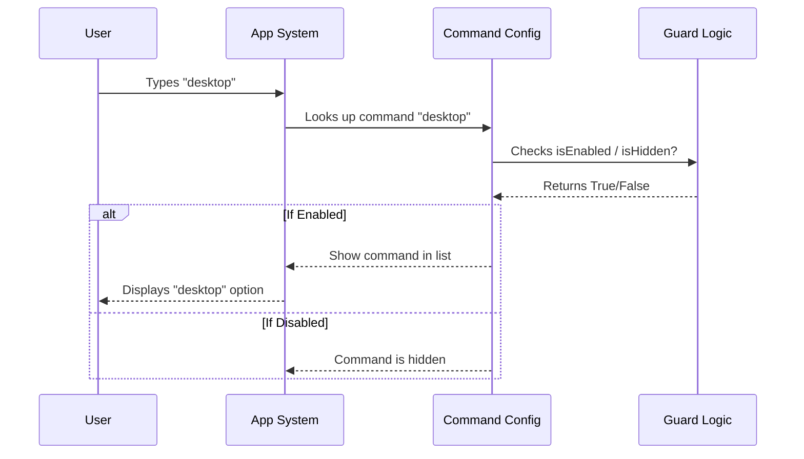

# Chapter 1: Command Configuration

Welcome to the **desktop** project! In this first chapter, we are going to look at the foundation of any feature in our system: the **Command Configuration**.

## What is Command Configuration?

Imagine you are running a restaurant. Before a customer can order a specific dish, you need to list it on the menu. The menu tells the customer:
1.  **Name:** What the dish is called.
2.  **Description:** What the dish tastes like.
3.  **Availability:** Who is allowed to order it (maybe it's a lunch special).

In our code, the **Command Configuration** is exactly like that menu item. It is a "blueprint" or an "ID card" that tells the system that a feature called "desktop" exists, how to identify it, and when to show it.

### The Use Case: Adding the "Desktop" Feature

We want to add a feature that lets a user switch their current conversation to the **Claude Desktop** app. But the system doesn't know this feature exists yet. We need to create a configuration object to register it.

## Key Concepts

Let's break down the configuration into small, manageable pieces.

### 1. Identity (Name and Description)

First, we need to give our command a name and tell the user what it does.

```typescript
const desktop = {
  type: 'local-jsx',
  name: 'desktop', // The main command ID
  aliases: ['app'], // Shortcuts (e.g., typing 'app' works too)
  description: 'Continue the current session in Claude Desktop',
  // ... more settings below
}
```

**Explanation:**
*   `name`: This is the official ID. If the user types "desktop", this command triggers.
*   `aliases`: These are nicknames. If a user prefers typing "app", it will do the same thing.
*   `description`: A helpful hint shown to the user explaining what will happen.

### 2. Availability (Who and When?)

Not every command should be available to everyone or at all times. We need rules for visibility.

```typescript
// ... inside the desktop object
  availability: ['claude-ai'], // Only available in this context
  isEnabled: isSupportedPlatform, // A function checking if we can run it
  get isHidden() {
    return !isSupportedPlatform() // Hide it if we can't run it
  },
// ...
```

**Explanation:**
*   `availability`: Think of this like a VIP section. This command only works in the `claude-ai` environment.
*   `isEnabled` & `isHidden`: These act like a "Sold Out" sticker. We check a specific rule (called `isSupportedPlatform`) to see if the command should be active. We will learn exactly how this rule works in [Platform Guard](02_platform_guard.md).

### 3. The Recipe (Loading the Logic)

Finally, the menu needs to tell the kitchen where to find the recipe to actually cook the dish.

```typescript
// ... inside the desktop object
  load: () => import('./desktop.js'),
} satisfies Command
```

**Explanation:**
*   `load`: This doesn't run the code immediately. It points to *where* the code lives (`./desktop.js`). The system will only fetch this file when the user actually asks for the command. This concept is called **Lazy Loading**, which we will cover in [Lazy Module Loading](03_lazy_module_loading.md).
*   `satisfies Command`: This is a Typescript check. It ensures our "Menu Item" has all the required information (Name, Description, etc.).

## Putting It All Together

Here is how the complete configuration looks in `index.ts`. It combines the identity, the rules, and the loader into one object.

```typescript
import type { Command } from '../../commands.js'
// isSupportedPlatform logic helps us decide if we are on Mac/Windows
// We will build this in the next chapter.

const desktop = {
  type: 'local-jsx',
  name: 'desktop',
  aliases: ['app'],
  description: 'Continue the current session in Claude Desktop',
  availability: ['claude-ai'],
  isEnabled: isSupportedPlatform, // Reference to our guard function
  get isHidden() {
    return !isSupportedPlatform()
  },
  load: () => import('./desktop.js'),
} satisfies Command

export default desktop
```

## Internal Implementation: How it Works

When the application starts, it doesn't run the command immediately. It just reads this "menu." Here is what happens when a user searches for commands:



### Deep Dive: The `satisfies` Keyword

You might have noticed `satisfies Command` at the end of the object.

```typescript
} satisfies Command
```

Think of the `Command` interface as a **Form** provided by the government.
1.  The Form requires a `name`.
2.  The Form requires a `description`.
3.  The Form requires a `load` function.

By saying `satisfies Command`, we are telling TypeScript: "Check this object. Did I fill out the form correctly?" If we forgot the `name`, or if we put a number where a word belongs, TypeScript will give us an error immediately. This keeps our application crash-free and consistent.

## Conclusion

Congratulations! You have created the entry point for the "desktop" feature. We have defined **what** it is called, **who** can see it, and **where** the code lives.

 However, we referenced a mysterious function called `isSupportedPlatform` in our configuration. How do we know if the user is on a computer that actually supports this feature?

In the next chapter, we will write the security check that answers that question.

[Next Chapter: Platform Guard](02_platform_guard.md)

---

Generated by [Code IQ](https://github.com/adityasoni99/Code-IQ)