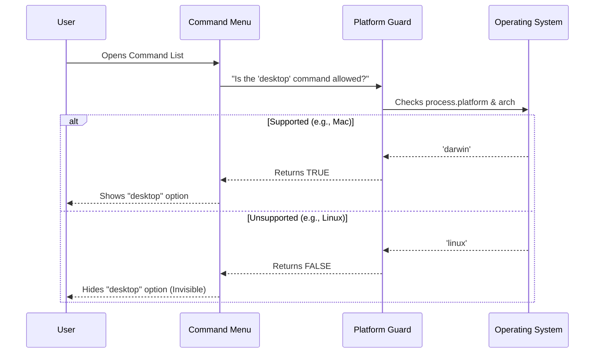

# Chapter 2: Platform Guard

In the previous chapter, [Command Configuration](01_command_configuration.md), we designed the "Menu Item" for our new feature. We decided that the desktop command *should* exist.

However, we left a placeholder in our code: a mysterious function called `isSupportedPlatform`.

## The Motivation: "You Must Be This Tall To Ride"

Imagine you are at an amusement park. Before you get on a rollercoaster, there is a sign that checks your height. If you are too short, the operator stops you for your own safety.

Our "Platform Guard" does the same thing. The feature we are building interacts with the **Claude Desktop App**. Currently, that app only works on:
1.  **macOS**
2.  **Windows (x64 architecture)**

If a user tries to run this on Linux or a mobile phone, the command will fail and look broken. To provide a high-quality experience, we should completely **hide** the command on unsupported computers.

## Key Concepts: Asking the System Questions

To build our guard, we need to ask the computer two questions: "What operating system are you?" and "What is your chip architecture?"

In our environment (Node.js), we use a global object called `process` to get these answers.

### 1. `process.platform`
This tells us the Operating System (OS).
*   **macOS** is called `'darwin'` (historical reasons!).
*   **Windows** is called `'win32'`.
*   **Linux** is called `'linux'`.

### 2. `process.arch`
This tells us about the CPU chip.
*   Standard Intel/AMD chips are usually `'x64'`.
*   Newer Apple Silicon or mobile chips might be `'arm64'`.

## Implementing the Guard

Let's write the `isSupportedPlatform` function step-by-step.

### Step 1: Checking for macOS

First, let's let macOS users in. They are always allowed.

```typescript
function isSupportedPlatform(): boolean {
  // Check if the OS is macOS ('darwin')
  if (process.platform === 'darwin') {
    return true // Allowed!
  }
  
  // ... check other systems below
  return false
}
```

**Explanation:**
We look at `process.platform`. If it is exactly equal to `'darwin'`, we immediately say "True" (Yes, this platform is supported).

### Step 2: Checking for Windows

Next, we check for Windows. But remember, we have a specific requirement: it must be `x64`.

```typescript
// ... inside the function
  // Check if OS is Windows AND architecture is x64
  if (process.platform === 'win32' && process.arch === 'x64') {
    return true // Allowed!
  }
// ...
```

**Explanation:**
We use `&&` (AND). Both conditions must be true. If the user is on Windows but using a different architecture (like ARM), this check fails, and we move on.

### Step 3: The Default Answer

If the computer is neither macOS nor Windows x64, what do we do? We deny entry.

```typescript
// ... at the very end of the function
  return false // Deny everyone else
}
```

**Explanation:**
This acts as a "catch-all." If none of the `if` statements above returned `true`, the function reaches this line and returns `false`.

## Putting It Together

Here is the complete guard function added to our file. It is simple, readable, and safe.

```typescript
// --- File: index.ts ---

function isSupportedPlatform(): boolean {
  if (process.platform === 'darwin') {
    return true
  }
  if (process.platform === 'win32' && process.arch === 'x64') {
    return true
  }
  return false
}
```

## Internal Implementation: The Gatekeeper Workflow

How does the system use this function? It happens automatically when the user opens the command palette.



### Hooking it up to Configuration

Now we connect our guard function to the configuration object we built in [Chapter 1](01_command_configuration.md).

```typescript
const desktop = {
  // ... name, description, etc ...
  
  // 1. Is the command clickable?
  isEnabled: isSupportedPlatform, 

  // 2. Should the command be invisible?
  get isHidden() {
    // If it is NOT supported, we hide it.
    return !isSupportedPlatform()
  },

  // ... load logic ...
} satisfies Command
```

**Explanation:**
1.  **`isEnabled`**: We pass the function itself. The system runs it to see if the feature is active.
2.  **`isHidden`**: This controls visibility. We use `!` (NOT).
    *   If `isSupportedPlatform` says **True** (Supported), `isHidden` becomes **False** (Visible).
    *   If `isSupportedPlatform` says **False** (Not Supported), `isHidden` becomes **True** (Invisible).

## Conclusion

We have successfully built a **Platform Guard**. Our feature is now smart enough to know where it is running. It will welcome macOS and Windows users while staying out of the way for Linux users to prevent errors.

Now that we have verified the user is allowed to use the feature, we need to actually load the code that performs the action. To keep our application fast, we don't want to load that code until the very last second.

In the next chapter, we will learn how to achieve this efficiency.

[Next Chapter: Lazy Module Loading](03_lazy_module_loading.md)

---

Generated by [Code IQ](https://github.com/adityasoni99/Code-IQ)