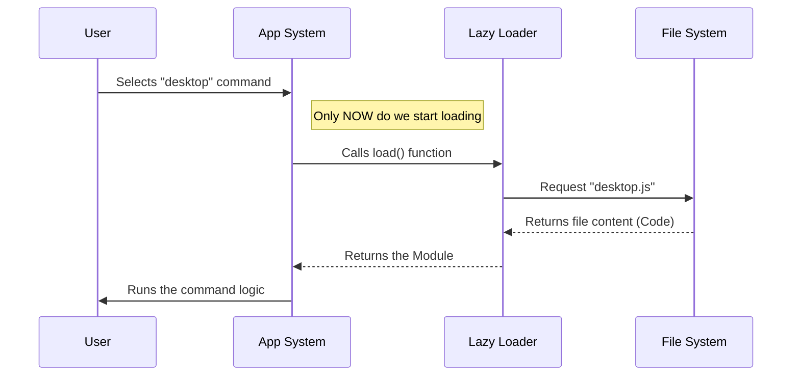

# Chapter 3: Lazy Module Loading

In the previous chapter, [Platform Guard](02_platform_guard.md), we built a security system to ensure our feature only runs on supported computers. We established safety.

Now, we are going to focus on **speed**.

## The Motivation: The Mechanic and the Truck

Imagine a master mechanic who owns a massive truck filled with thousands of specialty tools.
1.  **The "Slow" Way:** Every time the mechanic enters a customer's garage, they unload *every single tool* from the truck, just in case they might need one. This takes hours, and the garage gets crowded.
2.  **The "Lazy" Way:** The mechanic walks in with just a clipboard. If the job requires a specific heavy tool (like an engine hoist), *then* they walk back to the truck to get it.

In software, **Lazy Module Loading** is that second approach.

The code for our desktop feature might be "heavy" (containing complex logic or UI libraries). If we load it every time the application starts, the user waits longer, even if they never use the command. We want to keep the application lightweight and only fetch the "heavy tools" when the user specifically asks for them.

## Key Concepts: Static vs. Dynamic Imports

To understand how we achieve this, we need to look at how we import files in JavaScript.

### 1. Static Import (The "Unload Everything" Approach)
This is what you usually see at the very top of a file.

```typescript
// ❌ This loads the code immediately when the app starts!
import { HeavyFeature } from './heavy-feature.js';
```

When the computer sees this, it stops everything to read `heavy-feature.js` before it continues.

### 2. Dynamic Import (The "Fetch on Demand" Approach)
This is a special function that we can call *inside* our code.

```typescript
// ✅ This only loads the code when this line is executed
const myFeature = await import('./heavy-feature.js');
```

The `import()` function tells the system: "Go find this file now, read it, and come back to me when you are done."

## Implementing Lazy Loading

Let's look at how we implemented this in our command configuration from [Chapter 1: Command Configuration](01_command_configuration.md).

We didn't put the import at the top of `index.ts`. Instead, we put it inside a property called `load`.

### The Load Function

```typescript
// --- File: index.ts ---

const desktop = {
  // ... name, description, guard logic ...

  // The Lazy Loader:
  load: () => import('./desktop.js'),

} satisfies Command
```

**Explanation:**
1.  `load` is a function.
2.  Inside the function, we call `import('./desktop.js')`.
3.  Because this is inside a function (an arrow function `() => ...`), it does **not** run immediately.
4.  It sits there quietly, waiting to be called.

### What is `desktop.js`?

The file `./desktop.js` is the "heavy tool." It contains the actual code that draws the user interface and talks to the operating system. We will write the contents of this file in the next chapter.

For now, just know that `desktop.js` must have a **default export**. This is the entry point the loader is looking for.

```typescript
// --- File: desktop.js (Preview) ---

export default function DesktopCommand() {
  // This is the heavy logic!
  // It only runs after the dynamic import finishes.
  return "I have arrived!";
}
```

## Internal Implementation: How it Works

What happens when a user actually triggers the command? Here is the sequence of events.

### Step-by-Step Workflow

1.  **App Start:** The app reads the configuration. It sees the `load` function but does **not** execute it. `desktop.js` stays on the hard drive, keeping memory usage low.
2.  **User Action:** The user selects "desktop" from the menu.
3.  **Trigger:** The system calls the `load()` function we defined.
4.  **Fetching:** The `import('./desktop.js')` command runs. The system reads the file from the disk.
5.  **Execution:** Once the file is loaded, the system runs the logic inside it.

### The Flow Diagram



### Deep Dive: Promises

You might be wondering: "What happens while the computer is reading the file from the disk? Does the app freeze?"

No. The `import()` function returns something called a **Promise**.

Think of a Promise like a restaurant pager.
1.  You order food (Request the file).
2.  They give you a pager (The Promise).
3.  You can sit down and wait (The app stays responsive).
4.  When the pager buzzes (The Promise resolves), you get your food (The code is ready).

Our system handles this pager automatically. It shows a small loading spinner if the file takes a long time to read, ensuring the user always knows what is happening.

## Conclusion

By using **Lazy Module Loading**, we have kept our application fast and responsive. We are acting like the smart mechanic: keeping our heavy tools organized and only bringing them out when the job requires them.

So far, we have:
1.  Created the command ID card ([Command Configuration](01_command_configuration.md)).
2.  Secured it with a safety lock ([Platform Guard](02_platform_guard.md)).
3.  Optimized it to load efficiently (this chapter).

Now, the system has successfully fetched the `desktop.js` file. But what code goes inside that file? How do we actually show something to the user?

In the next chapter, we will build the visual interface that users interact with.

[Next Chapter: Visual Command Handler](04_visual_command_handler.md)

---

Generated by [Code IQ](https://github.com/adityasoni99/Code-IQ)