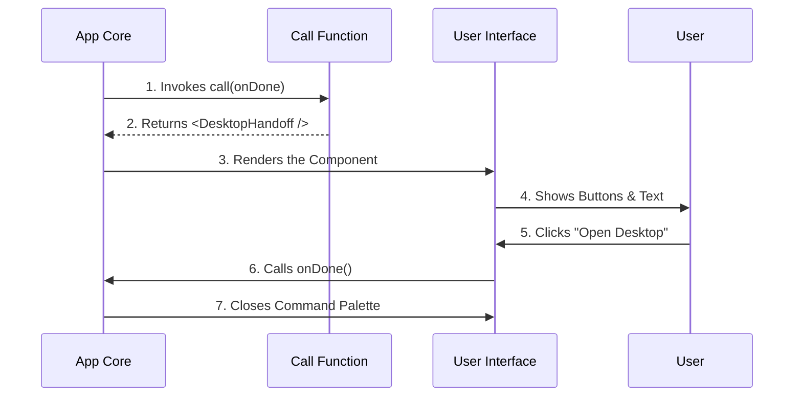

# Chapter 4: Visual Command Handler

Welcome to the final chapter of our series!

In the previous chapter, [Lazy Module Loading](03_lazy_module_loading.md), we learned how to efficiently fetch the code file from the hard drive only when the user asks for it.

Now, the file is loaded. The system has opened `desktop.tsx`. But what happens next? How do we go from a file sitting in memory to a beautiful user interface on the screen?

This brings us to the **Visual Command Handler**.

## What is a Visual Command Handler?

Most standard command-line tools only talk back to you in text. You type `date`, it prints `Mon Aug 14`.

However, our application is richer. We want to show buttons, loading bars, and guides. The **Visual Command Handler** is the bridge that connects the system's "Trigger" to the "Visual Interface."

### The "TV Director" Analogy

Think of your code like a Television Studio.
1.  **The User** is the audience.
2.  **The Component** (`DesktopHandoff`) is the actor on stage.
3.  **The Visual Command Handler** is the **Director**.

When the show starts, the Director doesn't act. The Director shouts **"Action!"** and points the camera at the actor.

In our code, this "Director" is a specific function named `call`.

## The Use Case

When the user runs the `desktop` command, we don't want to just print text saying "Go to the desktop app." We want to render a full React Component called `<DesktopHandoff />` that:
1.  Shows a spinner while preparing.
2.  Displays a button to launch the app.
3.  Automatically closes the command palette when finished.

## Key Concepts

To build this, we need to understand three small concepts.

### 1. The Entry Point (`call`)

Every command file **must** export a function named `call`. This is the rule. The system is programmed to look for this specific name. If you name it `start` or `run`, the system won't find it.

### 2. The "Done" Signal (`onDone`)

The command cannot run forever. Eventually, the user finishes the task. The system passes a special tool to our function called `onDone`.
*   Think of `onDone` like a **Remote Control**.
*   We pass this remote to our component.
*   When the component finishes its job, it presses the button on the remote to tell the system "Cut! We are finished."

### 3. Returning UI (`JSX`)

Instead of returning a string (text), our function returns **JSX**. This is HTML-like code that lives inside JavaScript. It tells the system *what* to draw on the screen.

## Implementing the Handler

Let's look at the implementation in `desktop.tsx`. We will break it down into tiny pieces.

### Step 1: The Setup

First, we need to import the actor (the component) we want to show.

```typescript
import React from 'react';
// We import our visual component (The Actor)
import { DesktopHandoff } from '../../components/DesktopHandoff.js';
// We import types for TypeScript safety
import type { CommandResultDisplay } from '../../commands.js';
```

**Explanation:**
We are getting ready to use React and our specific `DesktopHandoff` component.

### Step 2: The Function Signature

This is the "Director" declaring their role.

```typescript
// 'export' makes this available to the system
// 'async' means this might take a moment to set up
export async function call(onDone: (result?: string) => void) {
    // Logic goes here...
}
```

**Explanation:**
We define the `call` function. Notice the `onDone` argument? That is the "Remote Control" the system gives us to close the app later.

### Step 3: "Action!" (Rendering)

Finally, we tell the system what to show.

```typescript
// Inside the call function...
return (
    // We render the component and give it the 'onDone' remote
    <DesktopHandoff onDone={onDone} />
);
```

**Explanation:**
We return the `<DesktopHandoff />` tag. This tells the system: "Please draw this component on the screen."
Crucially, we pass `onDone={onDone}`. We are handing the remote control to the actor so they can turn off the lights when they are done.

## Putting It All Together

Here is the complete, minimal code for `desktop.tsx`.

```typescript
import React from 'react';
import { DesktopHandoff } from '../../components/DesktopHandoff.js';

// The Visual Command Handler
export async function call(onDone: any): Promise<React.ReactNode> {
  
  // Return the visual component to be rendered
  return <DesktopHandoff onDone={onDone} />;
}
```

*Note: We simplified the TypeScript types slightly above for readability, but the logic is identical.*

## Internal Implementation: Behind the Scenes

How does the system know what to do with that returned component?

### The Sequence of Events

When the [Lazy Module Loader](03_lazy_module_loading.md) finishes loading the file, the system executes the `call` function.



1.  **Invoke:** The System runs `desktop.call()`.
2.  **Return:** The function immediately returns the React Element.
3.  **Render:** The System takes that element and mounts it into the React application tree.
4.  **Interact:** The User interacts with the component.
5.  **Finish:** When the component calls `onDone()`, the system removes the component from the screen.

### Deep Dive: The `DesktopHandoff` Component

While this chapter focuses on the *handler* (the bridge), it helps to know what happens inside the component we just rendered.

The `DesktopHandoff` component receives the `onDone` prop. It likely looks something like this (simplified):

```typescript
// Inside DesktopHandoff.js
export function DesktopHandoff({ onDone }) {
  
  const handleClick = () => {
    // 1. Do the work (Open the app)
    window.open('claude://desktop');
    
    // 2. Use the remote to close the command
    onDone(); 
  };

  return <button onClick={handleClick}>Open Desktop App</button>;
}
```

By passing `onDone` from the `call` function down to the `DesktopHandoff`, we created a complete loop of control.

## Conclusion

Congratulations! You have successfully navigated the entire architecture of a command in the **desktop** project.

Let's review our journey:
1.  **[Command Configuration](01_command_configuration.md):** You created the identity card for the feature (Name, Description).
2.  **[Platform Guard](02_platform_guard.md):** You added security to ensure it only runs on supported computers.
3.  **[Lazy Module Loading](03_lazy_module_loading.md):** You optimized performance by loading the code only when needed.
4.  **Visual Command Handler (This Chapter):** You built the director function that renders the visual interface and manages the command lifecycle.

You now understand the full lifecycle of a modern, efficient, and visual desktop command. You are ready to build your own features!

---

Generated by [Code IQ](https://github.com/adityasoni99/Code-IQ)