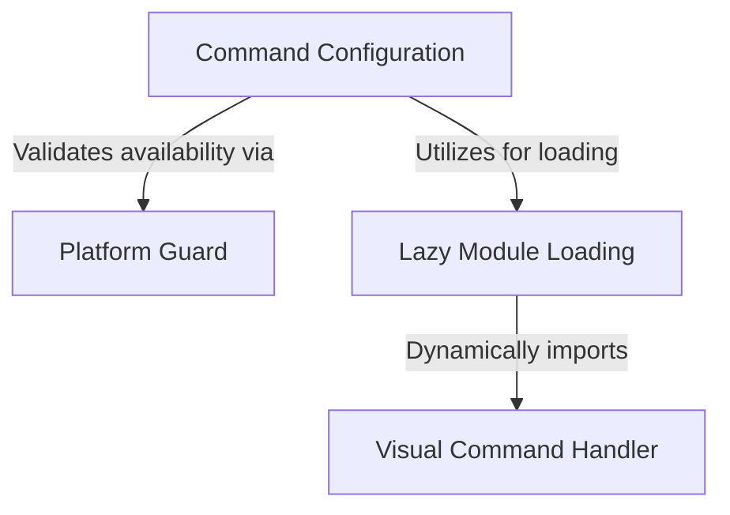

# Tutorial: desktop

This project enables a **command** that allows users to transfer their current session to the *Claude Desktop* application. It utilizes a **configuration object** to define the command's metadata, employs a **platform guard** to ensure visibility only on supported operating systems (macOS/Windows), and uses **lazy loading** to import the visual interface code only when requested.

## Chapters

1. [Command Configuration](01_command_configuration.md)
2. [Platform Guard](02_platform_guard.md)
3. [Lazy Module Loading](03_lazy_module_loading.md)
4. [Visual Command Handler](04_visual_command_handler.md)

---

Generated by [Code IQ](https://github.com/adityasoni99/Code-IQ)