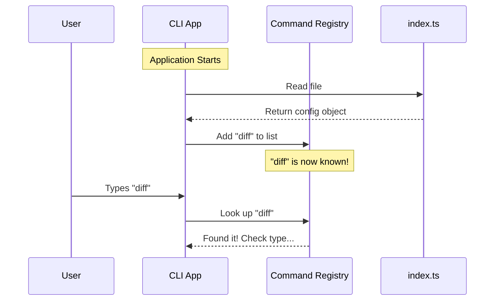

# Chapter 1: Command Registration

Welcome to the **diff** project! In this first chapter, we are going to look at the most fundamental part of adding a feature to an application: **Command Registration**.

## The Problem: How does the app know we exist?

Imagine you have built a brand new tool that helps users view file changes (the "diff"). You have the code ready, but the main application doesn't know it exists yet.

Think of the application as a **Restaurant**.
*   The **Kitchen** is where the code runs (where the food is made).
*   The **Customers** are the users typing commands.

If you invent a new dish but don't write it on the **Menu**, customers won't know they can order it, and the waiters won't know to tell the kitchen to make it.

**Command Registration** is simply writing your new feature onto the "Menu". It tells the application:
1.  What the command is called.
2.  What it does (a short description).
3.  Where to find the code to run it.

## The Solution: The Configuration Object

To solve this, we create a specific file (usually `index.ts`) that acts as our menu entry. We don't put all the heavy code here; we just put the metadata.

Let's look at how we register the `diff` command.

### Step 1: Defining the Command
We start by exporting a configuration object. This object contains the essential details the application needs to recognize our command.

```typescript
// --- File: index.ts ---
import type { Command } from '../../commands.js'

export default {
  type: 'local-jsx',
  name: 'diff',
  // ... continued below
```

**Explanation:**
*   `export default`: This exposes the object so the main application can read it.
*   `type`: This tells the app what *kind* of command this is. Here, it is `'local-jsx'`. We will explore exactly what that means in the next chapter, [Local JSX Handler](02_local_jsx_handler.md).
*   `name`: This is the keyword the user will type (e.g., `$ app diff`).

### Step 2: Description and Loading
Next, we provide a description for the help menu and tell the app where the actual logic lives.

```typescript
// ... continued from above
  description: 'View uncommitted changes and per-turn diffs',
  load: () => import('./diff.js'),
} satisfies Command
```

**Explanation:**
*   `description`: If a user types `$ app --help`, they will see this text next to the `diff` command.
*   `load`: This is a function that imports the heavy code. It's a "pointer" to the kitchen. We will cover this mechanics in [Dynamic Lazy Loading](03_dynamic_lazy_loading.md).
*   `satisfies Command`: This is a TypeScript feature. It ensures our menu entry follows the rules (must have a name, must have a description, etc.).

## Under the Hood: How Registration Works

When you start the application, it doesn't run your `diff` code immediately. Instead, it performs a quick scan.

Here is what happens step-by-step:

1.  **Boot Up:** The CLI App starts.
2.  **Scan:** It looks for `index.ts` files in the command folder.
3.  **Register:** It reads the `name` and `description` and adds them to its internal list.
4.  **Wait:** It sits idle until the user actually types `diff`.

### Sequence Diagram



## Internal Implementation Details

The beauty of this abstraction is that it separates the **definition** of a command from the **execution** of a command.

The main application likely has a loop that looks something like this (simplified):

```typescript
// Pseudo-code inside the main framework
const commands = new Map();

// 1. Load the config
import diffConfig from './commands/diff/index.js';

// 2. Register it
commands.set(diffConfig.name, diffConfig);

console.log(`Registered command: ${diffConfig.name}`);
```

**Explanation:**
The application effectively creates a dictionary. The key is the string `'diff'`, and the value is the object we created in `index.ts`. This makes looking up the command extremely fast when the user types it.

## Conclusion

You have just learned **Command Registration**.

By creating a simple configuration object, we successfully told the application:
*   **Who we are:** `name: 'diff'`
*   **What we do:** `description: ...`
*   **Where the logic is:** `load: ...`

However, you might have noticed the line `type: 'local-jsx'`. This is a special instruction telling the application how to render the output.

How does the application handle this specific type? Let's find out in the next chapter: [Local JSX Handler](02_local_jsx_handler.md).

---

Generated by [Code IQ](https://github.com/adityasoni99/Code-IQ)