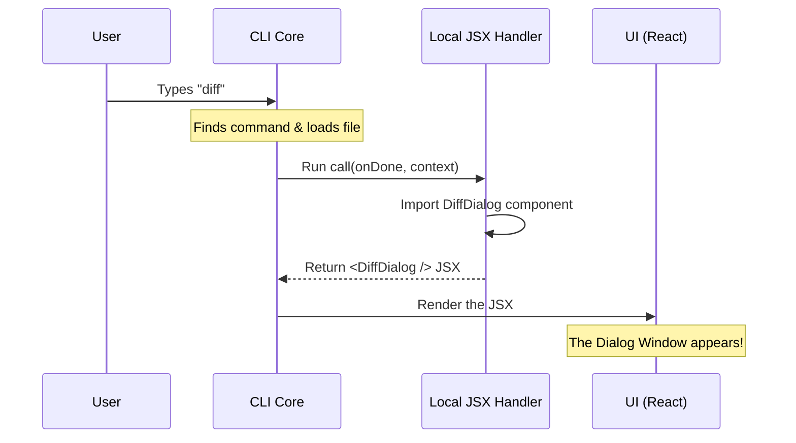

# Chapter 2: Local JSX Handler

Welcome back! In the previous chapter, [Command Registration](01_command_registration.md), we learned how to "put our item on the menu." We registered the `diff` command so the application knows it exists.

But right now, if a user selects our command, nothing happens. It's like ordering a dish at a restaurant, but there is no chef in the kitchen to cook it.

In this chapter, we will write the **Local JSX Handler**. This is the "Chef." It is the code that actually runs, executes logic, and serves up the user interface.

## The Problem: Connecting Logic to the Screen

When a user types `$ app diff`, they expect to see a visual interface—a dialog box showing file changes.

However, the command line (CLI) and the visual interface (React) are two different worlds.
*   **The CLI** knows about text, arguments, and system events.
*   **React** knows about buttons, windows, and rendering.

We need a bridge to connect them. We need a function that says: *"Okay, the command started. Here is the specific window you should open."*

## The Solution: The `call` Function

The **Local JSX Handler** is a specific function exported from your code, usually named `call`.

Think of this handler as the **entry point** of a mini-application.
1.  **Input:** It receives tools and data from the main app.
2.  **Process:** It prepares necessary components.
3.  **Output:** It returns a React Element (JSX) to be displayed.

Let's build the handler for our `diff` project. We will work in the file `diff.tsx`.

### Step 1: defining the Function

First, we define the function signature. It is an asynchronous function because it might need time to load resources.

```typescript
// --- File: diff.tsx ---
import * as React from 'react';
import type { LocalJSXCommandCall } from '../../types/command.js';

// The main entry point
export const call: LocalJSXCommandCall = async (onDone, context) => {
  // Logic goes here...
};
```

**Explanation:**
*   `export const call`: We must name it `call` so the system can find it automatically.
*   `LocalJSXCommandCall`: This TypeScript type ensures our function accepts the correct arguments.
*   `onDone`: A special function (a "remote control") we pass to the UI. When called, it tells the app to close the command.
*   `context`: A box containing useful data (like the current file changes). We will discuss this in [Context Injection](04_context_injection.md).

### Step 2: Loading the Component

Inside our function, we need to grab the actual visual component (the dialog box).

```typescript
// ... inside the call function
  
  // Load the visual component (Dialog) dynamically
  const {
    DiffDialog
  } = await import('../../components/diff/DiffDialog.js');

  // ... continued below
```

**Explanation:**
*   `await import(...)`: This loads the heavy UI code *only* when the command is actually run. This keeps the app fast. We will learn why we do this in [Dynamic Lazy Loading](03_dynamic_lazy_loading.md).
*   `DiffDialog`: This is the actual React component that looks like a window.

### Step 3: Rendering the Interface

Finally, we return the JSX. This is the "dish" we serve to the user.

```typescript
// ... continued from above

  // Return the React Element to be rendered
  return <DiffDialog 
    messages={context.messages} 
    onDone={onDone} 
  />;
};
```

**Explanation:**
*   `return <DiffDialog ... />`: We are not returning text; we are returning a UI element. The application will take this and draw it on the screen.
*   `messages={context.messages}`: We pass data from the CLI `context` into the visual component so it knows what to display.
*   `onDone={onDone}`: We pass the "remote control" to the component. If the user clicks "Close" inside the dialog, the dialog can call this function to exit.

## Under the Hood: The Execution Flow

To understand how this fits into the bigger picture, let's trace what happens when the user hits "Enter".

1.  **Trigger:** User runs the command.
2.  **Lookup:** The App reads the registration (Chapter 1) and finds our `load` function.
3.  **Execute:** The App runs our `call` handler (this chapter).
4.  **Render:** The Handler returns `<DiffDialog />`, and the App renders it to the screen.

### Sequence Diagram



## Internal Implementation Details

You might wonder: *Why don't we just write the UI code directly inside the handler?*

We separate them for a pattern called **separation of concerns**.

1.  **The Handler (`diff.tsx`)**: This is the **Controller**. It deals with logic, imports, data preparation, and routing. It doesn't care about colors or pixel placement.
2.  **The Component (`DiffDialog.tsx`)**: This is the **View**. It cares about buttons, layout, and how things look. It is covered in [React Component Bridge](05_react_component_bridge.md).

The Handler effectively acts as a "Launchpad." It sets up the environment and launches the UI.

## Conclusion

In this chapter, you learned about the **Local JSX Handler**.

*   It acts as the executable entry point for your command.
*   It is a function named `call`.
*   It bridges the gap between the CLI `context` and the React `component`.

You noticed that we used a fancy `await import` line to get our component. Why didn't we just use a standard `import` at the top of the file?

This is a crucial performance optimization technique! Let's explore why and how it works in the next chapter: [Dynamic Lazy Loading](03_dynamic_lazy_loading.md).

---

Generated by [Code IQ](https://github.com/adityasoni99/Code-IQ)