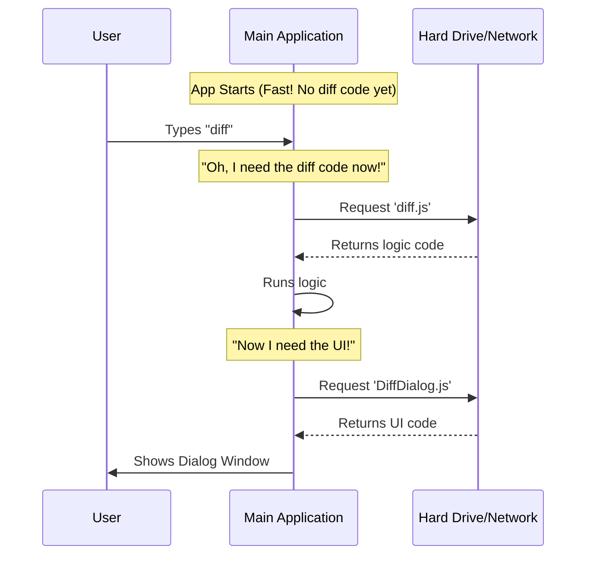

# Chapter 3: Dynamic Lazy Loading

Welcome to Chapter 3! In the previous chapter, [Local JSX Handler](02_local_jsx_handler.md), we wrote the code that connects our command logic to the user interface.

You might have noticed a peculiar way we imported our files using `await import(...)`. You might have asked: "Why don't we just put the `import` at the top of the file like usual?"

In this chapter, we answer that question. We are going to explore **Dynamic Lazy Loading**, the secret sauce that keeps your application fast and lightweight.

## The Problem: The Heavy Backpack

Imagine you are going on a hike. You pack your bag with a water bottle and a map.

Now, imagine if you were forced to also pack:
*   A tuxedo (in case there is a formal dinner on the mountain).
*   Scuba gear (in case you find a deep lake).
*   A snowboard (in case it suddenly snows).

Your bag would be incredibly heavy, and you probably won't use 99% of that gear.

**Traditional applications work like this heavy bag.**
Usually, when an app starts, it loads *every* single feature, *every* command, and *every* visual library immediately. This makes the startup time slow and uses a lot of computer memory.

## The Solution: The "On-Demand" Vending Machine

**Dynamic Lazy Loading** changes the rules. It splits your code into tiny pieces.

Think of it like a futuristic **Vending Machine**.
1.  The machine is small and empty.
2.  You press the button for "Chips".
3.  **Only then** does the machine "3D print" the chips for you.

If nobody presses the button, the machine doesn't waste space holding the chips.

In our `diff` project, we want to achieve two things:
1.  **Fast Boot:** The main app should start instantly.
2.  **Load Later:** The heavy React code for our `diff` tool should only load if the user actually types `$ app diff`.

## How We Implement It

We apply this pattern in two specific places in our project.

### 1. Lazy Loading the Command Logic

In [Command Registration](01_command_registration.md), we defined our `index.ts`. Instead of importing the code at the top, we used a special `load` function.

```typescript
// --- File: index.ts ---
export default {
  name: 'diff',
  description: 'View uncommitted changes',
  
  // This is the Magic Button:
  load: () => import('./diff.js'),
  
} satisfies Command
```

**Explanation:**
*   `() => import(...)`: This is a function that *returns* a promise to import the file.
*   The key concept here is that JavaScript **does not** read `./diff.js` yet. It just knows *where* it is.
*   The file is only read when the application executes this function (which happens only after the user types `diff`).

### 2. Lazy Loading the UI Components

We take it a step further. Inside our handler (from Chapter 2), we might have heavy dependencies, like complex UI libraries. We don't want to load those until the very last millisecond.

Here is the snippet from our `diff.tsx`:

```typescript
// --- File: diff.tsx ---
export const call: LocalJSXCommandCall = async (onDone, context) => {

  // Fetch the heavy UI component NOW, not before.
  const {
    DiffDialog
  } = await import('../../components/diff/DiffDialog.js');

  return <DiffDialog messages={context.messages} onDone={onDone} />;
};
```

**Explanation:**
*   `await`: Because loading a file takes a tiny bit of time (milliseconds), we must `await` the result.
*   `import(...)`: This fetches the `DiffDialog` code. If `DiffDialog` relies on React or other heavy libraries, those are also loaded at this specific moment.

## Under the Hood: What Happens?

Let's visualize the difference between a standard app and our lazy-loaded app.

In a **Standard App**, everything loads at step 1.
In our **Lazy App**, the timeline looks like this:



## Internal Implementation Details

How does JavaScript actually handle this?

When you use `import('...')` (with parentheses) instead of `import ... from '...'` (at the top of the file), you are using a feature called **Dynamic Imports**.

### Code Splitting
Behind the scenes, the build tool (like Webpack, Vite, or Rollup) sees these dynamic imports and performs **Code Splitting**.

Instead of bundling your whole application into one giant file named `app.js`, it creates separate "chunks":

1.  `app.js` (The main tiny skeleton)
2.  `chunk-diff.js` (Our logic)
3.  `chunk-dialog.js` (Our UI)

### The Promise
The `import()` function returns a JavaScript **Promise**.

```typescript
// Conceptual example of what import() returns
const modulePromise = import('./diff.js');

modulePromise.then((module) => {
  // Now we have the code!
  module.call();
});
```

By using `await`, we pause the execution of our function just long enough for the file to be fetched from the disk or network, parsed by the JavaScript engine, and made ready for use.

## Conclusion

You have learned about **Dynamic Lazy Loading**.

*   **The Concept:** Don't load code until you need it.
*   **The Benefit:** The application starts much faster and uses less memory.
*   **The Code:** We use `() => import(...)` in our configuration and `await import(...)` in our handler.

Now that our code is loaded and running, we have a blank dialog box. It needs data! It needs to know which files have changed to display them to the user.

How do we pass data from the command line into our newly loaded component? We will cover this in the next chapter: [Context Injection](04_context_injection.md).

---

Generated by [Code IQ](https://github.com/adityasoni99/Code-IQ)