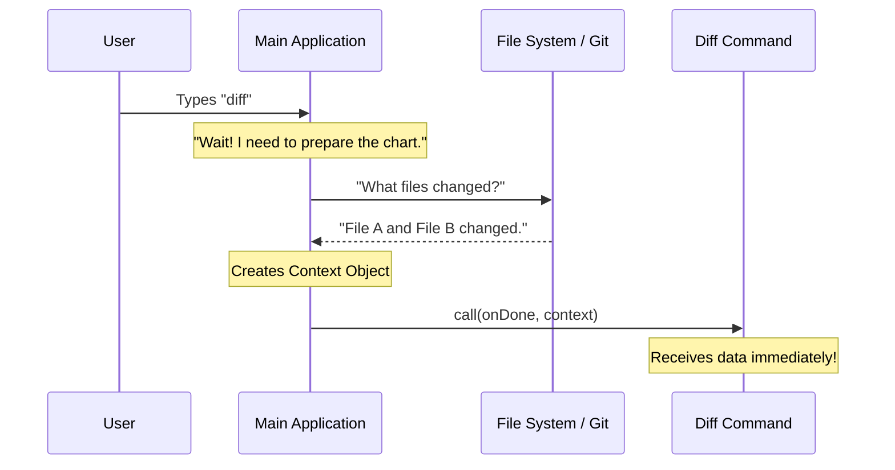

# Chapter 4: Context Injection

Welcome to Chapter 4! In the previous chapter, [Dynamic Lazy Loading](03_dynamic_lazy_loading.md), we learned how to keep our application fast by loading code only when we need it.

We now have a command that registers itself and loads efficiently. But we have a new problem: **The command is blind.**

When the `diff` command wakes up, it has the logic to *show* changes, but it doesn't know *what* the changes are. It doesn't know which files you edited or what text you deleted.

In this chapter, we explore **Context Injection**. This is how the main application gathers all the necessary information and hands it to your command.

## The Problem: The Doctor Needs a Chart

Imagine you are a specialist doctor (the Command). You are called into a room to treat a patient.

If you walk in with zero information, you have to waste time asking:
*   "Who are you?"
*   "What are your symptoms?"
*   "What is your history?"

It is much more efficient if the nurse hands you a **Clipboard** (the Context) before you even enter the room. The clipboard has the patient's name, vitals, and notes. You can immediately get to work.

In our software:
*   **The Patient** is the current state of your files (git changes, chat history).
*   **The Doctor** is your `diff` command.
*   **The Clipboard** is the `context` object.

Without the context, every command would have to manually scan the hard drive to find files. That is slow and repetitive.

## The Solution: The `context` Object

The application solves this by doing the heavy lifting for you. Before it calls your command, it gathers data about the environment and packs it into a neat object called `context`.

Let's look at our `diff.tsx` file again. You might remember the second argument in our function:

```typescript
// --- File: diff.tsx ---

// Notice the second argument: 'context'
export const call: LocalJSXCommandCall = async (onDone, context) => {
  
  // The 'context' object holds the data we need!
  const data = context.messages;

  // ...
};
```

**Explanation:**
*   `onDone`: The remote control to close the app (discussed in Chapter 2).
*   `context`: The "Clipboard." It contains everything the application knows about the current situation.

### What is inside the Context?

For a tool like `diff`, the context usually contains:
1.  **messages:** A list of recent interactions or file changes.
2.  **config:** User settings.
3.  **workingDir:** Where the user is currently located in the terminal.

## How to Use It

We don't need to create this data; we just need to **pass it along**.

Our goal is to get this data into our visual component so the user can see it.

### Step 1: Receiving the Data
Inside our `call` function, we access `context.messages`. This array contains the actual lines of code or text that have changed.

```typescript
// --- File: diff.tsx ---
export const call: LocalJSXCommandCall = async (onDone, context) => {
  
  // 1. We have the data here
  const recentChanges = context.messages;
  
  // ... continued below
```

### Step 2: Injecting into the Component
We pass this data as a "prop" (property) to our React component.

```typescript
// ... continued from above
  const { DiffDialog } = await import('../../components/diff/DiffDialog.js');

  // 2. We inject it into the UI here
  return <DiffDialog 
    messages={recentChanges} 
    onDone={onDone} 
  />;
};
```

**Explanation:**
*   `messages={recentChanges}`: This is the injection. We are taking the data from the "Clipboard" (Context) and handing it to the "Surgeon" (The Dialog Component).

## Under the Hood: How is Context Created?

You might be wondering: *Who creates this clipboard?*

The main application core acts as a **Data Gatherer**. When the user presses "Enter" on a command, the core pauses to collect information before running your code.

### The Sequence of Events

1.  **User Input:** User types `diff`.
2.  **Gathering:** The App Core scans the `.git` folder to see what changed.
3.  **Packaging:** It puts these changes into a JSON object (the Context).
4.  **Injection:** It calls your `call` function and passes the object as an argument.



## Internal Implementation Details

Let's look at a simplified version of the code that runs *inside the framework* (not your command code) to see how it constructs this object.

```typescript
// --- Framework Code (Simplified) ---

async function runCommand(commandName) {
  // 1. Gather Data (The hard work)
  const history = await git.getUncommittedChanges();
  
  // 2. Create the Clipboard
  const context = {
    messages: history,
    timestamp: Date.now()
  };

  // 3. Find the registered command
  const command = registry.get(commandName);

  // 4. INJECT the context
  await command.call(sys.exit, context);
}
```

**Explanation:**
*   This logic is hidden from you. You don't have to write the code that talks to Git.
*   You simply trust that when `call` is triggered, the `context` variable is already full of fresh data.

## Why is this Pattern Useful?

1.  **Simplicity:** Your command code stays clean. It doesn't worry about *how* to fetch data, only *how* to display it.
2.  **Testing:** If you want to test your command, you can pass in a fake `context` with fake messages. You don't need a real Git repository to run tests.
3.  **Consistency:** Every command receives data in the exact same format.

## Conclusion

In this chapter, you learned about **Context Injection**.

*   **The Concept:** Passing state (data) into the command handler.
*   **The Analogy:** A nurse handing a patient's chart (Context) to the doctor (Command).
*   **The Usage:** We access `context.messages` in our handler and pass it to our component.

We have now successfully:
1.  Registered the command.
2.  Created the handler.
3.  Lazy-loaded the resources.
4.  Injected the real data.

The final piece of the puzzle is the visual part. We have passed the `messages` to `<DiffDialog />`, but we haven't looked at how that component is built.

How do we build a React component that interacts with the terminal? Let's find out in the final chapter: [React Component Bridge](05_react_component_bridge.md).

---

Generated by [Code IQ](https://github.com/adityasoni99/Code-IQ)