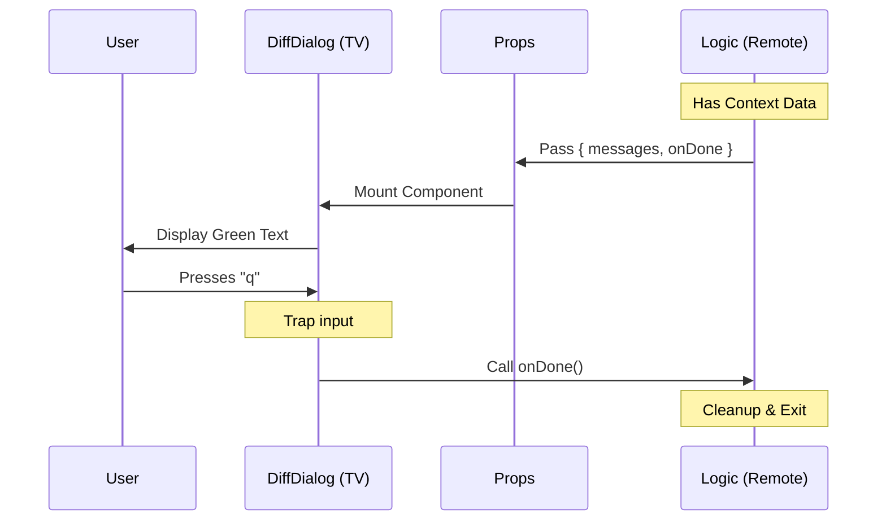

# Chapter 5: React Component Bridge

Welcome to the final chapter of our tutorial series!

In the previous chapter, [Context Injection](04_context_injection.md), we learned how the application gathers data (like git changes) and injects it into our command. We ended with our **Handler** holding a bag of data, ready to hand it off.

In this chapter, we build the **React Component Bridge**. This is the destination where our data finally becomes something the user can see and interact with.

## The Problem: The Remote and the TV

We have a disconnect.
1.  **The Handler** (from Chapter 2) controls the *logic* (starting, stopping, loading data).
2.  **The Component** controls the *visuals* (colors, text, layout).

Imagine a **Universal Remote Control** (The Handler) and a **TV Screen** (The Component).
*   The Remote doesn't know how to display a picture.
*   The TV doesn't know when to turn itself off.

We need a way to connect them so the Remote can tell the TV what to show, and the TV can tell the Remote when the user is done watching.

## The Solution: The Bridge (Props)

In React, the "Bridge" is built using **Props** (Properties). Props are how we pass signals from the logic layer down to the visual layer.

For our `diff` tool, we need to pass two specific things across the bridge:
1.  **Data:** The list of file changes (Channel selection).
2.  **Callback:** The function to close the app (The Power Button).

Let's build `DiffDialog.tsx` to accept these signals.

### Step 1: Defining the Interface

First, we define the "sockets" on the back of our TV. We need to tell TypeScript exactly what signals this component accepts.

```typescript
// --- File: components/diff/DiffDialog.tsx ---
import * as React from 'react';
import { Text, Box, useInput } from 'ink';

// 1. Define the Bridge connection points
type Props = {
  messages: string[];   // The Data
  onDone: () => void;   // The Power Button
};
```

**Explanation:**
*   `messages`: We expect an array of text strings (the file diffs).
*   `onDone`: We expect a function that takes no arguments. Calling this function shuts down the command.

### Step 2: The Visual Layer

Next, we create the component itself. It takes the `messages` prop and turns it into visual text.

```typescript
// ... continued
export const DiffDialog = ({ messages, onDone }: Props) => {
  
  // 2. Render the data
  return (
    <Box flexDirection="column" borderStyle="round">
      <Text bold>Changed Files:</Text>
      {messages.map((msg, index) => (
        <Text key={index} color="green">
          {msg}
        </Text>
      ))}
    </Box>
  );
};
```

**Explanation:**
*   `Box` and `Text`: These are components from `ink`. Think of `Box` like a `<div>` and `Text` like a `<span>`, but for the terminal.
*   `messages.map`: We loop through every message in our data and create a green text line for it.
*   **The Bridge in Action:** We took raw data (`messages`) and converted it into a visual element (`<Text>`).

### Step 3: The Interaction Layer

The user can see the changes, but they are stuck! They can't exit the screen. We need to wire up the "Power Button" using the `onDone` prop.

```typescript
// ... inside DiffDialog component
  
  // 3. Listen for key presses
  useInput((input, key) => {
    // If user presses "Escape" or "q"
    if (key.escape || input === 'q') {
      // PRESS THE POWER BUTTON!
      onDone();
    }
  });

  // ... return JSX
```

**Explanation:**
*   `useInput`: This is a hook that listens to your keyboard.
*   `onDone()`: This is the crucial moment. The *Component* (TV) calls the function given to it by the *Handler* (Remote). This triggers the cleanup process in the main application.

## Under the Hood: The Flow of Control

It is important to understand the direction of data and control.
*   **Data flows DOWN:** From Handler -> Component.
*   **Events flow UP:** From Component -> Handler.

Here is the lifecycle of the Bridge:

1.  **Mount:** The Handler imports `DiffDialog` and passes `messages`.
2.  **Render:** `DiffDialog` draws the text on the terminal.
3.  **Wait:** The app waits for the user.
4.  **Action:** User presses "q".
5.  **Signal:** `DiffDialog` calls `onDone`.
6.  **Exit:** The Handler receives the signal and closes the process.

### Sequence Diagram



## Internal Implementation Details

The file `diff.tsx` (The Handler) and `DiffDialog.tsx` (The Component) work together as a unit.

In [Local JSX Handler](02_local_jsx_handler.md), we saw this line:

```typescript
// From diff.tsx
return <DiffDialog messages={context.messages} onDone={onDone} />;
```

And now in this chapter, we see the receiving end:

```typescript
// From DiffDialog.tsx
export const DiffDialog = ({ messages, onDone }: Props) => ...
```

This matching of attributes (`messages={...}`) to function arguments (`{ messages }`) is the definition of the **React Component Bridge**. It allows us to keep our "Math" code completely separate from our "Art" code.

## Conclusion

Congratulations! You have completed the **React Component Bridge** chapter, and with it, the entire basic tutorial for the `diff` project.

Let's review what we built together:

1.  **[Command Registration](01_command_registration.md):** We told the app our command exists (`index.ts`).
2.  **[Local JSX Handler](02_local_jsx_handler.md):** We created the logic entry point (`diff.tsx`).
3.  **[Dynamic Lazy Loading](03_dynamic_lazy_loading.md):** We ensured our code only loads when needed.
4.  **[Context Injection](04_context_injection.md):** We learned how to receive data from the core app.
5.  **[React Component Bridge](05_react_component_bridge.md):** We rendered that data and handled user interaction.

You now have a fully functional feature that integrates seamlessly into the application architecture. You understand how to register, load, inject, and display data using the power of React in the terminal.

**Happy Coding!**

---

Generated by [Code IQ](https://github.com/adityasoni99/Code-IQ)