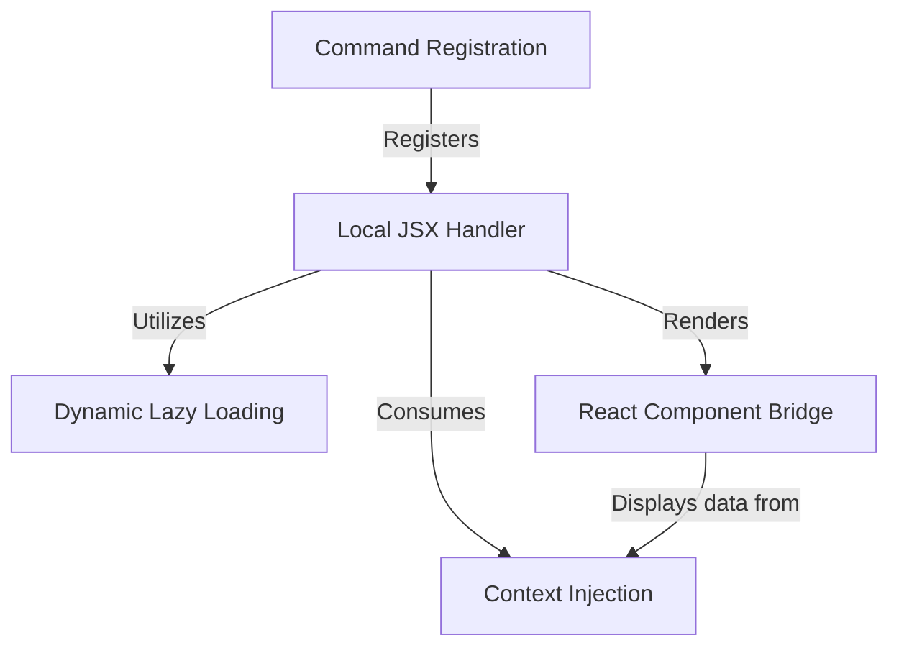

# Tutorial: diff

This project enables a user to view **file differences** (diffs) and uncommitted changes through a specific command. To keep the application fast, it uses **dynamic lazy loading** to only fetch the necessary code and UI components when the user actually requests them. The logic then uses a **React bridge** to render a visual dialog box populated with data from the application's current state.

## Chapters

1. [Command Registration](01_command_registration.md)
2. [Local JSX Handler](02_local_jsx_handler.md)
3. [Dynamic Lazy Loading](03_dynamic_lazy_loading.md)
4. [Context Injection](04_context_injection.md)
5. [React Component Bridge](05_react_component_bridge.md)

---

Generated by [Code IQ](https://github.com/adityasoni99/Code-IQ)