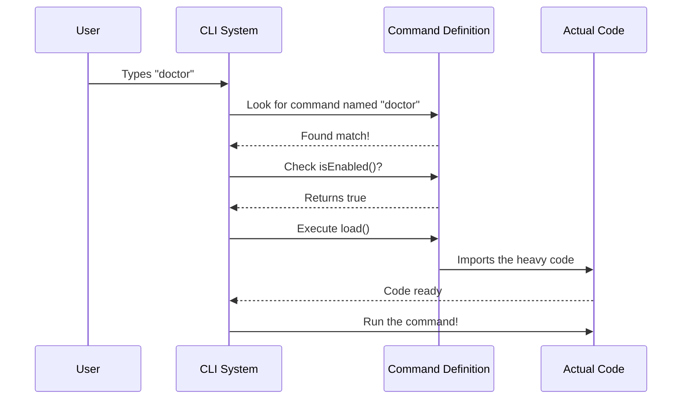

# Chapter 1: Command Definition

Welcome to the **Doctor** project! In this first chapter, we are going to learn how to introduce a new command to a Command Line Interface (CLI) application.

## Why do we need a Command Definition?

Imagine walking into a restaurant. Before you can eat, you need a **menu**. The menu doesn't contain the actual food; it contains a list of names, descriptions, and categories so you know what you can order.

A **Command Definition** is exactly like a menu item for your software.

**The Central Use Case:**
We want to build a `doctor` command. When a user runs this command, it should check if their computer is set up correctly. But before we write the code that actually *checks* the computer, we must first tell the CLI system:
1.  **What** is this command called? (`doctor`)
2.  **What** does it do? (Description)
3.  **When** is it allowed to run? (Is it enabled?)
4.  **Where** is the code located?

If we skip this step, the CLI won't know that the `doctor` command even exists!

## Key Concepts

To define a command, we create a simple Javascript object. Here are the parts we need to fill in:

1.  **Identity**: The `name` the user types and a human-readable `description`.
2.  **Visibility**: A rule (`isEnabled`) to decide if this command should appear on the menu or stay hidden.
3.  **Type**: A category (`type`) that tells the system how to handle the interface (e.g., is it text-only or interactive?).
4.  **Loading**: A specific instruction (`load`) on how to find the heavy logic code only when needed.

## How to Define the Command

Let's build the definition for our `doctor` command. We will look at the code in small pieces.

### 1. Basic Identity
First, we give the command a name and a description. This is what the user sees when they ask for help.

```typescript
// Define the basic identity
const doctor = {
  name: 'doctor',
  description: 'Diagnose and verify your Claude Code installation and settings',
  // ... other properties will go here
}
```
*Explanation: When the user types `doctor`, the system finds this object because the `name` matches.*

### 2. Visibility Rules
Sometimes, you might want to hide a command (maybe it's experimental). We use a function to check if it's enabled.

```typescript
import { isEnvTruthy } from '../../utils/envUtils.js'

// inside the doctor object...
  isEnabled: () => !isEnvTruthy(process.env.DISABLE_DOCTOR_COMMAND),
```
*Explanation: This function returns `true` or `false`. Here, it checks an environment variable. We will dive deeper into this in [Environment Feature Flags](02_environment_feature_flags.md).*

### 3. Execution Type and Loading
Finally, we tell the system what *kind* of command this is and where to find the actual code that runs the diagnosis.

```typescript
// inside the doctor object...
  type: 'local-jsx',
  load: () => import('./doctor.js'),
```
*Explanation:*
*   `type: 'local-jsx'`: This tells the system to use a specific display engine (React-like). You'll learn about this in [Local JSX Command Handler](04_local_jsx_command_handler.md).
*   `load`: This uses a technique called **dynamic import**. It means we don't load the heavy code until the user actually types `doctor`. See [Lazy Module Loading](03_lazy_module_loading.md) for more details.

### The Complete Code
Putting it all together, here is our full `index.ts` file. It's short, sweet, and serves as the perfect blueprint.

```typescript
import type { Command } from '../../commands.js'
import { isEnvTruthy } from '../../utils/envUtils.js'

const doctor: Command = {
  name: 'doctor',
  description: 'Diagnose and verify your Claude Code installation and settings',
  isEnabled: () => !isEnvTruthy(process.env.DISABLE_DOCTOR_COMMAND),
  type: 'local-jsx',
  load: () => import('./doctor.js'),
}

export default doctor
```

## Under the Hood: The Command Lifecycle

What happens when the application starts? It doesn't run the `doctor` logic immediately. It simply reads this definition file.

Here is the flow of events when a user interacts with the CLI:



### Internal Implementation Walkthrough

1.  **Registration**: When the CLI boots up, it imports this `doctor` object. It creates a list (a registry) of all available commands (like `doctor`, `help`, `login`).
2.  **Matching**: When you type `doctor` in your terminal, the CLI loops through its registry looking for an object where `name === 'doctor'`.
3.  **Verification**: Before running it, the CLI calls `doctor.isEnabled()`. If this returned `false`, the CLI would say "Command not found" or "Command disabled," protecting the user from broken or hidden features.
4.  **Handoff**: Once verified, the CLI looks at the `type`. Since it sees `local-jsx`, it prepares the specific rendering engine required for that type.

## Summary

In this chapter, we learned that a **Command Definition** is a lightweight blueprint. It doesn't contain the complex logic; instead, it tells the system **who** the command is, **when** it can run, and **where** to find the code.

By separating the *definition* (metadata) from the *implementation* (code), our CLI starts up very fast because it doesn't have to load heavy files until necessary.

In the next chapter, we will look closer at that `isEnabled` property and how we control features using environment variables.

[Next Chapter: Environment Feature Flags](02_environment_feature_flags.md)

---

Generated by [Code IQ](https://github.com/adityasoni99/Code-IQ)