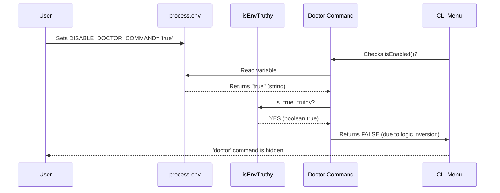

# Chapter 2: Environment Feature Flags

Welcome back! In [Chapter 1: Command Definition](01_command_definition.md), we created the identity card for our `doctor` command. We briefly mentioned a property called `isEnabled` that controls whether the command shows up or stays hidden.

In this chapter, we will explore **Environment Feature Flags**. This is the mechanism that powers that `isEnabled` property.

## Why do we need Feature Flags?

**The Central Use Case:**
Imagine you release the `doctor` command to thousands of users. Suddenly, you realize there is a critical bug that crashes the application on Windows computers.

You have two options:
1.  **The Slow Way:** Fix the code, rebuild the application, publish a new version, and hope every user updates immediately.
2.  **The Fast Way (Feature Flags):** Ask users to set a simple setting in their terminal that turns off the `doctor` command instantly, without needing a code update.

A **Feature Flag** acts like a circuit breaker or a light switch. It allows us to enable or disable parts of our application based on the environment it's running in.

## Key Concepts

To understand how we implement this, we need to understand two small concepts:

1.  **Environment Variables (`process.env`)**: These are global variables set by your operating system or terminal, not inside the JavaScript code. Node.js allows us to read them using `process.env`.
2.  **Truthiness**: Environment variables are always text strings. Even if you set a variable to `false`, it acts like the string `"false"`. We need a way to translate these strings into real `true` or `false` booleans.

## How to Use Feature Flags

Let's look at how we applied this to the `doctor` command in our `index.ts` file.

### 1. The Decision Logic
We want the `doctor` command to be **enabled** by default, but we want the ability to **disable** it if necessary.

```typescript
// From src/commands/doctor/index.ts
isEnabled: () => !isEnvTruthy(process.env.DISABLE_DOCTOR_COMMAND),
```

*Explanation:*
*   `process.env.DISABLE_DOCTOR_COMMAND`: We look for a specific environment variable.
*   `isEnvTruthy(...)`: A helper function that checks if that variable is "on" (e.g., set to "true" or "1").
*   `!`: The "NOT" operator. If the *Disable* flag is true, `isEnabled` becomes false.

### 2. Controlling the Command (User Side)
This is how a user would use this flag in their terminal.

**To Enable (Default behavior):**
The user doesn't need to do anything. If the variable isn't set, `isEnabled` returns true.

**To Disable:**
The user sets the variable before running the program.

```bash
# In your terminal
export DISABLE_DOCTOR_COMMAND=true
# Now, if you run the CLI, the 'doctor' command will vanish.
```

## Under the Hood: Internal Implementation

How does the system actually process this? Let's walk through the steps when the application launches.

### The Decision Flow

1.  **Startup**: The CLI starts and loads the `doctor` command definition.
2.  **Check Environment**: The system reads the variables currently active in your terminal.
3.  **Evaluate**: The `isEnabled` function runs. It grabs the string value of the variable.
4.  **Convert**: It converts that string (e.g., "true", "1") into a real Boolean `true`.
5.  **Register**:
    *   If `isEnabled` returns `true`: The command is added to the menu.
    *   If `isEnabled` returns `false`: The command is ignored completely.



### The `isEnvTruthy` Helper
Since environment variables are always strings, we can't just check `if (variable)`. A string containing `"false"` is technically "truthy" in JavaScript!

We use a helper function to solve this.

```typescript
// src/utils/envUtils.ts

export function isEnvTruthy(value: string | undefined): boolean {
  // If no value is set, it's false
  if (!value) return false
  
  // Check against common "true" values
  return ['1', 'true', 'TRUE'].includes(value)
}
```

*Explanation:*
1.  **Input**: It takes the value from `process.env` (which might be undefined).
2.  **Safety Check**: If the value is empty, return `false`.
3.  **Strict Matching**: It checks if the string is exactly `'1'`, `'true'`, or `'TRUE'`. Only these specific values count as "On".

## Summary

In this chapter, we learned that **Environment Feature Flags** allow us to control the behavior of our application from the outside, without changing the code.

By using `process.env` and a helper like `isEnvTruthy`, we created a safe "toggle switch" for our `doctor` command. This ensures we can quickly turn off the feature if it causes problems.

Now that our command is defined and we know when it is allowed to run, we need to figure out how to load the actual code efficiently.

[Next Chapter: Lazy Module Loading](03_lazy_module_loading.md)

---

Generated by [Code IQ](https://github.com/adityasoni99/Code-IQ)