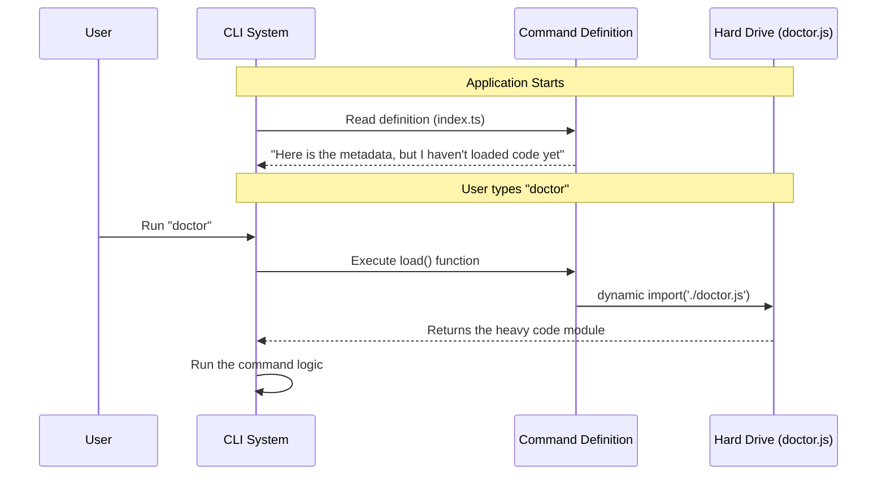

# Chapter 3: Lazy Module Loading

Welcome back! In [Chapter 2: Environment Feature Flags](02_environment_feature_flags.md), we learned how to use environment variables to safely hide or show our command.

Now that we know *if* the command should exist, we need to decide *how* to bring its code into memory. This brings us to a critical performance concept called **Lazy Module Loading**.

## Why do we need Lazy Loading?

**The Central Use Case:**
Imagine you are a carpenter. You have a massive shed filled with 500 different tools—saws, drills, hammers, sanders, and heavy machinery.

When you leave your house in the morning to fix a small loose screw, do you put **all 500 tools** into your backpack?

Of course not! That would be incredibly heavy and slow. instead:
1.  You carry a small list (an index) of what tools you own.
2.  You walk to the job site.
3.  Only when you realize you need the **Drill**, you go back to the shed and fetch *just* the Drill.

**Lazy Module Loading** applies this exact logic to software.

If our CLI tool has 50 commands, we don't want to load the computer code for all 50 commands every time the user types `help`. We want to load the code for the `doctor` command **only** when the user actually types `doctor`.

## Key Concepts

To understand the code, we need to understand the difference between two ways of importing code in JavaScript.

### 1. Static Imports (The Heavy Backpack)
This is what you usually see at the top of a file. It loads the code immediately, as soon as the application starts.

```typescript
// This loads the code INSTANTLY, whether we use it or not.
import { heavyLogic } from './heavyFile.js'
```

### 2. Dynamic Imports (The Tool in the Shed)
This is a function. It doesn't load anything until you actually run the function.

```typescript
// This loads NOTHING right now.
const loadMyTool = () => import('./heavyFile.js')

// The code is only loaded when we run this:
loadMyTool()
```

## How to Implement Lazy Loading

In our `doctor` project, we use this concept in our command definition. Let's look at `index.ts` again.

```typescript
// src/commands/doctor/index.ts

const doctor: Command = {
  name: 'doctor',
  // ... identity and flags ...
  
  // THE KEY PART:
  load: () => import('./doctor.js'),
}
```
*Explanation:*
*   We define a property called `load`.
*   We assign it a **function** (the `() => ...` part).
*   Inside that function, we use `import()`.
*   We point to `./doctor.js`. This is where the actual heavy logic lives.

Because we wrapped the import in a function, the file `./doctor.js` is **not read** when the application starts. It sits quietly on the hard drive until called upon.

## Under the Hood: The Loading Lifecycle

What happens when a user runs the application? Let's trace the steps to see how the system saves memory.

### The Sequence

1.  **Boot Up**: The CLI starts. It reads `index.ts` (the definition). It sees the `load` function but **does not run it**. The memory usage is tiny.
2.  **User Action**: The user types `doctor` in the terminal.
3.  **Trigger**: The CLI sees a match. Now it knows it needs the code.
4.  **Fetching**: The CLI executes the `load()` function.
5.  **Execution**: Node.js goes to the file system, reads `doctor.js`, and brings it into memory.



### Internal Implementation Details

So, where does the heavy code actually live? It lives in a separate file entirely.

We split our command into two files:
1.  `index.ts`: The lightweight definition (The Menu Item).
2.  `doctor.js` (or `.tsx`): The heavy implementation (The Meal).

**1. The Definition (index.ts)**
This file is small. It imports nothing heavy.

```typescript
// index.ts
// Quick to load, minimal dependencies
const doctor = {
  name: 'doctor',
  load: () => import('./doctor.js'), // Points to the heavy file
}
export default doctor
```

**2. The Implementation (doctor.js)**
This file might contain thousands of lines of code, huge libraries, and complex logic.

```javascript
// doctor.js
// This file is NOT loaded until the user asks for it.

// Heavy libraries are imported here
import { heavyDatabaseTool } from 'massive-library' 

export default function runDoctor() {
  console.log("Running diagnosis...")
  // ... lots of complex logic
}
```

By separating these two, we ensure that if a user only wants to use a different command (like `login`), they never pay the performance cost of loading the `doctor` libraries.

## Summary

In this chapter, we learned that **Lazy Module Loading** is a performance pattern. It allows us to keep our application startup time fast ("snappy") by only loading the heavy code for a command when it is explicitly requested.

We achieved this by using **Dynamic Imports** (`import()`) inside our `load` function, rather than standard static imports at the top of the file.

Now that we have successfully loaded our heavy code, we need a way to display information to the user. In the next chapter, we will learn about the display engine used by the `doctor` command.

[Next Chapter: Local JSX Command Handler](04_local_jsx_command_handler.md)

---

Generated by [Code IQ](https://github.com/adityasoni99/Code-IQ)