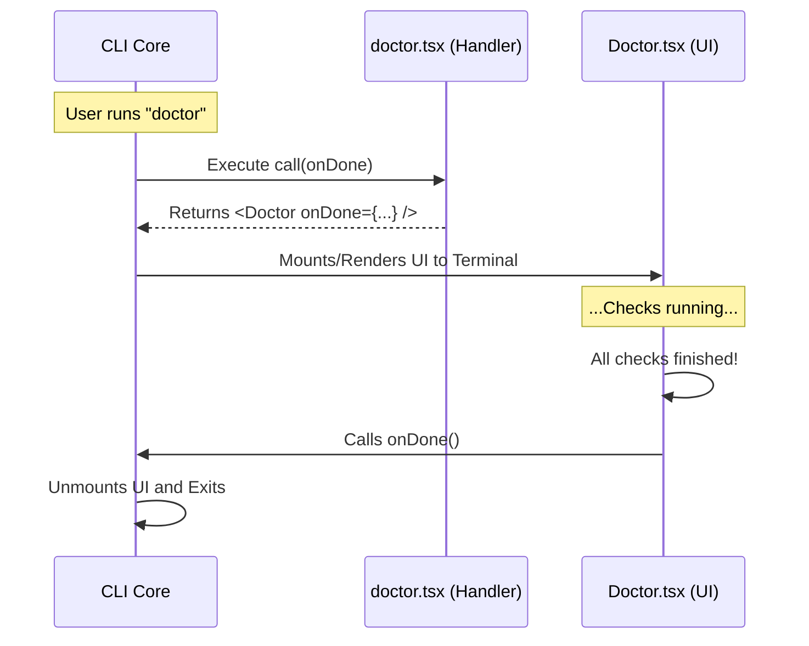

# Chapter 4: Local JSX Command Handler

Welcome back! In [Chapter 3: Lazy Module Loading](03_lazy_module_loading.md), we set up a system to efficiently load our heavy code only when needed.

Now that the code is loaded into memory, we face a new question: **How do we actually run it?**

Specifically, how do we run a command that isn't just a simple script, but a full interactive interface? This brings us to the **Local JSX Command Handler**.

## Why do we need a Command Handler?

**The Central Use Case:**
Most simple CLI commands are "Fire and Forget." You type `echo "hello"`, the computer prints "hello", and the program ends immediately.

But our `doctor` command is different. It needs to:
1.  Stay alive while it runs checks.
2.  Render a visual interface (using React components).
3.  Wait for the checks to finish.
4.  Only exit when the logic says so.

We need a standard way—a specific **pattern**—to connect the raw CLI environment to our React components. We need a bridge.

## Key Concepts

To build this bridge, we use three concepts:

1.  **The `call` Function**: This is the entry point. When the CLI loads your file, it looks for a specifically named function called `call` to start the work.
2.  **JSX in the Terminal**: Usually, JSX (React) renders HTML for browsers. Here, we use a specialized renderer that draws text and colors in the terminal, but we still write it like standard React code (`<MyComponent />`).
3.  **The `onDone` Callback**: Since the interface is interactive, the CLI doesn't know when to quit. We must pass it a function ("Call this when you are finished") so the UI can control the exit.

## How to Implement the Handler

In the previous chapter, we told the CLI to import `./doctor.js`. Now, let's look at the code inside that file (specifically `doctor.tsx`).

We will implement the bridge in two small steps.

### 1. The Setup and Imports
First, we import the necessary tools. We need React, the UI component we want to show, and the type definition to ensure our code follows the rules.

```typescript
// src/commands/doctor/doctor.tsx
import React from 'react';
import { Doctor } from '../../screens/Doctor.js';
import type { LocalJSXCommandCall } from '../../types/command.js';
```
*Explanation: We are preparing to render the `<Doctor />` screen. This screen contains the actual UI logic (which we will build in the next chapter).*

### 2. The Bridge Function (`call`)
This is the most important part. We export a constant named `call`. The CLI framework calls this function automatically.

```typescript
export const call: LocalJSXCommandCall = (onDone, _context, _args) => {
  // We return a Promise that resolves to our React Component
  return Promise.resolve(<Doctor onDone={onDone} />);
};
```
*Explanation:*
1.  **Arguments**: The function receives `onDone`. This is the "Exit Button" trigger.
2.  **The Return**: We return a `<Doctor />` component.
3.  **The Handoff**: Notice `onDone={onDone}`. We are passing the "Exit Button" *down* into the visual component. This allows the UI to decide when the program finishes.

## Under the Hood: The Execution Flow

How does a text command transform into a React component?

1.  **Initialization**: The CLI calls the `load()` function (from Chapter 3).
2.  **Discovery**: The CLI looks inside the loaded file for the `call` export.
3.  **Mounting**: The CLI takes the React component returned by `call` and "mounts" it to the terminal standard output, taking over the screen.
4.  **Termination**: The app stays running until the component triggers `onDone`.



### Internal Implementation Walkthrough

While you only need to write the `call` function, it helps to understand what the CLI system does with it.

The system treats `local-jsx` commands differently than standard scripts. It expects a return value that looks like a UI Element.

```typescript
// Pseudo-code of what the CLI framework does internally

async function runCommand(commandDef) {
    // 1. Load the module
    const module = await commandDef.load();
    
    // 2. Define the exit strategy
    const onDone = () => {
        process.exit(0); // Quit the program
    };

    // 3. Get the component from the handler
    const uiComponent = await module.call(onDone);

    // 4. Render it using a library (like Ink)
    render(uiComponent);
}
```

*Explanation:*
The complexity of setting up the React reconciler and managing the terminal output is hidden from you. As a developer, your contract is simple: **Export a `call` function, return a Component, and use `onDone`.**

## Summary

In this chapter, we learned about the **Local JSX Command Handler**.

This pattern acts as a connector. It takes the execution signal from the CLI and translates it into a React Component tree. Crucially, it handles the application lifecycle by passing down an `onDone` callback, giving our interactive UI the power to decide when the work is complete.

Now that our handler is successfully mounting the `<Doctor />` component, we need to actually build that component!

In the final chapter, we will write the React code that displays the diagnosis interface.

[Next Chapter: Screen Component Integration](05_screen_component_integration.md)

---

Generated by [Code IQ](https://github.com/adityasoni99/Code-IQ)