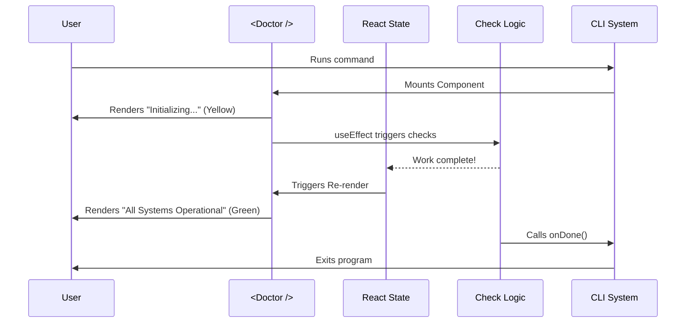

# Chapter 5: Screen Component Integration

Welcome to the final chapter of our **Doctor** command tutorial!

In [Chapter 4: Local JSX Command Handler](04_local_jsx_command_handler.md), we built the "bridge" (`doctor.tsx`) that connects the CLI system to React. We passed a special function called `onDone` across that bridge.

Now, we are going to build the destination: **The Screen Component**.

## What is a Screen Component?

**The Central Use Case:**
Imagine you are building a video game. You have the console (the CLI) and the controller (the inputs), but you need a **Television** to actually see the game.

In our project, the **Screen Component** (`<Doctor />`) is that television.
It is responsible for:
1.  **Visuals**: Showing text, colors, and spinners to the user.
2.  **Logic**: Running the actual health checks (like "Is Docker running?").
3.  **Completion**: Deciding when the command is finished and shutting down.

If we didn't have this component, the command would just hang in empty space, doing nothing.

## Key Concepts

To build a screen for a CLI, we use **React**, but with a twist.

### 1. Terminal UI (TUI)
In a web browser, you use HTML tags like `<div>` or `<h1>`.
In a terminal, those tags don't exist. Instead, we use special components provided by a library called **Ink**.
*   Instead of `<div>`, we use `<Box>`.
*   Instead of `<span>`, we use `<Text>`.

### 2. The `onDone` Prop
React components usually run forever until the user closes the browser tab.
But a CLI command needs to **exit** when it finishes its job. We use a prop called `onDone`. When our work is finished, we call this function to tell the CLI: "Cut! It's a wrap."

## How to Build the Screen

Let's build `screens/Doctor.tsx`. We will create a simple screen that simulates checking the system health and then exits.

### 1. Imports and Setup
First, we import React and the basic building blocks for Terminal UI.

```typescript
import React, { useEffect, useState } from 'react';
import { Text, Box } from 'ink'; // Special Terminal components

// We define what props this component accepts
interface DoctorProps {
  onDone: () => void; // The "Exit Button"
}
```
*Explanation: We are getting ready to build a UI. We define `DoctorProps` to ensure we receive the `onDone` function from the handler we built in Chapter 4.*

### 2. The Component State
We need to remember what is happening. Are we loading? Did we find a problem?

```typescript
export const Doctor: React.FC<DoctorProps> = ({ onDone }) => {
  // State to hold the current status message
  const [status, setStatus] = useState('Initializing diagnosis...');
  
  // State to determine color (green for good, yellow for working)
  const [color, setColor] = useState('yellow');

  // ... logic continues below
```
*Explanation: We use `useState`. `status` stores the text user sees ("Checking..."), and `color` makes it look pretty.*

### 3. The Logic (The Diagnosis)
We use `useEffect` to trigger the actual work as soon as the component appears on the screen.

```typescript
  useEffect(() => {
    // Simulate a heavy task (like checking a database)
    const runChecks = setTimeout(() => {
      setStatus('All systems operational! \u2714'); // checkmark symbol
      setColor('green');
      
      // Tell the CLI we are finished after a short pause
      setTimeout(onDone, 1000); 
    }, 2000);

    return () => clearTimeout(runChecks);
  }, [onDone]);
```
*Explanation:*
1.  **Start**: When the screen mounts, the timer starts.
2.  **Wait**: It waits 2 seconds (simulating work).
3.  **Update**: It changes the text to "All systems operational!" and turns green.
4.  **Exit**: It calls `onDone`, which shuts down the CLI program.

### 4. The Visuals (The Return)
Finally, we draw the UI based on our current state.

```typescript
  return (
    <Box flexDirection="column" padding={1}>
      <Text color="cyan" bold> CLAUDE DOCTOR </Text>
      <Box marginTop={1}>
        <Text color={color}> {status} </Text>
      </Box>
    </Box>
  );
};
```
*Explanation:*
*   `<Box>`: Acts like a container with padding.
*   `<Text>`: Displays our `status` string in the requested `color`.
*   The user sees "CLAUDE DOCTOR" at the top, and the status updating below it.

## Under the Hood: The Rendering Cycle

How does React work inside a black-and-white terminal window?

1.  **Mount**: The CLI mounts `<Doctor />`.
2.  **First Paint**: React generates a string of text with special color codes and sends it to `process.stdout` (your terminal screen).
3.  **Re-render**: When `setStatus` changes, React calculates the difference. It erases the previous line and writes the new line.
4.  **Unmount**: When `onDone` is called, the CLI stops listening to React and releases the terminal back to the user.



### Implementing Complex Logic
In a real application, you wouldn't just use `setTimeout`. You would import helper functions to check files, network connections, or API keys.

```typescript
// Example of real world usage inside useEffect
useEffect(() => {
  async function diagnose() {
    const isDockerRunning = await checkDocker(); // Import this real function
    if (isDockerRunning) {
      setStatus("Docker is good.");
    } else {
      setStatus("Error: Docker is down.");
    }
    onDone();
  }
  diagnose();
}, []);
```

## Tutorial Summary

Congratulations! You have successfully built the complete architecture for the `doctor` command.

Let's review the journey we took through these 5 chapters:

1.  **[Command Definition](01_command_definition.md)**: We created the "Menu Item" so the CLI knows the command exists.
2.  **[Environment Feature Flags](02_environment_feature_flags.md)**: We added a safety switch to enable/disable the command using `process.env`.
3.  **[Lazy Module Loading](03_lazy_module_loading.md)**: We ensured the heavy code is only loaded when the user asks for it, keeping the app fast.
4.  **[Local JSX Command Handler](04_local_jsx_command_handler.md)**: We built a bridge to translate the CLI command into a React environment.
5.  **Screen Component Integration**: We built the interactive UI that communicates with the user and runs the actual logic.

You now possess the knowledge to add any number of complex, interactive commands to this project. Happy coding!

---

Generated by [Code IQ](https://github.com/adityasoni99/Code-IQ)