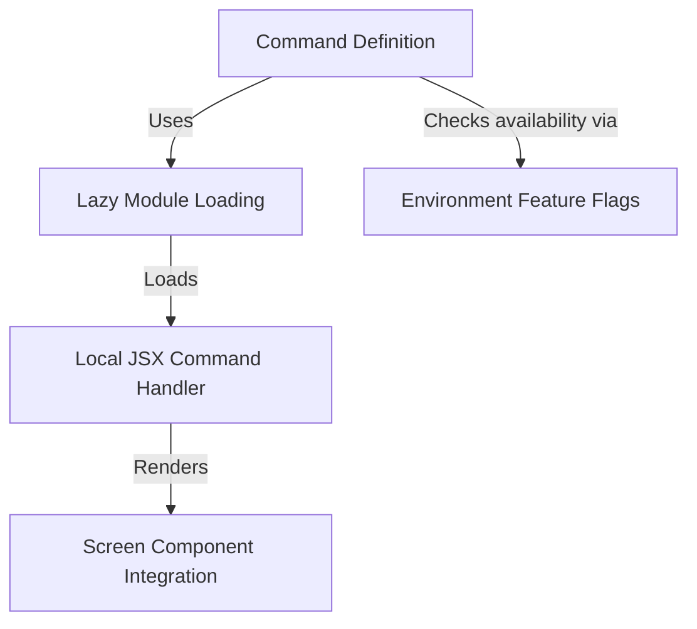

# Tutorial: doctor

This project implements a **system diagnostic tool** designed to verify the installation and settings of the application. It utilizes a **lazy loading** strategy to fetch the command logic only when needed and renders an interactive *React-based* user interface directly within the terminal to display the diagnosis results.

## Chapters

1. [Command Definition](01_command_definition.md)
2. [Environment Feature Flags](02_environment_feature_flags.md)
3. [Lazy Module Loading](03_lazy_module_loading.md)
4. [Local JSX Command Handler](04_local_jsx_command_handler.md)
5. [Screen Component Integration](05_screen_component_integration.md)

---

Generated by [Code IQ](https://github.com/adityasoni99/Code-IQ)