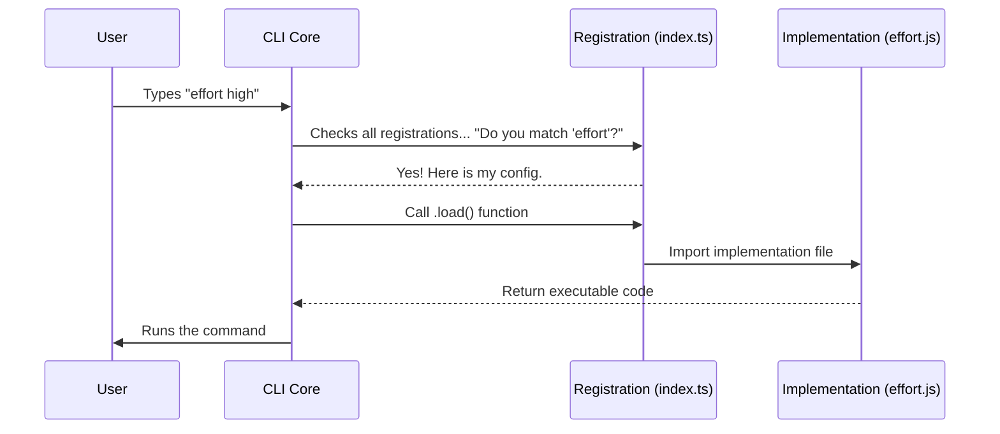

# Chapter 1: Command Module Registration

Welcome to the **Effort** project tutorial! In this series, we are going to build a CLI (Command Line Interface) feature that allows users to control how "hard" an AI model thinks before answering.

## Motivation

Imagine you are building a massive CLI tool that has 50 different commands.

If the application loaded the code for **all 50 commands** every time you started it, the program would be slow and sluggish. It would be like a restaurant chef cooking every single item on the menu before you even sat down to order!

**Command Module Registration** solves this. It acts like a **Menu**. It lists what is available (the command name) and a brief description, but it doesn't do the "heavy lifting" (loading the actual logic) until the user specifically asks for it.

### The Use Case

We want to create a command that looks like this:

```bash
my-cli effort high
```

To make this work, we need a small file that tells the CLI:
1.  "My name is `effort`."
2.  "I accept arguments like `low`, `high`, or `auto`."
3.  "Here is where you find my code if someone calls me."

## Concept Breakdown

The registration file is a lightweight "ID Card" for your feature. Here are the key parts:

1.  **Identity:** The unique name the user types (e.g., `effort`).
2.  **Metadata:** Helpful text for the user (description, argument hints).
3.  **Lazy Loader:** A special function that imports the heavy code only when needed.

## Implementation Guide

Let's look at the file `index.ts`. We will break it down into small, manageable pieces.

### 1. Defining the Structure

First, we export a default object. We use `satisfies Command` to make sure we don't forget any required information. This is like filling out a form—TypeScript will yell at us if we leave a box blank.

```typescript
import type { Command } from '../../commands.js'

export default {
  type: 'local-jsx', // Defines the rendering engine
  name: 'effort',    // The command the user types
  // ... more settings below
} satisfies Command
```

*   **Explanation:** We tell the system that this module is a `Command`. The `type: 'local-jsx'` tells the CLI that we will eventually draw the interface using React (we'll cover that in [React-based Command Lifecycle](02_react_based_command_lifecycle.md)).

### 2. Adding User Instructions

Next, we tell the user what this command does and what arguments it accepts.

```typescript
  // Inside the object...
  description: 'Set effort level for model usage',
  
  // Shows the user what options are available
  argumentHint: '[low|medium|high|max|auto]',
```

*   **Explanation:** If a user types `my-cli help`, they will see this description. The `argumentHint` is a visual cue telling them they can type `effort low` or `effort max`.

### 3. The Lazy Loader

This is the most important part for performance. We define a `load` function.

```typescript
  // ...
  // This function is ONLY called if the user types "effort"
  load: () => import('./effort.js'),
} satisfies Command
```

*   **Explanation:** Notice we use `() => import(...)`. This means we **do not** read the file `./effort.js` right now. We wait until the CLI specifically asks for it. This keeps the application startup fast.

### 4. Immediate Execution Logic

Sometimes, we need to decide if the command runs immediately or waits for user interaction.

```typescript
import { shouldInferenceConfigCommandBeImmediate } from '../../utils/immediateCommand.js'

// ... inside the object
  get immediate() {
    // Returns true/false based on system state
    return shouldInferenceConfigCommandBeImmediate()
  },
```

*   **Explanation:** This getter checks if the command needs to bypass standard waiting times. For beginners, just know this helps the CLI feel snappy.

## Under the Hood: How it Works

What happens when you actually run the program? Let's visualize the flow.

### Sequence Diagram

This diagram shows how the CLI uses the Registration module to find and run your command.



### The Registration Flow

1.  **Startup:** The CLI starts up. It scans your folder for `index.ts` files. It reads the **Name** and **Description**, but it ignores the `load` function for now.
2.  **Matching:** When you type `effort`, the CLI looks through its list of names. It finds a match in our registration file.
3.  **Activation:** Now that it knows you want to run `effort`, it executes the `load()` function.
4.  **Handoff:** The `load()` function imports `./effort.js`. This file contains the actual React logic and controllers.

The file `./effort.js` (which we just loaded) is where the real magic happens. This leads us directly into the next concepts, specifically the [React-based Command Lifecycle](02_react_based_command_lifecycle.md) where we draw the UI, and the [Effort Level Controller](03_effort_level_controller.md) which handles the logic.

## Conclusion

You have successfully created the "Entry Point" for your feature!

*   We defined the command's **Name** (`effort`).
*   We described its **Arguments** (`low`, `high`, etc.).
*   We set up **Lazy Loading** so our app stays fast.

Currently, our command is registered, but we haven't defined *how* it behaves once it runs. For that, we need to look at the implementation file we just pointed to.

[Next Chapter: React-based Command Lifecycle](02_react_based_command_lifecycle.md)

---

Generated by [Code IQ](https://github.com/adityasoni99/Code-IQ)