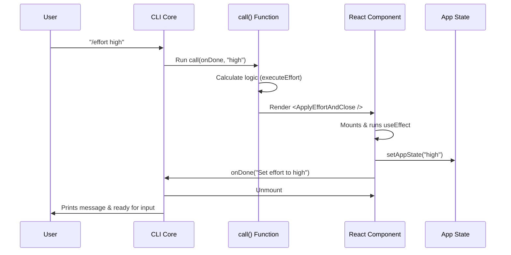

# Chapter 2: React-based Command Lifecycle

In the previous chapter, [Command Module Registration](01_command_module_registration.md), we set up the "Menu" for our application. We told the CLI that a command named `effort` exists.

Now, we are going to build the kitchen. When the user orders "Effort," what actually happens?

## Motivation

In traditional scripts (like Bash or simple Python scripts), execution is linear:
1.  Read input.
2.  Do math.
3.  Print text.
4.  Exit.

However, modern CLI tools are interactive. They might need to wait for an API, show a loading spinner, or manage global state (like a "Memory" of settings).

**React-based Command Lifecycle** brings the power of web development to the terminal. Instead of just running a function, we **render a component**. This allows us to:
*   Manage **State** (remembering settings).
*   Handle **Side Effects** (writing to config files).
*   Control **Asynchronous Flow** (waiting for data).

### The Use Case

We want to handle this command:
```bash
/effort high
```

The CLI needs to:
1.  **Parse** "high".
2.  **Update** the application state so the AI knows to think harder.
3.  **Notify** the user ("Effort set to high").
4.  **Close** the command.

## Concept Breakdown

To make this work, we use three main concepts:

1.  **The Entry Point (`call`):** The function that decides *which* component to show.
2.  **The Component:** A React function that handles the logic.
3.  **The `onDone` Callback:** The "Exit Button." Since React apps usually run forever, we need a specific way to tell the CLI "We are finished here."

## Implementation Guide

Let's look at `effort.tsx`. We will build the lifecycle step-by-step.

### 1. The Entry Point

This is the function that the Lazy Loader (from Chapter 1) imports. Its job is to look at the arguments and decide what to render.

```typescript
// effort.tsx
import * as React from 'react';
// ... other imports

export async function call(
  onDone: LocalJSXCommandOnDone, // The "Exit" switch
  _context: unknown,
  args?: string                  // User input (e.g., "high")
): Promise<React.ReactNode> {
```

*   **Explanation:** This function receives `onDone`. Pass this around! Whoever calls this function finishes the command. It returns a `ReactNode`—literally UI elements.

### 2. Routing Logic

Inside `call`, we check what the user wants. Do they want to *see* the current status, or *change* it?

```typescript
  // Inside call()...
  args = args?.trim() || '';

  // Case A: User typed "/effort" or "/effort status"
  if (!args || args === 'current' || args === 'status') {
    return <ShowCurrentEffort onDone={onDone} />;
  }

  // Case B: User typed "/effort high"
  const result = executeEffort(args);
  return <ApplyEffortAndClose result={result} onDone={onDone} />;
}
```

*   **Explanation:** We act like a traffic cop. If the user didn't provide a value, we render `<ShowCurrentEffort />`. If they did, we render `<ApplyEffortAndClose />`.

### 3. The Logic Component (`ApplyEffortAndClose`)

This component is invisible. It doesn't print text to the screen immediately. Instead, it acts like a logic controller. It runs once, updates settings, and leaves.

```typescript
function ApplyEffortAndClose({ result, onDone }) {
  const setAppState = useSetAppState(); // Hook to access global state
  const { effortUpdate, message } = result;

  React.useEffect(() => {
    // Logic goes here (see next snippet)
  }, [effortUpdate, message, onDone, setAppState]);

  return null; // We don't render UI, we just send a final message
}
```

*   **Explanation:** We use `useEffect`. In React, this means "Do this after the component loads." We return `null` because we aren't drawing a UI widget; we are performing an action.

### 4. Performing Side Effects

Inside that `useEffect`, we actually update the application.

```typescript
    // Inside useEffect...
    if (effortUpdate) {
      // 1. Update the Global State
      setAppState(prev => ({
        ...prev,
        effortValue: effortUpdate.value
      }));
    }
    
    // 2. Tell the CLI we are done and print the result
    onDone(message);
```

*   **Explanation:**
    1.  **`setAppState`**: This updates the CLI's working memory.
    2.  **`onDone(message)`**: This is crucial. It prints the success message to the terminal and kills the React process for this command, returning control to the user.

## Internal Mechanics: How it Works

What happens "Under the Hood" when you press Enter?

### Sequence Diagram



### The Lifecycle Flow

1.  **Mounting:** The CLI "mounts" your component. It's like opening a browser window that is invisible.
2.  **Execution:** The `useEffect` hook triggers immediately. It calculates necessary updates.
3.  **State Update:** The component reaches out to the Global App State (which we will cover in [State and Persistence Bridge](05_state_and_persistence_bridge.md)) and changes the configuration.
4.  **Termination:** The component calls `onDone`. The CLI receives the final string, prints it, and destroys the component instance.

## Why do it this way?

You might ask: *Why not just update the variable and return a string? Why use React?*

Simple commands might not need it, but complex ones do. By using React components, we prepare ourselves for complex interactions, such as:
*   Showing a progress bar while saving settings.
*   Asking for confirmation ("Are you sure?") before applying.
*   Listening for real-time updates from other parts of the system.

## Conclusion

We have successfully built a command that has a **Lifecycle**. It starts, thinks, acts, and finishes using standard React patterns.

*   We used `call()` to route the request.
*   We used a React Component to handle the logic.
*   We used `onDone` to exit gracefully.

Now that we have successfully updated the state to "high", what does "high" actually *mean* to the AI? How does the system interpret that string?

[Next Chapter: Effort Level Controller](03_effort_level_controller.md)

---

Generated by [Code IQ](https://github.com/adityasoni99/Code-IQ)