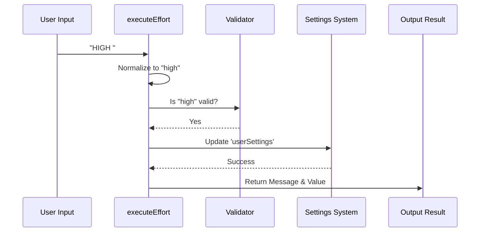

# Chapter 3: Effort Level Controller

In the previous chapter, [React-based Command Lifecycle](02_react_based_command_lifecycle.md), we built the visual component that receives the command. We learned how to "mount" the command and "close" it when done.

But wait—what actually happens when we receive the text `"high"`? How does the computer know that `"high"` is valid, but `"super-duper-mode"` is not?

This brings us to the **Effort Level Controller**.

## Motivation

Think of the **Command Registration** (Chapter 1) as the **Menu** in a restaurant.
Think of the **React Lifecycle** (Chapter 2) as the **Waiter** who takes your order and brings you the food.

The **Effort Level Controller** is the **Chef**.

The Chef needs to:
1.  **Understand the Ticket:** If the waiter writes "med-rare", the chef knows that means "Medium Rare".
2.  **Check Ingredients:** If you order "Unicorn Steak", the chef says, "We don't serve that."
3.  **Cook the Food:** The chef actually prepares the meal (updates the settings).

### The Use Case

We want to handle this scenario:

```bash
/effort HIGH
```

The controller needs to take this raw, messy input and turn it into a precise configuration update for the AI model.

## Concept Breakdown

The Controller logic is contained in the function `executeEffort`. It performs three distinct steps:

1.  **Normalization:** Users are messy. They might type `High`, `HIGH`, or `high `. We need to clean this up.
2.  **Validation:** We need a bouncer at the door. Only specific words (`low`, `medium`, `high`, `max`, `auto`) are allowed in.
3.  **Execution:** If the input is valid, we bundle up the result and send it back to the React component.

## Implementation Guide

Let's look at how we build this logic inside `effort.tsx`.

### 1. The Main Controller Function

This is the entry point for our logic. It takes the raw string from the user.

```typescript
// effort.tsx
export function executeEffort(args: string): EffortCommandResult {
  // 1. Normalization: Clean up the input
  const normalized = args.toLowerCase();

  // 2. Special Case: Handling "auto"
  if (normalized === 'auto' || normalized === 'unset') {
    return unsetEffortLevel();
  }
  
  // ... continued below
```

*   **Explanation:** We immediately convert `HIGH` to `high` using `.toLowerCase()`. This makes checking for equality much easier later. We also check for `auto` immediately, as that requires clearing settings rather than setting a new one.

### 2. The Validator

Now that we have a clean string, we ask: "Is this a real effort level?"

```typescript
  // ... inside executeEffort
  
  // 3. Validation: Check against allowed list
  if (!isEffortLevel(normalized)) {
    return {
      message: `Invalid argument: ${args}. Valid options are: low, medium, high, max, auto`
    };
  }

  // 4. Action: Apply the change
  return setEffortValue(normalized);
}
```

*   **Explanation:** `isEffortLevel` is a helper function that returns `true` or `false`. If the user typed `chaos_mode`, this returns `false`, and we return an error message immediately. If it is valid, we pass it to `setEffortValue`.

### 3. The Action Taker (`setEffortValue`)

This function does the actual work of preparing the data to be saved.

```typescript
function setEffortValue(effortValue: EffortValue): EffortCommandResult {
  // We prepare the value to be saved to disk
  const persistable = toPersistableEffort(effortValue);
  
  if (persistable !== undefined) {
    // We attempt to save it to User Settings
    const result = updateSettingsForSource('userSettings', {
      effortLevel: persistable
    });
    // Error handling omitted for brevity...
  }
  
  // ... continued below
```

*   **Explanation:** We convert the value into a format safe for storage (`persistable`). Then, we call `updateSettingsForSource`. This saves the preference so that the next time you open the CLI, it remembers you like "high" effort.

### 4. Generating the Feedback

Finally, the function returns a result object containing a human-readable message and the data update.

```typescript
  // ... inside setEffortValue
  
  const description = getEffortValueDescription(effortValue);
  
  return {
    message: `Set effort level to ${effortValue}: ${description}`,
    effortUpdate: {
      value: effortValue
    }
  };
}
```

*   **Explanation:** We don't just say "Done." We fetch a helpful description (e.g., "Comprehensive implementation with extensive testing") so the user confirms they selected the right mode.

## Under the Hood: How it Works

Let's visualize the flow of data when the user presses Enter.

### Sequence Diagram



### The Logic Flow

1.  **Input:** The user inputs a string. It might have weird capitalization.
2.  **Sanitization:** The Controller strips spaces and lowers case.
3.  **Gatekeeping:** The Validator checks a predefined list of allowed words.
4.  **Storage:** If valid, the Controller talks to the Settings System to persist the change.
5.  **Feedback:** The Controller packages the result into a clean object (`EffortCommandResult`) which the React component (from Chapter 2) will display.

## Why separate this from React?

You might wonder: *Why didn't we put this `if/else` logic directly inside the React component?*

By separating the **Controller Logic** (`executeEffort`) from the **View** (React), we gain two benefits:
1.  **Testability:** We can write tests for `executeEffort('bad')` without needing to set up a fake React environment.
2.  **Reusability:** If we ever want to change effort levels via a different interface (like a config file or a GUI button), we can reuse this exact same logic.

## Conclusion

You have just built the "Brain" of the command!

*   We **normalized** messy user input.
*   We **validated** that the input matches allowed effort levels.
*   We **mapped** the text string to a concrete description.

However, saving the setting isn't always enough. Sometimes a user might have a global Environment Variable set (like `CLAUDE_CODE_EFFORT_LEVEL`) that conflicts with what they just typed. Who wins? The saved setting or the environment variable?

To solve this, we need to understand the **Configuration Priority System**.

[Next Chapter: Configuration Priority System](04_configuration_priority_system.md)

---

Generated by [Code IQ](https://github.com/adityasoni99/Code-IQ)