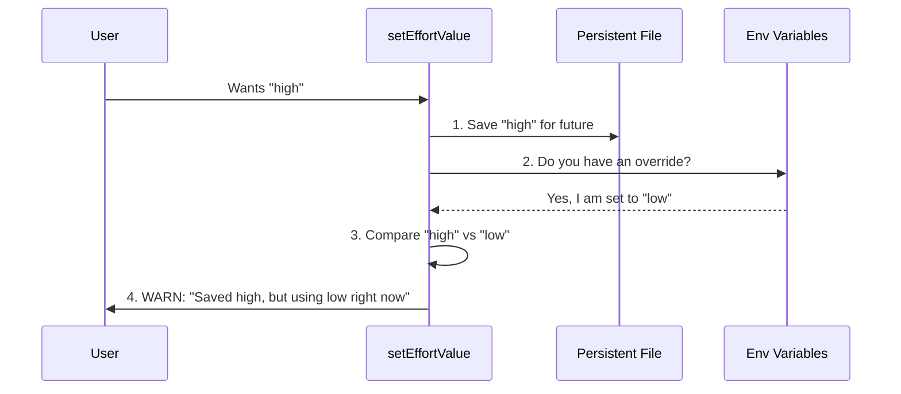

# Chapter 4: Configuration Priority System

In the previous chapter, [Effort Level Controller](03_effort_level_controller.md), we built the logic to validate user input. We know how to turn the text `"high"` into a valid configuration object.

But there is a catch.

What if you saved your preference as "High", but your system administrator set a global rule forcing "Low"? Who wins?

This chapter introduces the **Configuration Priority System**. This is the logic that decides which setting effectively controls the AI when multiple sources disagree.

## Motivation

Imagine you are adjusting the thermostat in your house.
1.  **The Schedule (Saved Setting):** Says 70°F.
2.  **You (User Command):** Turn the dial to 75°F.
3.  **The Main Breaker (Environment Variable):** Is turned OFF.

No matter how much you turn the dial (User Command), if the power is out (Environment Variable), the heat won't turn on.

### The Use Case

A user runs this command:
```bash
/effort high
```

 However, they started the application like this:
```bash
CLAUDE_CODE_EFFORT_LEVEL=low claude
```

**The Problem:** If we just say "Success! Effort set to High," we are lying. The application will technically "remember" High for later, but *right now*, it is forced to run on Low.

**The Solution:** We need a hierarchy to detect this conflict and warn the user.

## Concept Breakdown

We enforce a strict "Hierarchy of Power."

1.  **Environment Variables (Highest Priority):**
    These are temporary overrides set in the terminal (`CLAUDE_CODE_EFFORT_LEVEL`). They rule with an iron fist. If this is set, nothing else matters for the current session.

2.  **Session/User Commands (Middle Priority):**
    When the user types `/effort high`. This overrides saved settings, but *cannot* override Environment Variables.

3.  **Saved Settings (Lowest Priority):**
    The default behavior stored in a configuration file from previous sessions.

## Implementation Guide

We implement this logic inside our main execution function, `setEffortValue`. We don't just save the value; we check if the value can actually be applied.

Let's look at `effort.tsx` again.

### 1. Saving the Preference

First, we do what the user asked: we try to save their preference to the persistent settings file.

```typescript
// effort.tsx - inside setEffortValue()

// 1. Convert to a save-able format
const persistable = toPersistableEffort(effortValue);

// 2. Save to User Settings (The "Employee Handbook")
if (persistable !== undefined) {
  updateSettingsForSource('userSettings', {
    effortLevel: persistable
  });
}
```

*   **Explanation:** This updates the "Lowest Priority" layer. Even if an Env Var blocks it *now*, we save it so that next time (when the Env Var is gone), this setting will work.

### 2. Checking the "Boss" (Environment Variables)

Now, we check if there is a higher power controlling the system.

```typescript
import { getEffortEnvOverride } from '../../utils/effort.js';

// ... inside setEffortValue()

// Check if an Environment Variable is set
const envOverride = getEffortEnvOverride();
```

*   **Explanation:** `getEffortEnvOverride` looks at `process.env`. If it finds `CLAUDE_CODE_EFFORT_LEVEL`, it returns that value. Otherwise, it returns `undefined`.

### 3. Detecting Conflict

This is the core of the Priority System. We compare what the **User Wants** vs. what the **Env Var Dictates**.

```typescript
// If an override exists AND it's different from what the user wants
if (envOverride !== undefined && envOverride !== effortValue) {
  
  const envRaw = process.env.CLAUDE_CODE_EFFORT_LEVEL;
  
  // Return a WARNING instead of a success message
  return {
    message: `Not applied: CLAUDE_CODE_EFFORT_LEVEL=${envRaw} overrides effort this session.`,
    effortUpdate: { value: effortValue }
  };
}
```

*   **Explanation:**
    *   If `envOverride` is "low" and `effortValue` (user input) is "high", they don't match.
    *   We return a message telling the user: "I heard you, and I saved 'High' for later, but right now 'Low' is in charge."

### 4. The Happy Path

If there is no Environment Variable (or if it matches what the user wants), we return the standard success message.

```typescript
// ... inside setEffortValue()

return {
  message: `Set effort level to ${effortValue}`,
  effortUpdate: {
    value: effortValue
  }
};
```

## Under the Hood: The Flow of Logic

How does the system make this decision? Let's visualize the decision tree when a user types `/effort high`.

### Sequence Diagram



### Why logic works this way

You might ask: *Why do we save the setting if it's being ignored?*

Imagine you are temporarily working on a laptop with a battery saver limitation (Env Var). You set your preference to "Max Performance".
1.  **Right now:** The battery saver forces "Low Power".
2.  **Tomorrow:** You plug the laptop in (Env Var removed).
3.  **Result:** Because we saved your "Max Performance" setting, the system automatically switches to it.

## Analyzing the Output

The `executeEffort` function returns a result object. The **React Component** (from [Chapter 2](02_react_based_command_lifecycle.md)) uses this object.

### Scenario A: No Conflict
*   **Input:** `/effort high`
*   **Env Var:** (Empty)
*   **Output Message:** "Set effort level to high"
*   **Effect:** App state updates to high. Settings file updates to high.

### Scenario B: Conflict
*   **Input:** `/effort high`
*   **Env Var:** `low`
*   **Output Message:** "Not applied: CLAUDE_CODE_EFFORT_LEVEL=low overrides effort this session"
*   **Effect:** App state stays `low` (because Env wins), but Settings file updates to `high` (for later).

## Conclusion

You have successfully implemented a **Priority System**.

*   We acknowledged that different configuration sources exist.
*   We gave **Environment Variables** the power of veto.
*   We ensured the user is **warned** rather than confused when their command doesn't seem to work immediately.

Now we have a command that parses input, handles conflicts, and prepares data for saving. But how exactly does that data get into the permanent configuration file? How do we read it back when the app restarts?

For that, we need to cross the bridge between our running code and the file system.

[Next Chapter: State and Persistence Bridge](05_state_and_persistence_bridge.md)

---

Generated by [Code IQ](https://github.com/adityasoni99/Code-IQ)