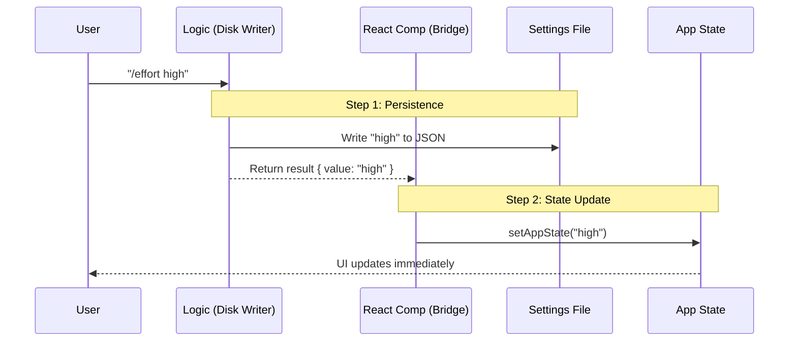

# Chapter 5: State and Persistence Bridge

In the previous chapter, [Configuration Priority System](04_configuration_priority_system.md), we learned how to decide which setting wins when there are conflicts (like Environment Variables vs. User Input). We figured out *what* the value should be.

Now, we need to make sure that value actually **sticks**.

## Motivation

Computers have two types of memory:
1.  **Short-term (RAM):** Fast, but forgets everything when you close the program.
2.  **Long-term (Disk):** Slower, but remembers everything forever.

When a user types `/effort high`, two things must happen:
1.  **Immediate Effect:** The AI needs to know *right now* to use high effort for the next question.
2.  **Permanent Record:** If you close the CLI and open it tomorrow, it should remember you set it to "high."

The **State and Persistence Bridge** is the code that synchronizes these two worlds. It ensures your "Current Session" and your "Saved Settings" stay in sync.

### The Use Case

The user successfully sets the effort level:
```bash
/effort high
```

We need to:
1.  Write "high" to a generic `settings.json` file (Persistence).
2.  Update the running React application so the UI updates instantly (State).

## Concept Breakdown

To achieve this, we use two specific tools provided by the framework.

### 1. Persistence (`updateSettingsForSource`)
This is the "Long-term Memory." It writes data to the user's configuration file. This happens inside our logic controller.

### 2. State (`useAppState`)
This is the "Short-term Memory." It is a React Hook that holds the current variables in memory. This happens inside our UI component.

## Implementation Guide

We handle this synchronization in two different parts of our code: the **Logic Function** (Disk) and the **React Component** (RAM).

### Part 1: Writing to Disk (Persistence)

Inside our logic function `setEffortValue` (which we looked at in Chapter 3), we save the data.

```typescript
// effort.tsx
import { updateSettingsForSource } from '../../utils/settings/settings.js';

// Inside setEffortValue()...
const persistable = toPersistableEffort(effortValue);

if (persistable !== undefined) {
  // This writes to the physical file on the user's disk
  updateSettingsForSource('userSettings', {
    effortLevel: persistable
  });
}
```

*   **Explanation:** `updateSettingsForSource` opens the user's settings file, finds the `effortLevel` key, and updates it. This ensures that next time the app loads, it reads this value.

### Part 2: Updating RAM (State)

Saving to disk doesn't automatically tell the running React app that something changed. We need to manually update the "Live State." We do this in the `ApplyEffortAndClose` component.

First, we grab the "setter" hook:

```typescript
// effort.tsx
import { useSetAppState } from '../../state/AppState.js';

function ApplyEffortAndClose({ result, onDone }) {
  // This hook allows us to write to the live application memory
  const setAppState = useSetAppState();
  
  // ... logic continues
```

*   **Explanation:** `useSetAppState` gives us a function (similar to React's `setState`) that updates the global store.

### Part 3: The Bridge (Connecting them)

Now we use `useEffect` to trigger the update. We take the result calculated by our logic and feed it into the state.

```typescript
  // ... inside ApplyEffortAndClose
  const { effortUpdate } = result;

  React.useEffect(() => {
    if (effortUpdate) {
      // Update the global variable 'effortValue'
      setAppState(prev => ({
        ...prev,
        effortValue: effortUpdate.value
      }));
    }
    // ... cleanup code
  }, [effortUpdate, setAppState]);
```

*   **Explanation:**
    1.  We check if `effortUpdate` exists (it comes from the logic function).
    2.  We call `setAppState`.
    3.  We use `...prev` to keep all other state variables (like model name, history, etc.) unchanged, only updating `effortValue`.

## Under the Hood: The Synchronization Flow

Let's visualize how the data travels from your keyboard to the disk and back to the memory.

### Sequence Diagram



### The "Bridge" Pattern

1.  **Logic Phase:** The pure TypeScript function calculates the valid value and saves it to **Disk**. It returns this value to the caller.
2.  **View Phase:** The React Component receives this value. It acts as the bridge. It takes the value returned by the Logic Phase and pushes it into **RAM**.

## Reading the State

So far we have *written* the state. How do we *read* it to show the user?

We use `useAppState`. This hook listens to the RAM. If the RAM changes (because of what we did in Part 2), this hook triggers a re-render.

```typescript
// effort.tsx
function ShowCurrentEffort({ onDone }) {
  // Select ONLY the effortValue from the huge state object
  const effortValue = useAppState(s => s.effortValue);
  
  // Pass this value to our helper to generate the message
  const { message } = showCurrentEffort(effortValue, model);
  
  onDone(message);
  return null;
}
```

*   **Explanation:** `useAppState(s => s.effortValue)` means "Watch the global state, but only wake me up if `effortValue` changes."

## Why separate them?

You might ask: *Why doesn't `updateSettingsForSource` just automatically update `useAppState`?*

Decoupling (separating) them is safer:
1.  **Performance:** Writing to disk is slow (milliseconds). Updating RAM is fast (microseconds). We don't want the UI to freeze while waiting for the hard drive.
2.  **Flexibility:** Sometimes we want to update the State *without* saving to disk (e.g., a "Preview" mode).
3.  **Truth:** The State represents "What is happening right now." The Disk represents "What should happen next time." Keeping them separate allows for complex features like Session Overrides (which we discussed in the Priority System).

## Conclusion

Congratulations! You have completed the **Effort** project tutorial series.

You have built a fully functional, professional-grade CLI feature that:
1.  **Registers** itself efficiently ([Chapter 1](01_command_module_registration.md)).
2.  **Renders** a UI using React lifecycle methods ([Chapter 2](02_react_based_command_lifecycle.md)).
3.  **Validates** input using a logic controller ([Chapter 3](03_effort_level_controller.md)).
4.  **Prioritizes** configuration sources safely ([Chapter 4](04_configuration_priority_system.md)).
5.  **Synchronizes** memory and disk using the State Bridge (this chapter).

You now understand the core architecture of building complex, interactive tools where user preferences must be both immediate and permanent.

---

Generated by [Code IQ](https://github.com/adityasoni99/Code-IQ)