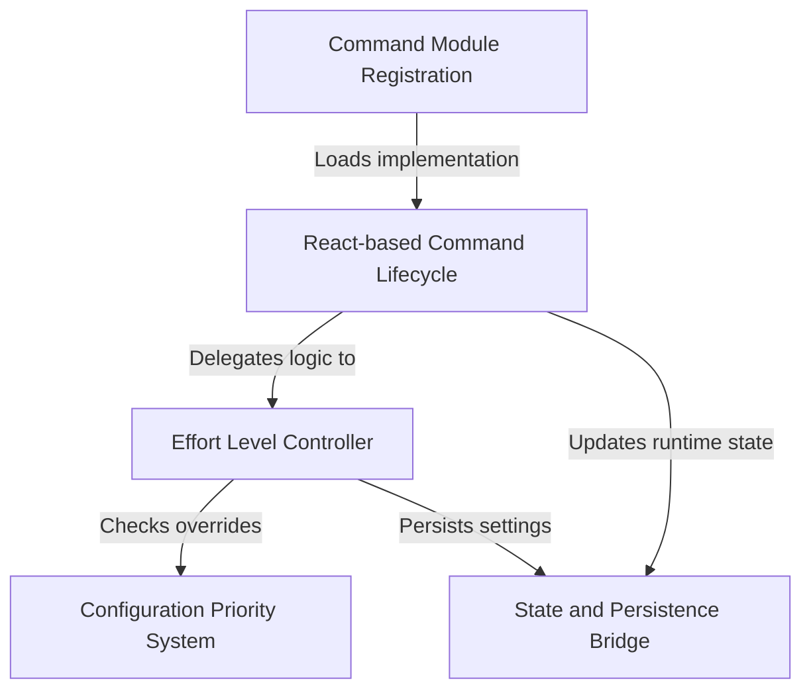

# Tutorial: effort

This project implements a CLI command that allows users to adjust the **effort level** of an AI model (e.g., *low*, *high*, *max*), controlling the depth of reasoning used. It utilizes a **React-based** lifecycle to process commands, resolves conflicts between environment variables and user inputs, and ensures preferences are synchronized between runtime state and persistent storage.

## Chapters

1. [Command Module Registration](01_command_module_registration.md)
2. [React-based Command Lifecycle](02_react_based_command_lifecycle.md)
3. [Effort Level Controller](03_effort_level_controller.md)
4. [Configuration Priority System](04_configuration_priority_system.md)
5. [State and Persistence Bridge](05_state_and_persistence_bridge.md)

---

Generated by [Code IQ](https://github.com/adityasoni99/Code-IQ)