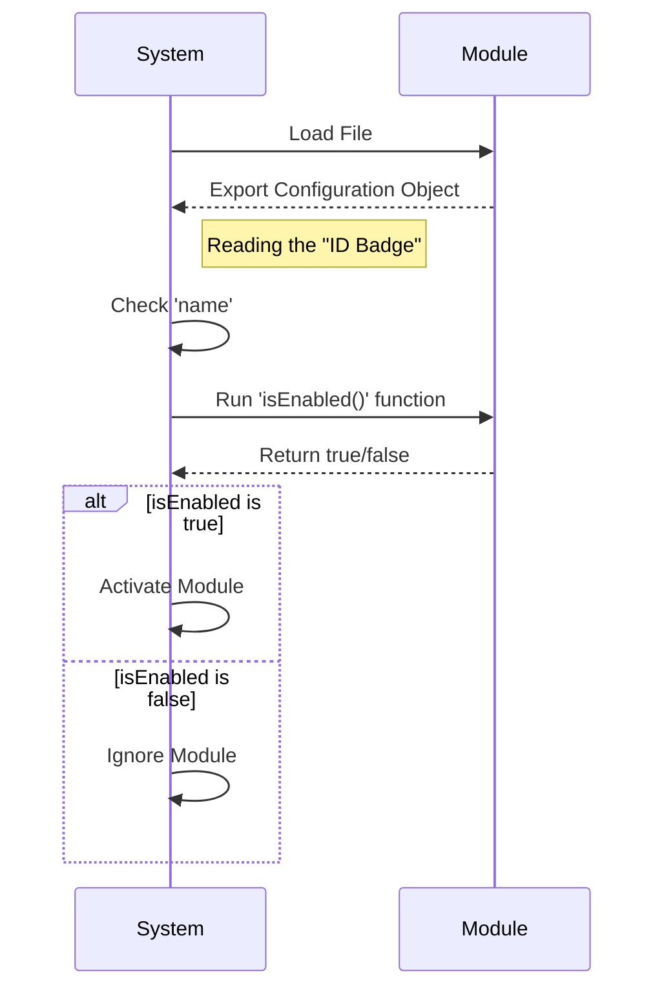

# Chapter 1: Module Configuration Interface

Welcome to the first chapter of the `env` project! Here, we will learn how to organize different parts of our software so they can work together smoothly.

## The Problem: Identifying Strangers

Imagine you are running a large office building. People arrive at the front door constantly. Some are employees, some are maintenance workers, and some are just testing the security doors.

If the security guard has to learn a different set of rules for every single person (e.g., "Bob needs a key," "Alice uses a passcode," "Charlie just yells open"), it would be chaos.

**The Solution:** You enforce a standard **ID Badge**.

Regardless of who the person is, they must present a standard badge with:
1.  **Name:** Who are they?
2.  **Status:** Are they allowed in right now?
3.  **Visibility:** Should they appear in the public directory?

In our code, this "ID Badge" is called the **Module Configuration Interface**.

## Key Concepts

To solve this, every module (tool or feature) in our system must provide a specific set of information.

1.  **`name`**: A simple text label (string) identifying the module.
2.  **`isHidden`**: A true/false flag. If `true`, this module works in the background and isn't listed in help menus.
3.  **`isEnabled`**: A rule (function) that decides if the module should turn on.

## Solving the Use Case

Let's look at how we write code to create this "ID Badge." We aren't writing complex logic yet; we are just exporting a set of rules.

Here is the code structure required for a module:

```javascript
// This is the "ID Badge" we present to the system
export default {
  name: 'my-module',
  isHidden: false,
  // A simple rule: always allow entry
  isEnabled: () => true
};
```

**What happens here?**
*   We create an object (the `{ }` brackets).
*   We define our three properties.
*   We `export` it so the main system can read it.

## Internal Implementation: Under the Hood

How does the system actually use this interface? Let's walk through the process step-by-step.

1.  **System Startup**: The main application wakes up.
2.  **Module Check**: It looks at a module file.
3.  **Badge Inspection**: It reads the exported object (the interface).
4.  **Decision**:
    *   It reads the `name` for logging.
    *   It runs `isEnabled()`. If it returns `false`, the system ignores the module.
    *   It checks `isHidden` to decide if it should print the name to the console.

### Sequence Diagram

Here is a diagram showing a module presenting its configuration to the System.



### Code Deep Dive

Let's look at a real, minimal example of this interface in action. This comes from a file named `index.js`. This specific example represents a "stub"—a placeholder module that does nothing.

**File:** `index.js`

```javascript
export default {
  isEnabled: () => false, // 1. Logic to decide if active
  isHidden: true,         // 2. Visibility setting
  name: 'stub'            // 3. Identity
};
```

**Explanation:**
1.  **`isEnabled: () => false`**: This is a function that returns `false`. It tells the system: "I am currently disabled. Do not let me in."
2.  **`isHidden: true`**: This tells the system: "Do not show me in the list of available tools."
3.  **`name: 'stub'`**: The ID of this module is "stub".

By adhering to this strict structure, the system can safely load this file without crashing, even though the module essentially says, "Leave me alone."

## Conclusion

You have learned about the **Module Configuration Interface**. Just like an ID badge allows a security guard to process people efficiently, this interface allows our system to process different code modules efficiently using a standard set of properties (`name`, `isHidden`, `isEnabled`).

Now that we know what the ID badge looks like, let's create a specific type of badge for a dummy module.

[Next Chapter: Stub Implementation](02_stub_implementation.md)

---

Generated by [Code IQ](https://github.com/adityasoni99/Code-IQ)