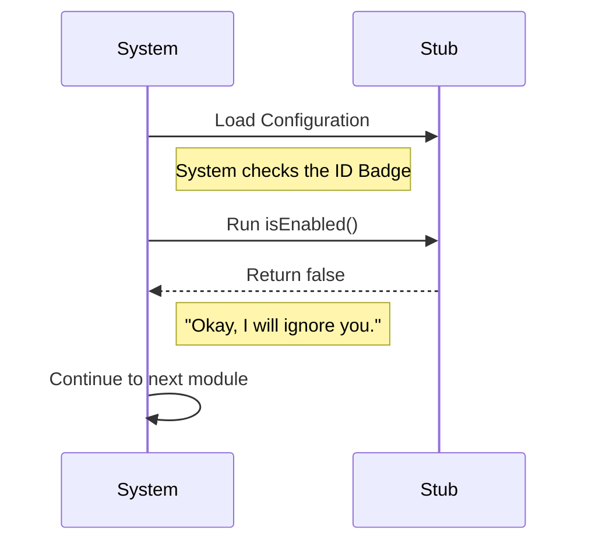

# Chapter 2: Stub Implementation

Welcome back! In [Chapter 1: Module Configuration Interface](01_module_configuration_interface.md), we learned that every module in our system needs to wear a standard "ID Badge" (the configuration interface) so the system can recognize it.

Now, we are going to build our first module. But here is the twist: **We are going to build a module that does absolutely nothing.**

## The Problem: The "Movie Prop" Dilemma

Imagine you are building a movie set for a western film. You build a long street with a Saloon, a Bank, and a Sheriff's office.

The script says the actors will only go inside the Saloon. However, the camera will still see the Bank and the Sheriff's office in the background.

*   **If you leave empty space:** The set looks broken and incomplete.
*   **If you build a real Bank:** It costs too much money and time for a building no one will enter.

**The Solution:** You build a **Prop Front**.
It looks like a building from the outside (it has a sign and a door), but the door is locked, and there is nothing inside. It satisfies the requirement of "being a building" without doing any work.

In programming, we call this a **Stub Implementation**.

## Key Concepts

A **Stub** is a piece of code that fits the system's requirements (it has the ID Badge) but is deliberately turned off.

1.  **Placeholder:** It holds a spot in the file structure so the system doesn't complain that a file is missing.
2.  **Safety:** It prevents crashes by clearly stating, "I exist, but don't use me."
3.  **Invisible:** It hides itself from user menus so people don't try to click a button that doesn't work.

## Solving the Use Case

We need to create a module that fulfills the contract we defined in Chapter 1, but guarantees it will never run.

Here is the exact code you need to write. We return to our standard `index.js`.

### The Code

```javascript
// File: index.js
export default {
  isEnabled: () => false, // Always say "No"
  isHidden: true,         // Hide from the menu
  name: 'stub'            // Name it 'stub'
};
```

**What is happening here?**

*   **`isEnabled: () => false`**: This is the lock on the door. When the system asks, "Can I come in?", this function returns `false`.
*   **`isHidden: true`**: This puts a tarp over the building. The system knows it is there, but it won't list it in the "Directory of Services."
*   **`name: 'stub'`**: This is the label so developers know what this file is.

## Internal Implementation: Under the Hood

How does the system handle this "do nothing" module? It is actually a very efficient conversation.

1.  **Load:** The System finds the `stub` module.
2.  **Check:** The System checks the configuration.
3.  **Rejection:** The module explicitly reports it is disabled.
4.  **Action:** The System skips it immediately. No resources are wasted trying to load complex logic.

### Sequence Diagram

Here is what the conversation looks like between the System and our Stub.



### Code Deep Dive

Let's look at the `index.js` file provided in the project one last time. It is often written as a "one-liner" to keep it out of the way.

**File:** `index.js`

```javascript
export default { isEnabled: () => false, isHidden: true, name: 'stub' };
```

**Why write it this way?**
Since this module has no logic, no variables, and no functions other than the configuration, we can compress it.

1.  The system imports this object.
2.  It calls `isEnabled()`.
3.  It receives `false`.
4.  The system effectively "throws away" the module and moves on.

This ensures that even if you have a file structure for a future feature (like a "Login System" that isn't finished yet), you can use this Stub implementation to keep the file valid without breaking the application.

## Conclusion

You have successfully created a **Stub Implementation**.

It might feel strange to write code that says "don't run me," but this is an essential pattern in software engineering. It allows you to:
1.  Reserve space for future features.
2.  Disable buggy modules without deleting the files.
3.  Satisfy system interfaces safely.

You now understand the interface (Chapter 1) and how to create a safe, empty placeholder (Chapter 2). You are ready to start building real, functional modules!

---

Generated by [Code IQ](https://github.com/adityasoni99/Code-IQ)