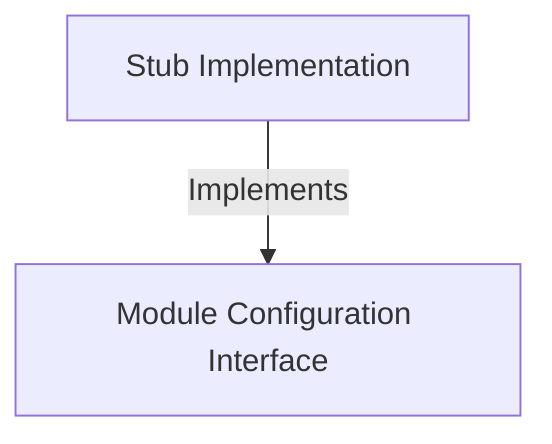

# Tutorial: env

This project serves as a **placeholder** or "dummy" component for an environment system. It exports a *stub module* that satisfies the required structure but remains **disabled** and **hidden**, ensuring the application doesn't crash if a real environment isn't loaded.

## Chapters

1. [Module Configuration Interface](01_module_configuration_interface.md)
2. [Stub Implementation](02_stub_implementation.md)

---

Generated by [Code IQ](https://github.com/adityasoni99/Code-IQ)