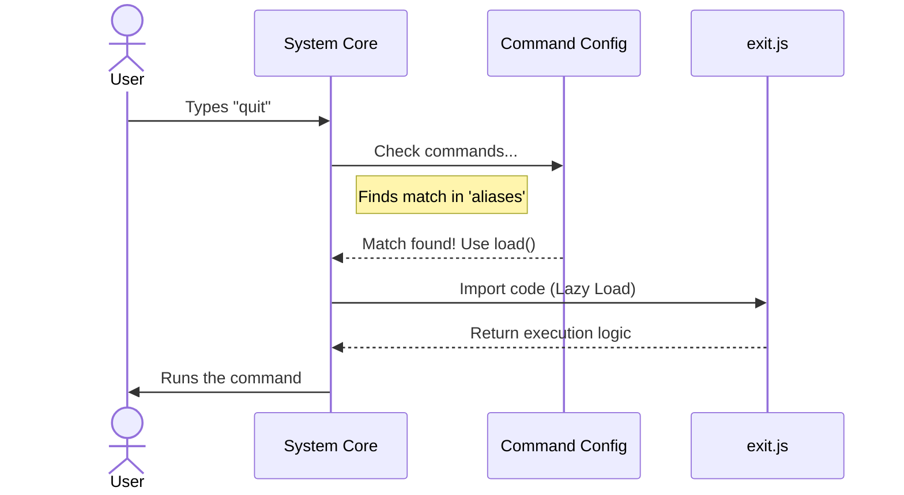

# Chapter 1: Command Configuration

Welcome to the `exit` project! In this first chapter, we are going to learn how to teach our command-line interface (CLI) to recognize commands.

## The Motivation

Imagine you walk into a restaurant. You sit down and look at a menu. The menu lists the names of the dishes (like "Burger" or "Pasta") and a short description. However, the food isn't sitting on the table yet. The chef doesn't start cooking until you actually **order** the dish.

This approach saves space and resources. If the chef cooked every single item on the menu as soon as you walked in, the kitchen would be a mess!

In our CLI tool, we face a similar challenge. We want our program to understand many commands, but we don't want to load all the heavy computer code for every single command right when the program starts. That would make the program slow to open.

**The Solution:** We create a **Command Configuration**. This is our "menu." It tells the system *what* the commands are called, but it waits to load the "recipe" (the code) until the user asks for it.

## The Use Case: The "Exit" Command

Our goal for this chapter is simple: We want to tell the system that there is a command called `exit` (or `quit`) that shuts down the program.

We aren't writing the shutdown logic yet; we are just defining the **metadata** so the system knows this command exists.

## Key Concepts

Here is the breakdown of a Command Configuration:

1.  **Identity:** What do we type to run this? (e.g., `exit`).
2.  **Aliases:** Are there nicknames? (e.g., `quit`).
3.  **Lazy Loading:** The instruction to only load the code file when needed.

## Usage: Defining the Configuration

Let's look at the code in `index.ts`. This single object defines everything the system needs to know about our command.

```typescript
import type { Command } from '../../commands.js'

const exit = {
  type: 'local-jsx',
  name: 'exit',
  aliases: ['quit'],
  description: 'Exit the REPL',
  immediate: true,
  load: () => import('./exit.js'),
} satisfies Command

export default exit
```

**What is happening here?**

*   `name: 'exit'`: This registers the primary keyword. If you type `exit`, the system looks for this.
*   `aliases: ['quit']`: This adds synonyms. Typing `quit` works exactly the same way.
*   `description`: This text appears if the user asks for help (like a menu description).
*   `load`: This is the special part! It points to the file `./exit.js`.

> **Note:** The property `type: 'local-jsx'` tells the system *how* to handle the visual output. We will cover exactly what that means in [Chapter 2: Local JSX Command Handler](02_local_jsx_command_handler.md).

## Under the Hood: Internal Implementation

How does the system use this configuration object? Let's walk through the process step-by-step.

1.  **Startup:** The system reads this small configuration object. It's very lightweight.
2.  **Waiting:** The system waits for user input. It has **not** read the file `./exit.js` yet.
3.  **Matching:** You type `quit`. The system checks the `aliases` list. It finds a match!
4.  **Loading:** Now that you ordered the "dish," the system executes the `load` function to import the heavy code.
5.  **Execution:** The command runs.

### Sequence Diagram

Here is a visual representation of this flow:



### Deep Dive: The Code Details

Let's look closer at two specific lines from our snippet that make this "magic" happen.

#### 1. Lazy Loading
```typescript
load: () => import('./exit.js'),
```
In JavaScript/TypeScript, `import()` allows us to load a file dynamically. By wrapping it in a function `() => ...`, we ensure the import doesn't happen automatically. It only triggers when the system calls `.load()`. This keeps our application startup very fast.

#### 2. Immediate Execution
```typescript
immediate: true,
```
Some commands need to happen right away without waiting for other processes or complex rendering queues. For a command like `exit`, we usually want it to feel instantaneous.

## Conclusion

In this chapter, we learned how to create a lightweight **Command Configuration**. We created a "menu item" for our `exit` command that defines its name, description, and where to find the actual code. This allows our CLI to be fast and organized.

Now that we have configured *what* the command is, we need to define *how* it renders its output.

[Next Chapter: Local JSX Command Handler](02_local_jsx_command_handler.md)

---

Generated by [Code IQ](https://github.com/adityasoni99/Code-IQ)