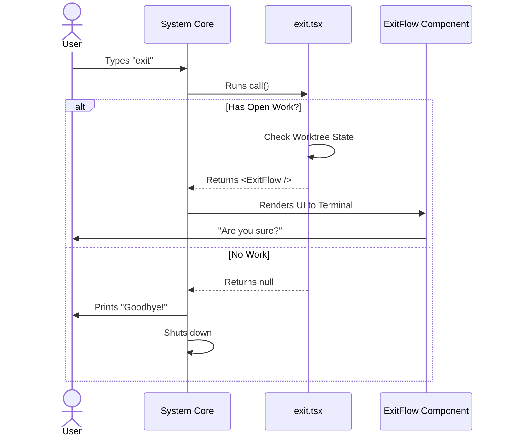

# Chapter 2: Local JSX Command Handler

Welcome back! In [Chapter 1: Command Configuration](01_command_configuration.md), we created the "menu item" for our command. We told the system, "If the user types `exit`, load this file."

Now, we need to write the actual code that runs when that file is loaded.

## The Motivation

In traditional command-line tools, commands usually do one thing: they run a task and print text to the screen.

But what if exiting is dangerous? What if you have unsaved work open?

If you try to close a word processor with unsaved changes, it pops up a window: *"Do you want to save before quitting?"* We want that same level of interactivity in our terminal. We don't just want to print text; we want to render an **interface**.

**The Solution:** The **Local JSX Command Handler**. Instead of just running a function, our command acts like a React component controller. It decides whether to perform an action immediately or render a purely interactive UI (like a dialog box) inside your terminal.

## Key Concepts

To understand this handler, we need to understand two main ideas:

1.  **The `call` Function:** Every command exports a function named `call`. This is the entry point.
2.  **The Return Value (`ReactNode`):** This function doesn't just return text. It returns a **React Component** (UI) or `null`.

### The Analogy: The Smart Doorman

Imagine a doorman at a building exit:

1.  **Scenario A (Empty Hands):** You walk up with nothing. The doorman simply opens the door. (Returns `null` -> Action happens immediately).
2.  **Scenario B (Carrying Boxes):** You walk up carrying a stack of fragile boxes. The doorman stops you and asks, "Do you need help with those?" (Returns `<Component />` -> UI appears).

## Usage: The Logic Flow

Let's look at how we implement this logic in our `exit.tsx` file. We want to check if the user is busy before letting them leave.

### 1. The Function Signature

First, we define the structure. The system passes us a tool called `onDone`, which we use to tell the system "We are finished."

```typescript
import * as React from 'react';
// We import types to keep our code safe
import type { LocalJSXCommandOnDone } from '../../types/command.js';

// This is the main function the system calls
export async function call(onDone: LocalJSXCommandOnDone) {
  // Logic goes here...
}
```
*Explanation:* This is the standard skeleton for any Local JSX command.

### 2. Checking for Baggage (State)

We need to see if the user has an active "Worktree Session" (our term for open work). We will cover exactly how this state works in [Chapter 4: Worktree Session State](04_worktree_session_state.md).

```typescript
import { getCurrentWorktreeSession } from '../../utils/worktree.js';

// ... inside the call function
const showWorktree = getCurrentWorktreeSession() !== null;
```
*Explanation:* We ask a utility helper: "Is there anything currently open?" The result is `true` or `false`.

### 3. Path A: The Interactive UI

If `showWorktree` is true, we shouldn't exit yet. We should show a component.

```typescript
import { ExitFlow } from '../../components/ExitFlow.js';

if (showWorktree) {
  // Return a React Component!
  return <ExitFlow 
    onDone={onDone} 
    onCancel={() => onDone()} 
  />;
}
```
*Explanation:* This is the "JSX" part. We return an `<ExitFlow />` tag. The CLI will render this as a visual interface (buttons, text) in the terminal. The command technically keeps running until the user interacts with that UI.

### 4. Path B: Immediate Action

If there is no work open, we just leave.

```typescript
import { gracefulShutdown } from '../../utils/gracefulShutdown.js';

// If no worktree, say goodbye and quit
onDone('Goodbye!');
await gracefulShutdown(0, 'prompt_input_exit');
return null;
```
*Explanation:* We return `null` because we don't need to show any UI. We trigger the shutdown process immediately. (We will learn more about this in [Chapter 5: Graceful Shutdown](05_graceful_shutdown.md)).

## Internal Implementation

How does the system handle these different return types? Let's visualize the decision-making process.

### Sequence Diagram



### Under the Hood Code

The real power here is that `call` is `async`. This means it can perform asynchronous checks (like checking a database or file system) before deciding what to show.

Here is a simplified view of the actual `exit.tsx` file combining the parts we discussed:

```typescript
export async function call(onDone: LocalJSXCommandOnDone): Promise<React.ReactNode> {
  // 1. Check if we have open work
  const showWorktree = getCurrentWorktreeSession() !== null;

  // 2. If yes, render the UI Component
  if (showWorktree) {
    return <ExitFlow showWorktree={showWorktree} onDone={onDone} />;
  }

  // 3. If no, just exit
  onDone('Goodbye!'); 
  await gracefulShutdown(0, 'prompt_input_exit');
  
  // 4. Return null tells React "render nothing"
  return null;
}
```

> **Note:** The actual source code includes an extra check at the beginning for `BG_SESSIONS` (background sessions like tmux). If running in the background, we detach instead of quit. We will explore how that persistence works in [Chapter 3: Background Session Persistence](03_background_session_persistence.md).

## Summary

In this chapter, we learned that a command isn't just a script; it's a **UI Controller**.

1.  The `call` function is the brain.
2.  It checks the application state.
3.  It can return a **React Component** to make the terminal interactive.
4.  It can return `null` to perform invisible actions immediately.

Now that we know how to handle the immediate "exit" action, what happens if we *don't* want to exit fully? What if we want the program to keep running in the background?

[Next Chapter: Background Session Persistence](03_background_session_persistence.md)

---

Generated by [Code IQ](https://github.com/adityasoni99/Code-IQ)