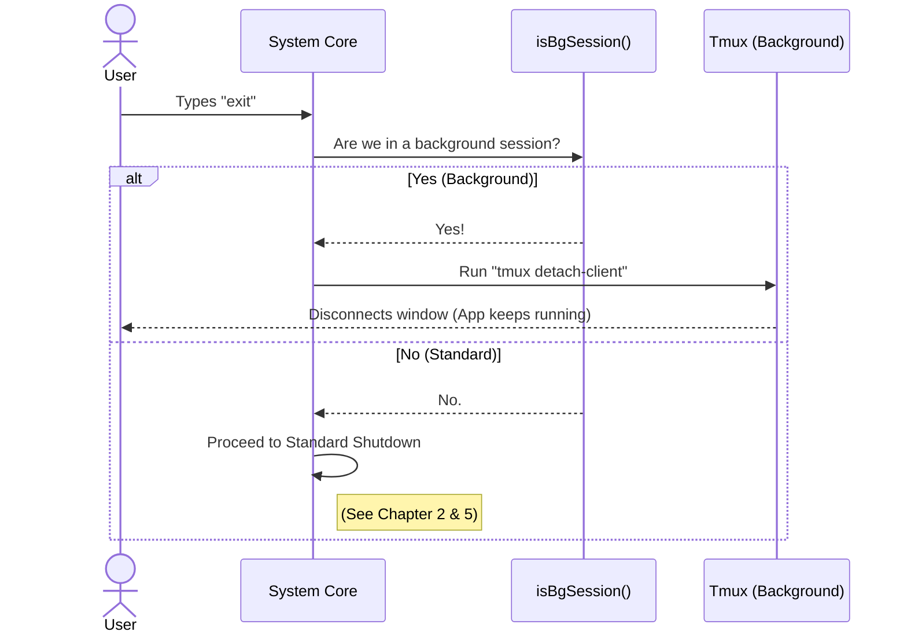

# Chapter 3: Background Session Persistence

Welcome back!

In [Chapter 2: Local JSX Command Handler](02_local_jsx_command_handler.md), we built a smart "Exit" command that can pause and ask the user questions using a visual interface.

However, that chapter assumed one thing: when the user leaves, the program stops. But what if we want the program to keep running secretly in the background?

## The Motivation

Imagine you are watching a movie on your TV.
1.  **Standard Exit:** You unplug the TV. The screen goes black, and the movie stops completely.
2.  **Background Persistence:** You press the "Power" button on the remote. The screen turns off, but the cable box keeps recording the show. When you turn the TV back on later, the show is still there.

In the world of command-line tools, we often use a tool called **tmux** to act like that cable box. It creates a **Background Session**.

**The Use Case:**
A user is running a long task (like generating a large codebase) inside a background session. They type `exit`.
*   **Wrong Behavior:** The program kills the task and shuts down completely.
*   **Correct Behavior:** The program simply disconnects the user's view ("detaches"), but keeps the task running in the background.

## Key Concepts

To handle this, we need to understand three simple concepts:

1.  **Foreground vs. Background:**
    *   **Foreground:** A standard terminal window. If you close it, the programs inside die.
    *   **Background (Session):** A persistent environment (like tmux). If you disconnect, the programs inside stay alive.

2.  **Detaching:**
    This is the act of "disconnecting the screen" without stopping the "movie." We don't want to *kill* the application; we want to *detach* the client.

3.  **Feature Flags:**
    Sometimes we want to enable or disable this behavior globally. We use a "feature flag" to check if background sessions are even allowed.

## Usage: The Logic Flow

We need to add a check at the very beginning of our `exit` command. Before we ask about unsaved work (as we did in Chapter 2), we check: *"Am I in a background session?"*

If the answer is **Yes**, we detach immediately.

### 1. The Imports

We need a few tools to make this work. We need to check if the feature is on, check if we are in a session, and a way to send system commands.

```typescript
import { feature } from 'bun:bundle';
import { spawnSync } from 'child_process';
import { isBgSession } from '../../utils/concurrentSessions.js';
// ... other imports
```

### 2. The Background Check

Inside our main `call` function, this is the very first thing we do.

```typescript
// Inside exit.tsx -> call() function
if (feature('BG_SESSIONS') && isBgSession()) {
  // We are in a background session!
  // 1. Tell the CLI wrapper we are done interacting
  onDone();
  
  // 2. Run the logic to detach
  detachSession(); 
  
  // 3. Return null (render nothing)
  return null;
}
```

### 3. The Detach Action

How do we actually "detach"? We use `spawnSync`. This is like the code typing a command into the terminal for you. We tell `tmux` to `detach-client`.

```typescript
// The logic inside the if-statement above
spawnSync('tmux', ['detach-client'], {
  stdio: 'ignore'
});
```
*Explanation:*
*   `tmux`: The program we are calling.
*   `detach-client`: The command we are sending to tmux.
*   `stdio: 'ignore'`: We don't need to see the output of this command.

## Internal Implementation

Let's visualize what happens when a user types `exit` in these two different modes.

### Sequence Diagram



### Under the Hood: The `isBgSession` Helper

You might be wondering, "How does the code know it's in a background session?"

While the exact code for `isBgSession` is in a utility file, the logic is usually very simple: it checks **Environment Variables**.

When `tmux` runs, it adds a special tag to the system environment (often called `$TMUX`). Our helper function simply looks for that tag.

### Putting it Together

Here is how this new logic sits on top of the code we wrote in [Chapter 2: Local JSX Command Handler](02_local_jsx_command_handler.md).

```typescript
export async function call(onDone: LocalJSXCommandOnDone) {
  // PRIORITY 1: Handle Background Persistence
  if (feature('BG_SESSIONS') && isBgSession()) {
    onDone();
    // Detach the user, keep the app running
    spawnSync('tmux', ['detach-client'], { stdio: 'ignore' });
    return null;
  }

  // PRIORITY 2: Handle Unsaved Work (From Chapter 2)
  const showWorktree = getCurrentWorktreeSession() !== null;
  if (showWorktree) {
    return <ExitFlow ... />;
  }

  // PRIORITY 3: Standard Shutdown
  // ...
}
```

## Conclusion

In this chapter, we learned how to make our CLI smarter about *where* it is running.

*   If we are in a standard terminal, `exit` means "Shutdown."
*   If we are in a persistent background session, `exit` means "Step Away" (Detach).

This ensures that long-running tasks aren't accidentally killed just because the user wants to close their window.

Now, let's look closer at that "Unsaved Work" we keep mentioning. How does the system know if you have work in progress?

[Next Chapter: Worktree Session State](04_worktree_session_state.md)

---

Generated by [Code IQ](https://github.com/adityasoni99/Code-IQ)