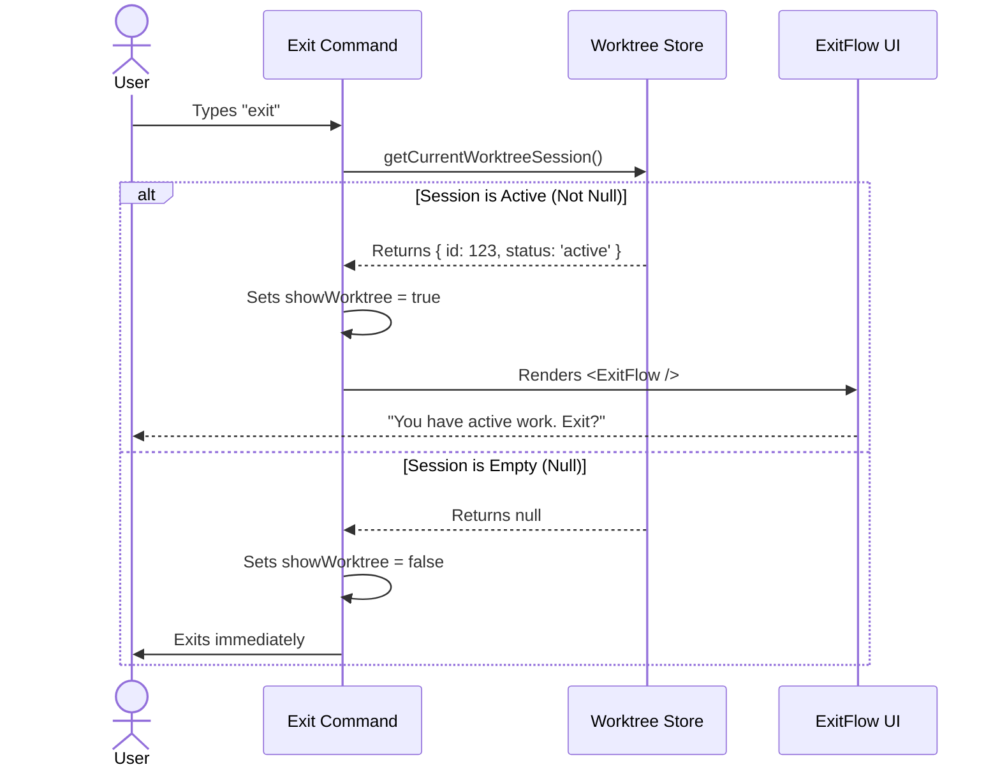

# Chapter 4: Worktree Session State

Welcome to Chapter 4!

In the previous chapter, [Chapter 3: Background Session Persistence](03_background_session_persistence.md), we learned how to detect if our program is running in a "permanent" background session (like tmux) and detach from it instead of quitting.

But what if we are in a normal, foreground session? Is it always safe to quit immediately?

## The Motivation

Imagine you are writing a long essay in a word processor. You have written three paragraphs but haven't saved the file yet. You accidentally click the "X" button to close the window.

If the program just closes, you lose your work. That is a bad user experience! instead, the program checks for **Unsaved Changes** and stops you with a popup: *"Do you want to save your changes?"*

In our `exit` project, we have a similar concept called the **Worktree Session**. This represents the "active task" or the context the AI is currently working on. If the user tries to exit while a task is active, we need to interrupt the exit process and ask them what to do.

## Key Concepts

To implement this safety check, we rely on a few simple concepts:

1.  **The Worktree:** This is the actual folder or project the user is working on.
2.  **The Session:** This is the *state* of the work. It tracks if there is an active conversation, a pending file change, or a running AI agent.
3.  **The Null Check:** In our code, if there is **no** active work, the session is `null`. If there **is** work, the session is an object containing data.

## Usage: Checking the State

We need to ask the system: *"Is there a session active right now?"*

We do this inside our `exit.tsx` file (which we set up in [Chapter 2: Local JSX Command Handler](02_local_jsx_command_handler.md)).

### 1. Importing the Helper

We use a utility function specifically designed to retrieve the current state.

```typescript
// Import the getter function from our utilities
import { getCurrentWorktreeSession } from '../../utils/worktree.js';
```
*Explanation:* We don't need to manage the state ourselves; we just import a tool to ask for it.

### 2. Performing the Check

Inside our command logic, we call this function.

```typescript
// Inside the call() function
const currentSession = getCurrentWorktreeSession();

// Check if it is NOT null
const showWorktree = currentSession !== null;
```
*Explanation:*
*   If `currentSession` is `null`, `showWorktree` becomes `false`. It is safe to quit.
*   If `currentSession` has data, `showWorktree` becomes `true`. We need to warn the user.

### 3. Triggering the UI

Now we use that boolean value (`true` or `false`) to decide whether to show our interactive component.

```typescript
import { ExitFlow } from '../../components/ExitFlow.js';

if (showWorktree) {
  // Render the "Are you sure?" UI
  return <ExitFlow 
    showWorktree={showWorktree} 
    onDone={onDone} 
  />;
}
```
*Explanation:* If `showWorktree` is true, we return the `<ExitFlow />` component. This stops the immediate exit and shows the user options (like "Save" or "Discard").

## Internal Implementation

How does `getCurrentWorktreeSession` know if work is happening?

It acts as a **Global State Store**. Think of it like a flag on a mailbox. If the flag is up, there is mail (work). If it's down, the box is empty.

### Sequence Diagram

Here is the flow of information when the user types `exit`:



### Under the Hood: The Utility

While we don't need to write the utility code in this chapter, it helps to understand what it looks like internally. It is essentially a variable getter.

```typescript
// ... inside utils/worktree.js (Simplified)

let currentSession: Session | null = null;

export function getCurrentWorktreeSession() {
  return currentSession;
}
```

When the AI starts a task, other parts of the system update `currentSession`. Our `exit` command simply reads it.

## Conclusion

In this chapter, we added a critical safety layer to our CLI.
1.  We learned that **Worktree Session State** represents active work.
2.  We used `getCurrentWorktreeSession()` to check if that state exists (`!== null`).
3.  We used that check to trigger the `<ExitFlow />` UI, preventing accidental data loss.

Now we have handled background sessions (Chapter 3) and active foreground sessions (Chapter 4). But what happens if the user says, "Yes, I really want to quit"? How do we shut down the program cleanly without leaving a mess?

[Next Chapter: Graceful Shutdown](05_graceful_shutdown.md)

---

Generated by [Code IQ](https://github.com/adityasoni99/Code-IQ)